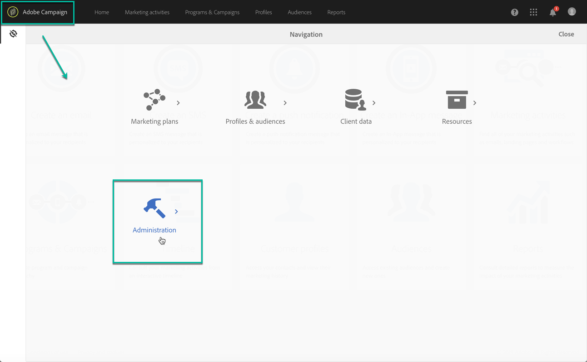

# Configuratiescherm openen {#accessing-control-panel}

Het regelpaneel is rechtstreeks beschikbaar via de Experience Cloud of via het product zelf.

Het is alleen toegankelijk voor **Admin-gebruikers**. Raadpleeg [deze sectie](../../discover/using/managing-permissions.md) voor meer informatie over het toewijzen van gebruikers aan de groep Beheerders.

## Toegang vanaf het Platform Experience Cloud {#access-experience-cloud-platform}

Voer de onderstaande stappen uit om het Configuratiescherm te openen vanuit het Adobe Experience Cloud-Platform.

1. Navigeer aan [Experience Cloud homepage](https://experiencecloud.adobe.com/){target=&quot;_blank&quot;}.

1. Klik de specifieke verbinding in **Snelle Toegang** sectie.

   

Het regelpaneel is ook toegankelijk via de Experience Cloud-Platform **oplossingskiezer**:

1. Van [Adobe Experience Cloud homepage](https://experiencecloud.adobe.com/){target=&quot;_blank&quot;}, selecteer **Campagne** van **Snelle Toegang** sectie of het hoogste menu op het recht.

   

1. De lijst van uw instanties van de Campagne toont. Klik op de **Control Panel**-kaart om deze te starten.

   

## Toegang tot het product {#access-product}

>[!NOTE]
>
>Toegang vanuit het product is alleen beschikbaar voor [Campaign Standard](https://experienceleague.adobe.com/docs/campaign-standard/using/campaign-standard-home.html?lang=nl){target=&quot;_blank&quot;}.

1. Open uw Campaign Standard product.

1. Selecteer het **[!UICONTROL Administration]** menu van **Navigatie** ruit.

   

1. Klik op het pictogram **[!UICONTROL Control Panel]**.

   
