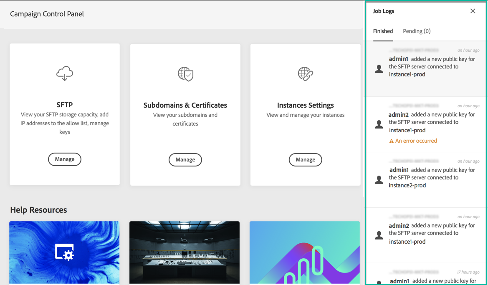

# De interface van het configuratiescherm verkennen {#discovering-interface}

De startpagina van het Configuratiescherm geeft u toegang tot alle acties die op uw Campaign-instanties kunnen worden uitgevoerd.

Zij worden vertegenwoordigd door kaarten die in onderwerpen worden georganiseerd, bijvoorbeeld **Prestatiebewaking**.

<!--With upcoming Campaign releases, more topics and cards will be made available.-->

## Taaklogbestanden {#job-logs}

Met de knop **[!UICONTROL Job Logs]** in de rechterbovenhoek kunt u alle wijzigingen controleren die door gebruikers van uw organisatie zijn aangebracht.

Klik op een element in de lijst voor meer informatie.

Met de knop **[!UICONTROL Open]** hebt u rechtstreeks toegang tot het tabblad Configuratiescherm waar de wijziging is aangebracht.

## Help-bronnen {#help-resources}

De **[!UICONTROL Help Resources]** Deze sectie bevat nuttige documentatie die u helpt bij het gebruik van de producten van het Configuratiescherm en de Campagne. Aarzel niet om ze te verkennen.

