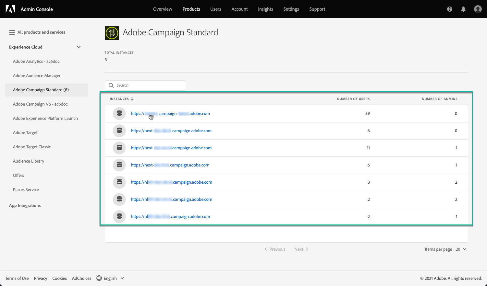

# Machtigingen voor het configuratiescherm beheren {#managing-permissions-control-panel}

Het Configuratiescherm is beschikbaar voor alle Admin-gebruikers van een Campagne-instantie. Voer de onderstaande stappen uit om gebruikers toe te wijzen aan de groep Beheerders en ze toegang te verlenen tot het Configuratiescherm.

[ Ontdek deze functie in video](../../discover/using/managing-permissions.md#video)

1. Ga naar de [Homepage van Adobe Experience Cloud](https://experiencecloud.adobe.com/){target="_blank"}.

1. De **Admin Console** door op de beschikbare koppeling van de **Snelle toegang** of in het menu rechtsboven.

   

   >[!NOTE]
   >
   >Als de **Admin Console** De koppeling is niet zichtbaar, dit betekent dat u geen beheerdersrechten voor uw organisatie hebt. Neem contact op met uw organisatiebeheerders om de stappen uit te voeren.

1. Van de **Admin Console** selecteert u het gewenste campagneproduct in het menu **[!UICONTROL Products and services]** lijst.

   

   >[!NOTE]
   >
   >Als u uw product niet ziet, contacteer uw Beheerders van de Organisatie zodat zij u toegang tot het geven.

1. De lijst met instanties voor het campagneproduct wordt weergegeven. Selecteer de instantie waaraan u een Admin-gebruiker wilt toevoegen.

   

   >[!NOTE]
   >
   >U kunt verschillende Admin-gebruikers toevoegen voor elke Campagne-instantie. Beheerders hebben alleen toegang tot het Configuratiescherm van de instantie waartoe ze behoren.

1. De lijst van **[!UICONTROL Product Profiles]** voor de geselecteerde instantie wordt weergegeven. Klik op de knop **[!UICONTROL Administrators]** productprofiel voor toegang tot de lijst met Admin-gebruikers.

   

   >[!NOTE]
   >
   >Admin-gebruikers behoren standaard tot het productprofiel &quot;Beheerders&quot;. Afhankelijk van uw organisatieconfiguratie kan de naam van het productprofiel anders zijn (&quot;admin&quot;, &quot;admins&quot;, enz.).

1. De lijst met Admin-gebruikers wordt weergegeven. Klik op de knop **[!UICONTROL Add User]** om de gewenste gebruiker toe te voegen.

   

>[!NOTE]
>
>Zodra de toegang wordt gevormd, zal de gebruiker zich uit Adobe Experience Cloud moeten afmelden en opnieuw binnen, om tot Controlebord toegang te hebben.

## Video over zelfstudie {#video}

>[!VIDEO](https://video.tv.adobe.com/v/27147?quality=12)
