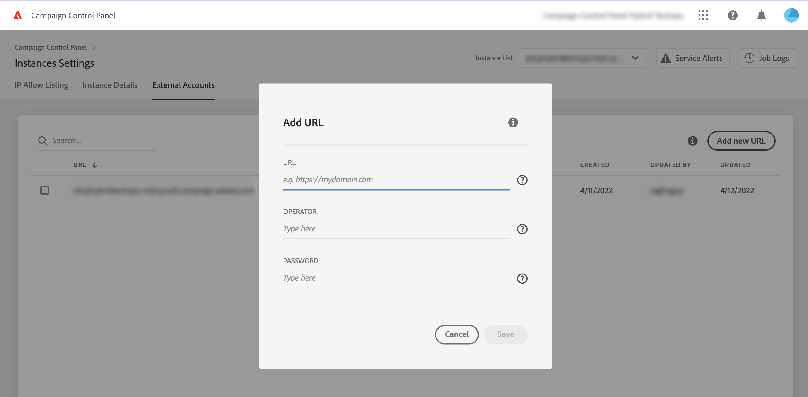

# MID/RT-instanties toevoegen (hybride model){#add-mid-rt-instances-hybrid-model}

>[!CONTEXTUALHELP]
>id="cp_externalaccounts"
>title="Externe accounts"
>abstract="In dit scherm kunnen klanten met een hybride hostingmodel hun MID/RT-instantie-URL opgeven die is geconfigureerd in de marketinginstantie in het configuratiescherm, om de mogelijkheden van het configuratiescherm te benutten."

Met het configuratiescherm kunnen klanten met een hybride hostingmodel specifieke mogelijkheden van het configuratiescherm benutten. Hiervoor moeten ze de URL van de instantie MID/RT opgeven die in hun marketinginstantie in het configuratiescherm is geconfigureerd.

Raadpleeg voor meer informatie over hostmodellen de [Campaign Classic-documentatie](https://experienceleague.adobe.com/docs/campaign-classic/using/installing-campaign-classic/architecture-and-hosting-models/hosting-models-lp/hosting-models.html?lang=nl).

## Een MID/RT-instantie toevoegen {#add}

>[!CONTEXTUALHELP]
>id="cp_externalaccounts_url"
>title="URL"
>abstract="URL van de instantie, die u kunt vinden in de Campaign Client Console in het menu Beheer > Platform > Externe accounts."

>[!CONTEXTUALHELP]
>id="cp_externalaccounts_operator"
>title="Operator"
>abstract="ID van de operator die is verstrekt na de eerste invulling door Adobe Admin."

>[!CONTEXTUALHELP]
>id="cp_externalaccounts_password"
>title="Wachtwoord"
>abstract="Wachtwoord van de operator opgegeven na eerste invulling door Adobe Admin."

Hybride klanten moeten verbinding met het configuratiescherm maken via Experience Cloud. Wanneer u het configuratiescherm voor de eerste keer opent, worden er op de startpagina slechts twee kaarten weergegeven.

>[!NOTE]
>
>Als u problemen ondervindt bij de toegang tot het configuratiescherm, is uw marketingexemplaar waarschijnlijk nog niet toegewezen aan uw organisatie-ID. Neem contact op met de klantenservice om deze configuratie te voltooien en verder te gaan. Als de verbinding is gelukt, wordt de startpagina van het configuratiescherm weergegeven.

Als u toegang wilt tot de mogelijkheden van het configuratiescherm, moet u de MID/RT-instantiegegevens opgeven op de kaart **[!UICONTROL Instances Settings]**. Volg de onderstaande stappen om dit te doen.

1. Selecteer op kaart **[!UICONTROL Instances Settings]** het tabblad **[!UICONTROL External Accounts]**.

1. Selecteer de gewenste marketinginstantie in de vervolgkeuzelijst en klik op **[!UICONTROL Add new URL]**.

   

1. Geef informatie over de MID/RT-instantie die u wilt toevoegen.

   

   * **[!UICONTROL URL]**: URL van de instantie, te vinden in de Campaign Client Console in het menu **[!UICONTROL Administration]** > **[!UICONTROL Platform]** > **[!UICONTROL External Accounts]**.

      

   * **[!UICONTROL Operator]**/**[!UICONTROL Password]**: referenties van de operator verstrekt na initiële voorziening door Adobe Admin.

      >[!NOTE]
      >
      >Als deze gegevens niet beschikbaar zijn, neemt u contact op met de klantenservice.

1. Klik op **[!UICONTROL Save]** om te bevestigen.

Bij het toevoegen van een MID/RT-URL wordt een async-proces geactiveerd om de juistheid van de URL&#39;s te valideren. Dit proces kan een paar minuten duren. Totdat de URL van de MID/RT-instantie is gevalideerd, is de taak in behandeling. Pas als de validatie is voltooid, krijgt u toegang tot de belangrijkste mogelijkheden van het configuratiescherm.

U kunt een MID/RT-instantie-URL op elk moment verwijderen of deactiveren door deze in de lijst te selecteren.

Let op: u kunt elke actie controleren die wordt uitgevoerd op het tabblad **[!UICONTROL External Accounts]** op een MID/RT-instantie-URL vanuit de **[!UICONTROL Job Logs]**:

## Beschikbare mogelijkheden voor hybride klanten {#capabilities}

Zodra een MID/RT-instantie aan het configuratiescherm is toegevoegd, kunt u gebruikmaken van de onderstaande mogelijkheden:

* [Belangrijke contacten en gebeurtenissen bewaken](../../service-events/service-events.md)
* [Uw instantiedetails bekijken](../../instances-settings/using/instance-details.md),
* [IP-adressen toevoegen aan de lijst met gewenste personen](../../instances-settings/using/ip-allow-listing-instance-access.md) (voor RT-instanties),
* [Informatie weergeven over gedelegeerde subdomeinen](../../subdomains-certificates/using/monitoring-subdomains.md),
* [SSL-certificaten van subdomeinen vernieuwen](../../subdomains-certificates/using/renewing-subdomain-certificate.md).
