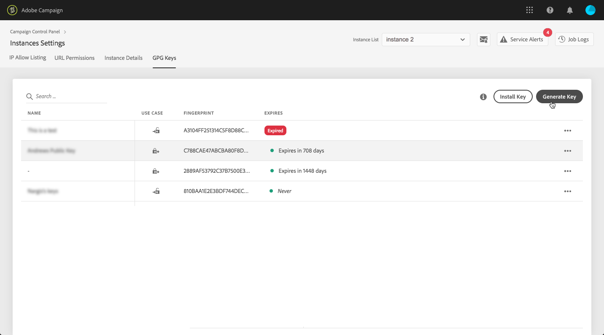
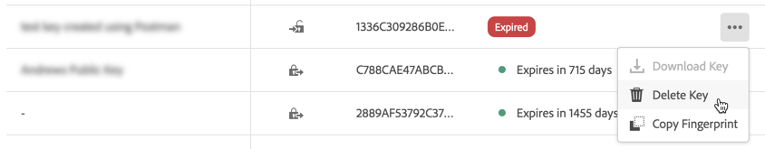

# Beheer van GPG-sleutels {#gpg-keys-management}

## GPG-codering {#about-gpg-encryption}

Met GPG-codering kunt u uw gegevens beveiligen met een systeem van paren met openbare en persoonlijke sleutels die voldoen aan de [OpenPGP](https://www.openpgp.org/about/standard/) -specificatie.

Zodra uitgevoerd, kunt u inkomende gegevens hebben ontsleuteld en uitgaande gegevens worden gecodeerd alvorens de overdracht voorkomt, om ervoor te zorgen dat zij niet door iedereen zonder een geldig passend zeer belangrijk paar zullen worden betreden.

Als u GPG-codering wilt implementeren met Campagne, moeten de GPG-sleutels rechtstreeks vanuit het Configuratiescherm op een marketingexemplaar worden geïnstalleerd en/of gegenereerd door een beheerder.

Dan kunt u:

* **Verzonden gegevens** versleutelen: Adobe Campaign verzendt gegevens nadat het met de geïnstalleerde openbare sleutel is gecodeerd.

* **Binnenkomende gegevens** decoderen: Adobe Campaign ontvangt gegevens die van een extern systeem zijn versleuteld met een openbare sleutel die u hebt gedownload van het Configuratiescherm. Adobe Campaign decodeert de gegevens met een persoonlijke sleutel die via het Configuratiescherm wordt gegenereerd.

**Verwante onderwerpen:**

* [Campaign Standard-zelfstudievideo](https://docs.adobe.com/content/help/en/campaign-standard-learn/tutorials/administrating/control-panel/generating-and-installing-gpg-keys.html)
* [Campaign Classic-zelfstudievideo](https://docs.adobe.com/content/help/en/campaign-classic-learn/tutorials/administrating/control-panel-acc/generating-and-installing-gpg-keys.html)

## Gegevens versleutelen {#encrypting-data}

Met het Configuratiescherm kunt u gegevens coderen die afkomstig zijn van uw Adobe Campaign-exemplaar.

Hiervoor moet u een GPG-sleutelpaar genereren van een PGP-versleutelingsprogramma en vervolgens de openbare sleutel installeren in het Configuratiescherm. Vervolgens kunt u gegevens versleutelen voordat u deze vanuit uw instantie verzendt. Ga als volgt te werk om dit te doen:

1. Genereer een combinatie van openbare en persoonlijke sleutels met een PGP-coderingsprogramma volgens de [OpenPGP-specificatie](https://www.openpgp.org/about/standard/). Hiertoe installeert u een GPG-hulpprogramma of GNuGP-software.

   >[!NOTE]
   >
   >Er is open-source gratis software beschikbaar om sleutels te genereren. Nochtans, zorg ervoor u de richtlijnen van uw organisatie volgt en het nut van GPG gebruikt door uw organisatie van IT/Veiligheid wordt geadviseerd.

1. Zodra het nut geïnstalleerd is, stel het bevel hieronder, in de Eind van MAC of het bevel van Vensters in werking.

   `gpg --full-generate-key`

1. Geef bij de aanwijzing de gewenste parameters voor de toets op. De vereiste parameters zijn:

   * **sleuteltype**: RSA
   * **sleutellengte**: 1024 - 4096 bits
   * **echte naam** en **e-mailadres**: Staat toe om te volgen wie tot het belangrijkste paar leidde. Voer een naam en e-mailadres in die aan uw organisatie of afdeling zijn gekoppeld.
   * **opmerking**: Als u een label toevoegt aan het opmerkingenveld, kunt u gemakkelijk de sleutel identificeren waarmee uw gegevens worden versleuteld.
   * **vervaldatum**: Datum of &quot;0&quot; voor geen vervaldatum.
   * **passphrase**
   

1. Als dit eenmaal is bevestigd, genereert het script een sleutel met de bijbehorende vingerafdruk, die u in een bestand kunt exporteren of rechtstreeks in het Configuratiescherm kunt plakken. Als u het bestand wilt exporteren, voert u deze opdracht uit, gevolgd door de vingerafdruk van de sleutel die u hebt gegenereerd.

   `gpg -a --export <fingerprint>`

1. Als u de openbare sleutel in het Configuratiescherm wilt installeren, opent u de **[!UICONTROL Instance settings]** kaart en selecteert u het **[!UICONTROL GPG keys]** tabblad en het gewenste exemplaar.

1. Klik op de **[!UICONTROL Install Key]** knop.

   

1. Plak de openbare sleutel die is gegenereerd met het PGP-versleutelingsgereedschap. U kunt het geëxporteerde bestand met de openbare sleutel ook rechtstreeks slepen en neerzetten.

   >[!NOTE]
   >
   >De openbare sleutel moet de OpenPGP-indeling hebben.

   

1. Klik op de **[!UICONTROL Install Key]** knop.

Zodra de openbare sleutel wordt geïnstalleerd, toont het in de lijst. U kunt de **...** om het te downloaden of zijn vingerafdruk te kopiëren.

De sleutel is dan beschikbaar voor gebruik in de werkschema&#39;s van Adobe Campaign. U kunt het gebruiken om gegevens te coderen wanneer het gebruiken van de activiteiten van de gegevensextractie.

Raadpleeg de documentatie bij Adobe Campaign voor meer informatie:

**Campaign Classic:**

* [Een bestand zoeken of versleutelen](https://docs.adobe.com/content/help/en/campaign-classic/using/automating-with-workflows/general-operation/how-to-use-workflow-data.html#zipping-or-encrypting-a-file)
* [Hoofdlettergebruik: Gegevens coderen en exporteren met een sleutel die is geïnstalleerd in het Configuratiescherm](https://docs.adobe.com/content/help/en/campaign-classic/using/automating-with-workflows/general-operation/how-to-use-workflow-data.html#use-case-gpg-encrypt)

**Campaign Standard:**

* [Gecodeerde gegevens beheren](https://docs.adobe.com/content/help/en/campaign-standard/using/managing-processes-and-data/importing-and-exporting-data/managing-encrypted-data.html)
* [Hoofdlettergebruik: Gegevens coderen en exporteren met een sleutel die is geïnstalleerd in het Configuratiescherm](https://docs.adobe.com/content/help/en/campaign-standard/using/managing-processes-and-data/importing-and-exporting-data/managing-encrypted-data.html#use-case-gpg-encrypt)

## Gegevens decoderen {#decrypting-data}

Met het Configuratiescherm kunt u externe gegevens die in Adobe Campaign-instanties komen, decoderen.

Hiervoor moet u een GPG-sleutelpaar rechtstreeks vanuit het Configuratiescherm genereren.

* De **openbare sleutel** wordt gedeeld met het externe systeem, dat het zal gebruiken om de gegevens te coderen die naar Campagne moeten verzenden.
* De **persoonlijke sleutel** wordt door Campagne gebruikt om de inkomende gecodeerde gegevens te decoderen.

Voer de volgende stappen uit om een sleutelpaar te genereren in het Configuratiescherm:

1. Open de **[!UICONTROL Instance settings]** kaart en selecteer vervolgens het **[!UICONTROL GPG keys]** tabblad en het gewenste Adobe Campaign-exemplaar.

1. Klik op de **[!UICONTROL Generate Key]** knop.

   

1. Geef de naam van de toets op en klik op **!UICONTROL Generate Key]**. Deze naam helpt u bij het identificeren van de sleutel die moet worden gebruikt voor decodering in Campagneworkflows

   

Zodra het zeer belangrijke paar wordt geproduceerd, toont de openbare sleutel in de lijst. De sleutelparen van de decryptie worden geproduceerd zonder vervaldatum.

U kunt de **...** om de openbare sleutel te downloaden of zijn vingerafdruk te kopiëren.

De openbare sleutel is dan beschikbaar om met om het even welk extern systeem te worden gedeeld. Adobe Campaign kan de persoonlijke sleutel gebruiken bij het laden van gegevens om gegevens te decoderen die met de openbare sleutel zijn versleuteld.

Raadpleeg de documentatie bij Adobe Campaign voor meer informatie:

**Campaign Classic:**

* [Een bestand decoderen of decoderen voordat het wordt verwerkt](https://docs.adobe.com/content/help/en/campaign-classic/using/automating-with-workflows/general-operation/importing-data.html#unzipping-or-decrypting-a-file-before-processing)
* [Hoofdlettergebruik: Gegevens importeren die zijn versleuteld met een toets die is gegenereerd door het Configuratiescherm](https://docs.adobe.com/content/help/en/campaign-classic/using/automating-with-workflows/general-operation/importing-data.html#use-case-gpg-decrypt)

**Campaign Standard:**

* [Gecodeerde gegevens beheren](https://docs.adobe.com/content/help/en/campaign-standard/using/managing-processes-and-data/importing-and-exporting-data/managing-encrypted-data.html)
* [Hoofdlettergebruik: Gegevens importeren die zijn versleuteld met een toets die is gegenereerd door het Configuratiescherm](https://docs.adobe.com/content/help/en/campaign-standard/using/managing-processes-and-data/importing-and-exporting-data/managing-encrypted-data.html#use-case-gpg-decrypt)

## GPG-toetsen controleren

Als u toegang wilt tot de GPG-sleutels die voor uw instanties zijn geïnstalleerd en gegenereerd, opent u de **[!UICONTROL Instance settings]** kaart en selecteert u het **[!UICONTROL GPG keys]** tabblad.

In de lijst worden alle GPG-sleutels voor versleuteling en ontsleuteling weergegeven die voor uw instanties zijn geïnstalleerd en gegenereerd, met gedetailleerde informatie over elke sleutel:

* **[!UICONTROL Name]**: De naam die is gedefinieerd tijdens het installeren of genereren van de sleutel.
* **[!UICONTROL Use case]**: Deze kolom geeft het gebruiksgeval van de toets aan:

   : De sleutel is geïnstalleerd voor gegevenscodering.

   : De sleutel is geproduceerd om gegevensdecryptie toe te staan.

* **[!UICONTROL Fingerprint]**: de vingerafdruk van de toets.
* **[!UICONTROL Expires]**: De vervaldatum van de toets. Let op: het Configuratiescherm geeft visuele indicaties als de sleutel de vervaldatum nadert:

   * Dringend (rood) wordt 30 dagen eerder getoond.
   * Waarschuwing (geel) wordt 60 dagen eerder weergegeven.
   * Een &quot;Verlopen&quot; rode banner wordt weergegeven zodra een toets is verlopen.
   >[!NOTE]
   >
   >Er wordt geen e-mailmelding verzonden door het Configuratiescherm.

We raden u aan alle toetsen die u niet meer nodig hebt, te verwijderen. Klik op de knop **..** selecteert u vervolgens **[!UICONTROL Delete Key].**.

>[!IMPORTANT]
>
>Voordat u een sleutel verwijdert, moet u ervoor zorgen dat deze niet wordt gebruikt in Adobe Campaign-workflows om te voorkomen dat deze mislukken.
