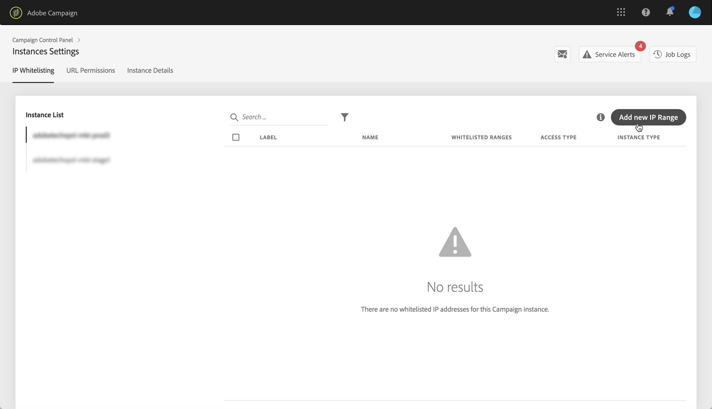
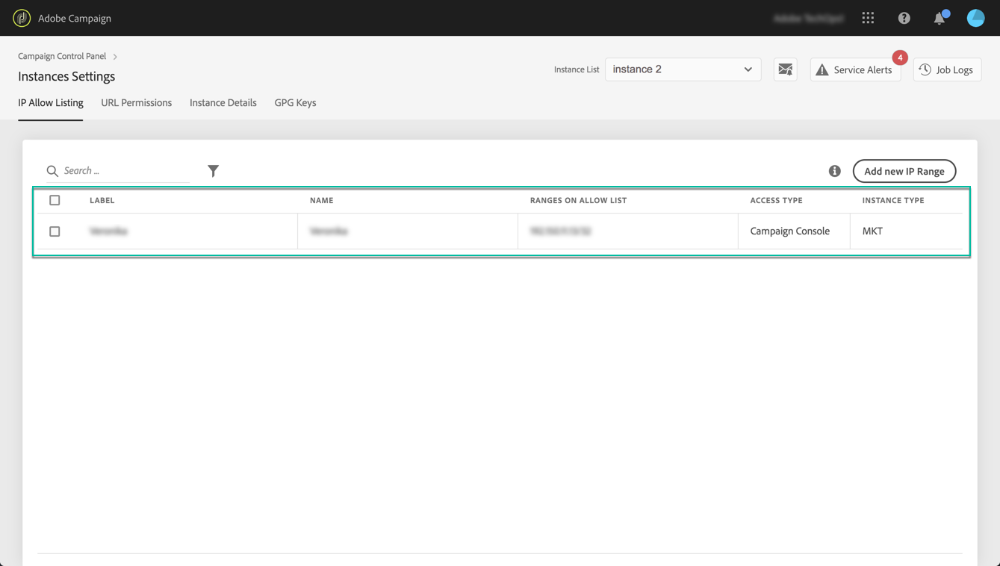

# IP-aanbieding toestaan {#ip-allow-listing}

>[!CONTEXTUALHELP]
>id="cp_instancesettings_iprange"
>title="Aanbieding via IP toestaan"
>abstract="Voeg IP adressen aan toe toestaan lijst om tot uw instanties toegang te hebben."
>additional-url="https://images-tv.adobe.com/mpcv3/045cac99-f948-478e-ae04-f8c161dcb9e2_1568132508.1920x1080at3000_h264.mp4" text="Video over demo bekijken"

>[!IMPORTANT]
>
>Deze functie is alleen beschikbaar voor Campaign Classic-instanties.

## Aanbieding via IP toestaan {#about-ip-allow-listing}

Standaard is uw Adobe Campaign Classic-instantie niet toegankelijk via verschillende IP-adressen.

Als uw IP adres niet aan toestaan lijst is toegevoegd, zult u niet aan login aan de instantie van dit adres kunnen. Op dezelfde manier kunt u mogelijk geen API verbinden met uw Message Center- of marketinginstantie als het IP-adres niet expliciet is toegevoegd aan de lijst met toegestane items.

Met het Configuratiescherm kunt u nieuwe verbindingen met uw instanties instellen door IP-adresbereiken toe te voegen aan de lijst met toegestane adressen. Volg de onderstaande stappen om dit te doen.

Zodra IP de adressen op toestaan lijst zijn, kunt u de exploitanten van de Campagne tot stand brengen en verbinden aan hen zodat de gebruikers tot de instantie kunnen toegang hebben.

## Aanbevolen procedures {#best-practices}

Volg de onderstaande aanbevelingen en beperkingen wanneer u IP-adressen toevoegt aan de lijst Toestaan in het Configuratiescherm.

* **Laat IP geen toegang tot alle Types** van Toegang toe als u niet het IP adres om met uw servers van RT, of de veiligheidsstreek van AEM van plan bent te verbinden.
* **Als u tijdelijk toegang tot uw instantie voor een IP adres** toeliet, zorg ervoor om de IP adressen uit te verwijderen sta lijst toe zodra u het niet meer nodig hebt om met uw instantie te verbinden.
* **Wij adviseren niet IP adressen van openbare plaatsen aan toe te voegen lijst** (luchthavens, hotels, enz.). Gelieve te gebruiken uw adres van bedrijfsVPN om uw instantie te allen tijde veilig te houden.

## IP-adressen toevoegen aan de lijst met toegestane toegang tot instantie {#adding-ip-addresses-allow-list}

>[!CONTEXTUALHELP]
>id="cp_instancesettings_iprange_add"
>title="Nieuw IP-bereik toevoegen"
>abstract="Definieer het IP-bereik dat u wilt toevoegen aan de lijst voor toestaan om verbinding te maken met uw instantie."

Ga als volgt te werk om IP-adressen toe te voegen aan de lijst allow:

1. Open the **[!UICONTROL Instances Settings card]** to access the IP allow listing tab, then click **[!UICONTROL Add new IP Range]**.

   >[!NOTE]
   >
   >Als de Instellingenkaart van de Instantie niet zichtbaar is op de homepage van het Controlebord, betekent dit dat uw identiteitskaart IMS ORG niet met om het even welke Klassieke Instanties van Adobe Campaign wordt geassocieerd

   

1. Vul de informatie voor de IP Waaier in die u aan toestaan lijst zoals hieronder beschreven wilt toevoegen.

   

   * **[!UICONTROL Instance(s)]**: De instanties waaraan de IP adressen zullen kunnen verbinden. Verschillende instanties kunnen tegelijkertijd worden gemanipuleerd. IP staat bijvoorbeeld toe dat een lijst op zowel Productie- als Stage-instanties kan worden uitgevoerd via dezelfde stap.
   * **[!UICONTROL IP Range]**: De IP waaier die u aan toestaan lijst, in het formaat wilt toevoegen CIDR. Merk op dat een IP waaier geen bestaande waaier op toestaat lijst kan overlappen. In dat geval, schrap eerst de waaier die overlappende IP bevat.
   >[!NOTE]
   >
   >CIDR (het Klasseloze Verpletteren inter-Domein) is het gesteunde formaat wanneer het toevoegen van IP waaiers met de interface van het Controlebord. De syntaxis bestaat uit een IP-adres, gevolgd door een &#39;/&#39;-teken en een decimaal getal. De opmaak en syntaxis worden volledig in [dit artikel](https://whatismyipaddress.com/cidr)beschreven.
   >
   >U kunt op internet zoeken naar gratis onlinegereedschappen waarmee u het IP-bereik dat u in handen hebt, kunt omzetten in de CIDR-indeling.

   * **[!UICONTROL Label]**: Het label dat wordt weergegeven in de lijst Toestaan.
   * **[!UICONTROL Name]**: De naam moet uniek zijn voor het toegangstype, de instantie (in het geval van een externe API-verbinding) en het IP-adres.

1. Specificeer het type van toegang dat u aan de IP adressen wilt verlenen:

   * **[!UICONTROL Campaign Console Access]**: De IP-adressen mogen verbinding maken met de Campaign Classic-console. De toegang van de Console wordt toegelaten voor slechts instanties van de Marketing. Toegang tot MID- en RT-instanties is niet toegestaan en daarom niet ingeschakeld.
   * **[!UICONTROL AEM connection]**: De opgegeven AEM IP-adressen mogen verbinding maken met de marketinginstantie.
   * **[!UICONTROL External API connection]**: Externe API&#39;s met de opgegeven IP-adressen kunnen verbinding maken met de instantie Marketing en/of Message Center (RT). Merk op dat de verbinding aan de console van instanties RT niet wordt toegelaten.
   

1. Klik op de **[!UICONTROL Save]** knop. De IP Waaier wordt toegevoegd aan toestaan lijst.

   

Om IP waaiers van de allow lijst te schrappen, selecteer hen dan de **[!UICONTROL Delete IP range]** knoop.

**Verwante onderwerpen:**
* [IP staat lijst (zelfstudie video) toe](https://docs.adobe.com/content/help/en/campaign-learn/campaign-classic-tutorials/administrating/control-panel-acc/ip-allow-listing.html)
* [Een beveiligingszone koppelen aan een operator](https://docs.campaign.adobe.com/doc/AC/en/INS_Additional_configurations_Configuring_Campaign_server.html#Linking_a_security_zone_to_an_operator)
