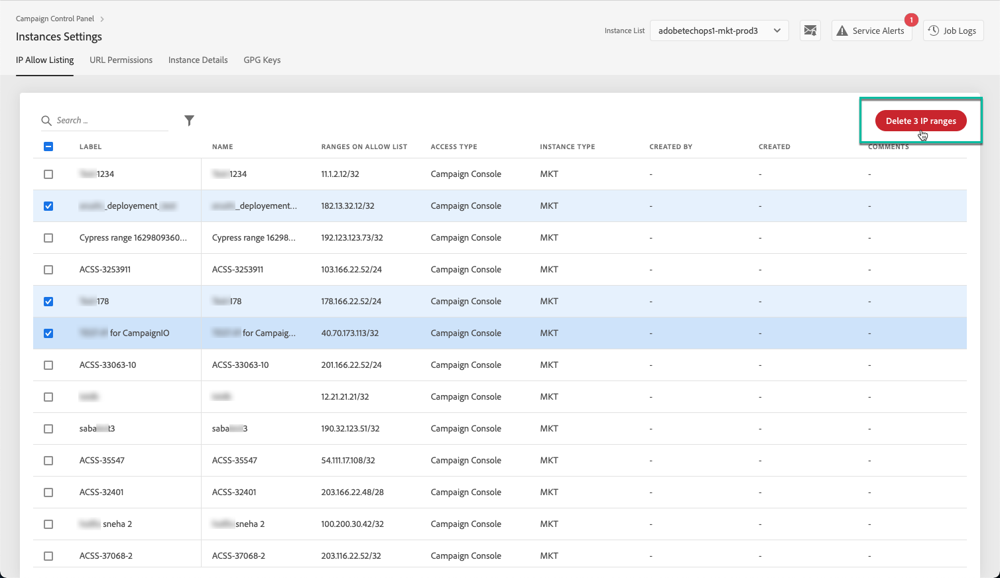

# IP-adressen toevoegen aan de lijst van gewenste IP-adressen {#ip-allow-listing}

>[!CONTEXTUALHELP]
>id="cp_instancesettings_iprange"
>title="IP-adressen toevoegen aan de lijst van gewenste IP-adressen"
>abstract="Voeg IP-adressen aan de lijst van gewenste IP-adressen toe om toegang tot uw instanties te hebben."
>additional-url="https://images-tv.adobe.com/mpcv3/045cac99-f948-478e-ae04-f8c161dcb9e2_1568132508.1920x1080at3000_h264.mp4" text="Demovideo bekijken"

## IP-adressen toevoegen aan de lijst van gewenste IP-adressen {#about-ip-allow-listing}

>[!IMPORTANT]
>
>Deze functie is alleen beschikbaar voor instanties van Campagne v7/v8.
>
>Als u een instantie met een hybride hostingmodel gebruikt, kunt u alleen IP-adressen toevoegen in &quot;Externe API-verbinding&quot; voor RT-instantie.

Standaard is uw Adobe Campaign-instantie niet toegankelijk via verschillende IP-adressen.

Als uw IP-adres niet aan de lijst van gewenste IP-adressen is toegevoegd, kunt u zich niet bij de instantie aanmelden vanaf dit adres. U kunt evenmin een API met uw Message Center of Marketing-instantie verbinden als het IP-adres niet uitdrukkelijk aan de lijst van gewenste IP-adressen met de instantie is toegevoegd.

Via het Configuratiescherm kunt u nieuwe verbindingen met uw instanties instellen door IP-adresbereiken aan de lijst van gewenste IP-adressen toe te voegen. Volg de onderstaande stappen om dit te doen.

Zodra IP-adressen in de lijst van gewenste IP-adressen staan, kunt u Campaign-operators maken en aan de IP-adressen koppelen, zodat de gebruikers toegang tot de instantie kunnen krijgen.

 [Ontdek deze functie in video](https://experienceleague.adobe.com/docs/campaign-classic-learn/control-panel/instance-settings/ip-allow-listing.html#instance-settings)

## Best practices {#best-practices}

Volg de onderstaande aanbevelingen en beperkingen wanneer u IP-adressen toevoegt aan de lijst van gewenste IP-adressen in het Configuratiescherm.

* **Schakel IP-toegang niet voor alle toegangstypen in** als u niet wilt dat het IP-adres verbinding maakt met uw RT-servers of de AEM-beveiligingszone.
* **Als u toegang tot uw instantie tijdelijk hebt ingeschakeld voor een IP-adres**, dient u de IP-adressen uit de lijst van gewenste IP-adressen te verwijderen zodra u niet langer wilt dat het verbinding maakt met uw instantie.
* **U kunt beter geen IP-adressen van openbare gelegenheden (luchthavens, hotels, enz.) aan de lijst van gewenste IP-adressen toevoegen.** Gebruik het adres van uw bedrijfs-VPN om uw instantie te allen tijde veilig te houden.

## IP-adressen aan de lijst van gewenste personen toevoegen, bijvoorbeeld toegang tot instantie {#adding-ip-addresses-allow-list}

>[!CONTEXTUALHELP]
>id="cp_instancesettings_iprange_add"
>title="Configuratie van IP-bereik"
>abstract="Definieer het IP-bereik dat u aan de lijst van gewenste IP-adressen wilt toevoegen om verbinding te maken met uw instantie."

>[!NOTE]
>
>Als de **[!UICONTROL Instance Settings]** De kaart is niet zichtbaar op de homepage van het Configuratiescherm. Dit betekent dat uw IMS-organisatie-id niet is gekoppeld aan Adobe Campaign v7/v8-instanties.

Ga als volgt te werk om IP-adressen aan de lijst van gewenste IP-adressen toe te voegen:

1. Open de **[!UICONTROL Instances Settings card]** voor toegang tot het tabblad voor toevoeging van IP-adressen aan de lijst van gewenste IP-adressen en klik vervolgens op **[!UICONTROL Add new IP Range]**.

   

1. Vul de informatie in voor het IP-bereik dat u aan de lijst van gewenste IP-adressen wilt toevoegen zoals hieronder beschreven.

   

   * **[!UICONTROL Instance(s)]**: De instanties waarmee de IP-adressen verbinding kunnen maken. Verschillende instanties kunnen tegelijkertijd worden gemanipuleerd. Het toevoegen van IP-adressen aan de lijst van gewenste IP-adressen kan bijvoorbeeld op productie- en stage-instanties worden uitgevoerd via dezelfde stap.
   * **[!UICONTROL IP Range]**: Het IP-bereik dat u aan de lijst van gewenste IP-adressen wilt toevoegen, in CIDR-indeling. Een IP-bereik mag een bestaand bereik in de lijst van gewenste IP-adressen niet overlappen. Verwijder in dat geval eerst het bereik met de overlappende IP-adressen.

   >[!NOTE]
   >
   >CIDR (Classless Inter-Domain Routing) is de ondersteunde indeling bij het toevoegen van IP-bereiken met de interface van het Configuratiescherm. De syntaxis bestaat uit een IP-adres, gevolgd door een slash (/) en een decimaal getal. De indeling en bijbehorende syntaxis worden uitgebreid beschreven in [dit artikel](https://whatismyipaddress.com/cidr).
   >
   >U kunt op internet zoeken naar gratis online tools waarmee u het IP-bereik dat u hebt, kunt omzetten in CIDR-indeling.

   * **[!UICONTROL Label]**: Het label dat in de lijst van gewenste IP-adressen wordt weergegeven.
   * **[!UICONTROL Name]**: De naam moet uniek zijn voor het toegangstype, de instantie (in het geval van een externe API-verbinding) en het IP-adres.

1. Specificeer het type toegang dat u aan de IP-adressen wilt verlenen:

   * **[!UICONTROL Campaign Console Access]**: De IP-adressen mogen verbinding maken met de Campagne Client Console. Toegang tot de console is alleen ingeschakeld voor Marketing-instanties. Toegang tot MID- en RT-instanties is niet toegestaan en daarom niet ingeschakeld.
   * **[!UICONTROL AEM connection]**: De opgegeven AEM IP-adressen mogen verbinding maken met de Marketing-instantie.
   * **[!UICONTROL External API connection]**: Externe API’s met de opgegeven IP-adressen kunnen verbinding maken met de Marketing- en/of Message Center-instantie (RT). Verbinding met de console van RT-instanties is niet ingeschakeld.

      >[!NOTE]
      >
      >Als u een instantie met een hybride hostingmodel gebruikt, kunt u alleen IP-adressen toevoegen in &quot;Externe API-verbinding&quot; voor RT-instantie.
   

1. Klik op de knop **[!UICONTROL Save]**. Het IP-bereik wordt toegevoegd aan de lijst van gewenste IP-adressen.

   <!---->

Standaard is uw Adobe Campaign-instantie niet toegankelijk via verschillende IP-adressen.

Om één of meerdere IP waaiers van de lijst van gewenste personen te schrappen, selecteer hen, dan klik **[!UICONTROL Delete IP range]** knop.

**Verwant onderwerp:**

* [Een beveiligingszone koppelen aan een operator](https://docs.campaign.adobe.com/doc/AC/en/INS_Additional_configurations_Configuring_Campaign_server.html#Linking_a_security_zone_to_an_operator)
