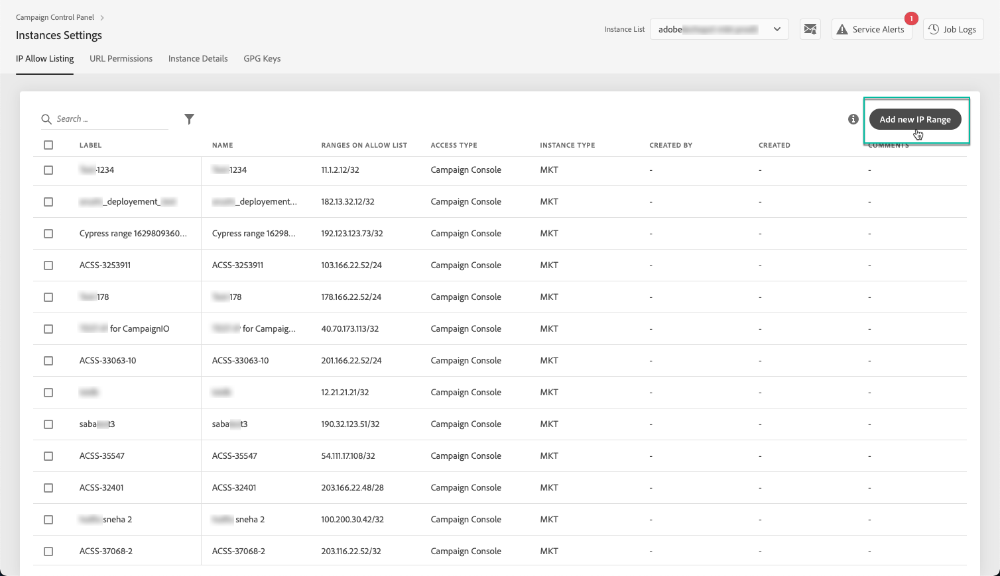

# IP-whitelisting {#ip-whitelisting}

>[!CONTEXTUALHELP]
>id="cp_instancesettings_iprange"
>title="Informatie over IP Whitelisting"
>abstract="Beheer IP whitelisting om tot uw instanties toegang te hebben."
>additional-url="https://images-tv.adobe.com/mpcv3/045cac99-f948-478e-ae04-f8c161dcb9e2_1568132508.1920x1080at3000_h264.mp4" text="Video over demo bekijken"

>[!IMPORTANT]
>
>Deze functie is alleen beschikbaar voor klassieke instanties van de campagne.

## Informatie over IP-whitelisting {#about-ip-whitelisting}

Standaard is uw Adobe Campagne Classic-instantie niet toegankelijk vanaf verschillende IP-adressen.

Als uw IP adres niet is gewhitelisted, zult u niet aan login aan de instantie van dit adres kunnen. Op dezelfde manier kunt u mogelijk geen API verbinden met uw Message Center- of marketinginstantie als het IP-adres niet expliciet is vermeld met de instantie.

Met het Configuratiescherm kunt u nieuwe verbindingen met uw instanties instellen door een whiteling toe te voegen aan IP-adresbereiken. Volg de onderstaande stappen om dit te doen.

Zodra IP adressen gewhitelisteerd, kunt u de exploitanten van de Campagne tot stand brengen en verbinden aan hen zodat de gebruikers tot de instantie kunnen toegang hebben.

## Aanbevolen procedures {#best-practices}

Volg de onderstaande aanbevelingen en beperkingen wanneer u een zwevend IP-adres opgeeft in het Configuratiescherm.

* **Laat IP geen toegang tot alle Types** van Toegang toe als u niet het IP adres om met uw servers van RT, of de veiligheidsstreek van AEM van plan bent te verbinden.
* **Als u tijdelijk toegang tot uw instantie voor een IP adres** toeliet, zorg ervoor om de IP adressen uit de whitelisted IP adressen te verwijderen zodra u het niet meer nodig hebt om met uw instantie te verbinden.
* **We raden geen whitelingIP-adressen van openbare plaatsen** aan (luchthavens, hotels, enz.). Gelieve te gebruiken uw adres van bedrijfsVPN om uw instantie te allen tijde veilig te houden.

## Whitelisting IP adressen voor de toegang van de Instantie {#whistelisting-ip-addresses}

>[!CONTEXTUALHELP]
>id="cp_instancesettings_iprange_add"
>title="Nieuw IP-bereik toevoegen"
>abstract="Bepaal de IP waaier die u aan whitelist om met uw instantie wilt verbinden."

Aan whitelist IP adressen, volg deze stappen:

1. Open de **[!UICONTROL Instances Settings card]** voor toegang tot het tabblad voor het in de whitelist opnemen van IP-adressen en klik vervolgens op **[!UICONTROL Add new IP Range]**.

   >[!NOTE]
   >
   >Als de Instellingenkaart van de Instantie niet zichtbaar is op de homepage van het Controlebord, betekent dit dat uw identiteitskaart van IMS ORG niet met om het even welke Classic Instanties van de Campagne van Adobe wordt geassocieerd

   

1. Vul de informatie voor de IP Waaier in die u aan whitelist zoals hieronder beschreven wilt.

   

   * **[!UICONTROL Instance(s)]**: De instanties waaraan de IP adressen zullen kunnen verbinden. Verschillende instanties kunnen tegelijkertijd worden gemanipuleerd. IP-whitelisting kan bijvoorbeeld in dezelfde stap worden uitgevoerd op zowel de instantie Productie als de instantie Stage.
   * **[!UICONTROL IP Range]**: De IP waaier die u aan whitelist, in het formaat CIDR wilt. Merk op dat een IP waaier een bestaand gebeiteld waaier niet kan overlappen. In dat geval, schrap eerst de waaier die overlappende IP bevat.
   >[!NOTE]
   >
   >CIDR (het Klasseloze Verpletteren inter-Domein) is het gesteunde formaat wanneer het toevoegen van IP waaiers met de interface van het Controlebord. De syntaxis bestaat uit een IP-adres, gevolgd door een &#39;/&#39;-teken en een decimaal getal. De opmaak en syntaxis worden volledig in [dit artikel](https://whatismyipaddress.com/cidr)beschreven.
   >
   >U kunt op internet zoeken naar gratis onlinegereedschappen waarmee u het IP-bereik dat u hebt, kunt omzetten in de CIDR-indeling.

   * **[!UICONTROL Label]**: Het label dat in de whitelisted IP adreslijst zal tonen.
   * **[!UICONTROL Name]**: De naam moet uniek zijn voor het toegangstype, de instantie (in het geval van een externe API-verbinding) en het IP-adres.

1. Specificeer het type van toegang dat u aan de IP adressen wilt verlenen:

   * **[!UICONTROL Campaign Console Access]**: De IP adressen zullen worden toegestaan om met de Klassieke Console van de Campagne te verbinden. De toegang van de Console wordt toegelaten voor slechts instanties van de Marketing. Toegang tot MID- en RT-instanties is niet toegestaan en daarom niet ingeschakeld.
   * **[!UICONTROL AEM connection]**: De opgegeven AEM IP-adressen mogen verbinding maken met de marketinginstantie.
   * **[!UICONTROL External API connection]**: Externe API&#39;s met de opgegeven IP-adressen kunnen verbinding maken met de instantie Marketing en/of Message Center (RT). Merk op dat de verbinding aan de console van instanties RT niet wordt toegelaten.
   

1. Klik op de **[!UICONTROL Save]** knop. De IP Waaier wordt toegevoegd aan de lijst van whitelisted IP adressen.

   

Om gewhitelisteerde IP waaiers te schrappen, selecteer hen dan de **[!UICONTROL Delete IP range]** knoop.

**Verwante onderwerpen:**
* [IP-whitelisting (videozelfstudie)](https://docs.adobe.com/content/help/en/campaign-learn/campaign-classic-tutorials/administrating/control-panel-acc/ip-whitelisting.html)
* [Een beveiligingszone koppelen aan een operator](https://docs.campaign.adobe.com/doc/AC/en/INS_Additional_configurations_Configuring_Campaign_server.html#Linking_a_security_zone_to_an_operator)
