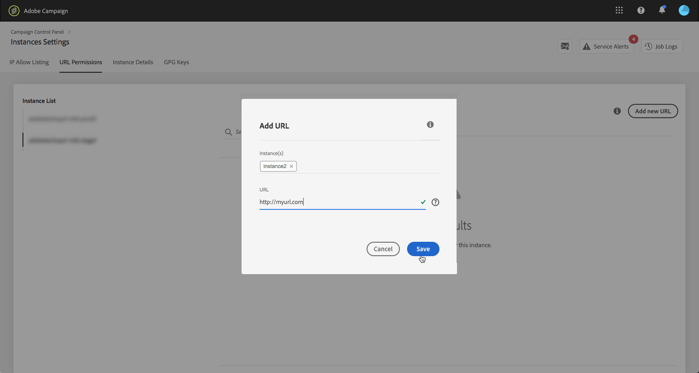

# URL-machtigingen {#url-permissions}

>[!CONTEXTUALHELP]
>id="cp_instancesettings_urlpermissions"
>title="Informatie over URL-machtigingen"
>abstract="Beheer de URL’s waarmee uw Adobe Campaign-instanties verbinding kunnen maken."
>additional-url="https://images-tv.adobe.com/mpcv3/91206a19-d9af-4b6a-8197-0d2810a78941_1563488165.1920x1080at3000_h264.mp4" text="Demovideo bekijken"

## Informatie over URL-machtigingen {#about-url-permissions}

>[!IMPORTANT]
>
>Deze functie is alleen beschikbaar voor instanties van de categorieën Campagne v8 en Campaign Classic v7, van build 8850. Als u een eerdere build gebruikt, moet u een upgrade uitvoeren om deze functie te kunnen gebruiken.

De standaardlijst met URL’s die via JavaScript-codes kunnen worden aangeroepen (workflows, enz.) door uw campagneinstanties beperkt zijn. Dit zijn URL’s waardoor uw instanties correct kunnen werken.

Instanties mogen standaard geen verbinding maken met externe URL’s. In het Configuratiescherm kunt u enkele externe URL’s toevoegen aan de lijst met geoorloofde URL’s, zodat uw instantie er verbinding mee kan maken. Hierdoor kunt u uw Campaign-instanties verbinden met externe systemen zoals SFTP-servers of websites, om de overdracht van bestanden en/of data mogelijk te maken.

Wanneer een URL is toegevoegd, wordt hiernaar verwezen in het configuratiebestand van de instantie (serverConf.xml).

 [Ontdek deze functie in video](https://experienceleague.adobe.com/docs/campaign-classic-learn/control-panel/instance-settings/adding-url-permissions.html?lang=en#instance-settings)

**Verwante onderwerpen:**

* [Campaign-server configureren](https://docs.campaign.adobe.com/doc/AC/en/INS_Additional_configurations_Configuring_Campaign_server.html)
* [Uitgaande verbindingsbeveiliging](https://experienceleague.adobe.com/docs/campaign-classic/using/installing-campaign-classic/security-privacy/server-configuration.html#outgoing-connection-protection)

## Best practices {#best-practices}

* Verbind uw Campaign-instantie niet met websites/servers waarmee u geen verbinding wilt maken.
* Verwijder URL’s waarmee u niet meer werkt. Houd er echter rekening mee dat als een ander gedeelte van uw bedrijf nog steeds verbinding maakt met de URL die u hebt verwijderd, niemand deze meer kan gebruiken.
* Het Configuratiescherm ondersteunt het **http**-, **https**- en **sftp**-protocol. Het invoeren van ongeldige URL’s of protocollen leidt tot fouten.

## URL-machtigingen beheren {#managing-url-permissions}

>[!CONTEXTUALHELP]
>id="cp_instancesettings_url_add"
>title="Nieuwe URL toevoegen"
>abstract="Voeg URL’s toe om verbindingen met uw Campaign-instantie toe te staan."

Ga als volgt te werk om een URL toe te voegen waarmee uw instantie verbinding kan maken:

1. Open de **[!UICONTROL Instances Settings]**-kaart om toegang te krijgen tot het tabblad **[!UICONTROL URL Permissions]**.

   >[!NOTE]
   >
   >Als de Instellingenkaart van de Instantie niet zichtbaar is op de homepage van het Controlebord, betekent dit dat uw IMS Organisatie ID niet met om het even welke instanties van Adobe Campaign wordt geassocieerd
   >
   >Het tabblad <b>URL permissions</b> bevat alle externe URL’s waarmee uw instantie verbinding kan maken. Deze lijst bevat geen URL’s die vereist zijn om Campaign te laten werken (bijvoorbeeld verbindingen tussen infrastructuuronderdelen).

1. Selecteer in het linkerdeelvenster de gewenste instantie en klik op de knop **[!UICONTROL Add new URL]**.

   

   >[!NOTE]
   >
   >Alle Campaign-instanties worden weergegeven in de lijst in het linkerdeelvenster.
   >
   >Aangezien het beheer van URL-machtigingen specifiek is voor Campaign Classic-instanties, wordt het bericht ‘Non-Applicable Instance’ weergegeven als u een Campaign Standard-instantie selecteert.

1. Typ de URL die u wilt autoriseren met het bijbehorende protocol (http, https of sftp).

   >[!NOTE]
   >
   >Het is mogelijk meerdere instanties te autoriseren om verbinding te maken met de URL. Daarvoor voegt u ze rechtstreeks toe vanuit het veld Instance(s) door de eerste letter te typen.

   

1. De URL wordt toegevoegd aan de lijst en u kunt er nu verbinding mee maken.

   >[!NOTE]
   >
   >De “/.*’’ worden automatisch toegevoegd aan het einde van de ingevoerde URL nadat deze is gevalideerd, zodat alle subpagina’s van de ingevoerde pagina inbegrepen zijn.

   

U kunt een URL op elk gewenst moment verwijderen door deze te selecteren en op de knop **[!UICONTROL Delete URL]** te klikken.

Houd er rekening mee dat als u een URL verwijdert, uw instantie deze niet opnieuw kan aanroepen.

## Algemene vragen {#common-questions}

**Ik heb een nieuwe URL toegevoegd, maar mijn instantie kan nog steeds geen verbinding maken met die URL. Hoe komt dat?**

In sommige gevallen moeten URL’s waarmee u verbinding probeert te maken, aan de lijst van gewenste URL’s worden toegevoegd. Het kan ook dat ze een wachtwoord of een andere vorm van verificatie vereisen. Aanvullende verificatie wordt niet beheerd in het Configuratiescherm.
