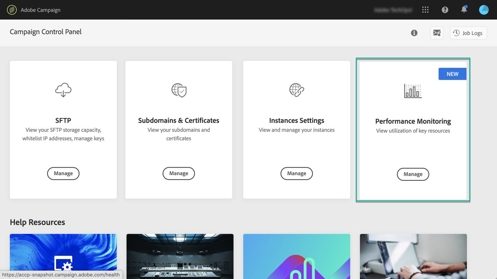

# Over prestatiebewaking {#about-performance-monitoring}

Het Configuratiescherm biedt verschillende functies waarmee u uw instanties kunt controleren en optimale prestaties kunt garanderen.

Met de **[!UICONTROL Performance monitoring]**-kaart op de startpagina van het Configuratiescherm kunt u het gebruik van uw Campagneinstanties, zoals bijvoorbeeld hun databasecapaciteit, controleren. Raadpleeg [deze sectie](../../performance-monitoring/using/database-monitoring.md) voor meer informatie.

>[!NOTE]
>
>Met de aanstaande versies van het Controlebord, zullen de extra controlefuncties beschikbaar worden gemaakt in deze kaart.

Bovendien kunt u zich via het Configuratiescherm aanmelden voor het ontvangen van e-mailmeldingen telkens wanneer een probleem wordt gedetecteerd in een van uw campagneexemplaren. Raadpleeg [deze sectie](../../performance-monitoring/using/email-alerting.md) voor meer informatie.

