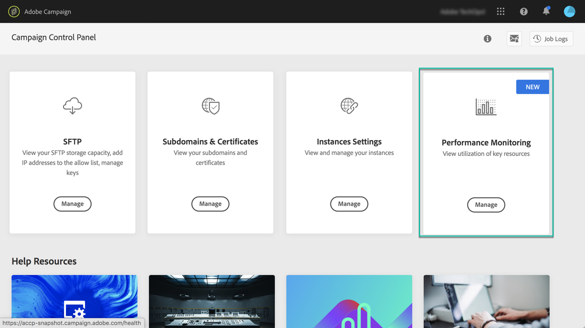

# Prestatiebewaking {#about-performance-monitoring}

Het Configuratiescherm biedt verschillende functies waarmee u uw instanties kunt controleren en optimale prestaties kunt garanderen.

De **[!UICONTROL Performance monitoring]** Met de kaart in de startpagina van het Configuratiescherm kunt u het gebruik van uw Campagneinstanties, zoals bijvoorbeeld hun databasecapaciteit, controleren. Raadpleeg [deze sectie](../../performance-monitoring/using/database-monitoring.md) voor meer informatie.

>[!NOTE]
>
>Met de aanstaande versies van het Controlebord, zullen de extra controlefuncties beschikbaar worden gemaakt in deze kaart.

