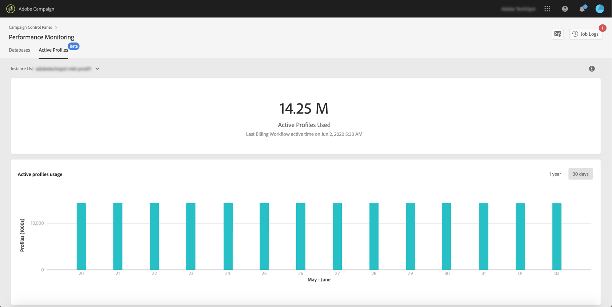

# Bewaking van actieve profielen {#active-profiles-monitoring}

## Actieve profielen {#about-active-profiles}

>[!IMPORTANT]
>
>Bewaking van actieve profielen vanuit het Configuratiescherm is beschikbaar in de bètaversie en kan regelmatig worden bijgewerkt en gewijzigd zonder kennisgeving. Het is beschikbaar bij Campaign Standard 10368-build.

Volgens uw contract worden al uw Campaign-instanties ingericht met een specifieke hoeveelheid actieve profielen die voor factureringsdoeleinden worden geteld. Raadpleeg uw meest recente contract voor informatie over het aantal aangeschafte actieve profielen.

‘Profiel’ betreft een datarecord (bijv. een record in de nmsRecipient-tabel of een externe tabel met een cookie-id, klant-id, mobiele id of andere informatie die relevant is voor een bepaald kanaal) die een eindklant, prospect of lead vertegenwoordigt.

Profielen worden als actief beschouwd als ze de afgelopen twaalf maanden via een kanaal zijn getarget of gecommuniceerd.

>[!NOTE]
>
>Er wordt geen rekening gehouden met de kanalen Facebook en Twitter.

Raadpleeg voor meer informatie over actieve profielen de documenten [Campaign Standard](https://docs.adobe.com/content/help/nl-NL/campaign-standard/using/profiles-and-audiences/managing-profiles/active-profiles.html) en [Campaign Classic v7](https://docs.adobe.com/content/help/nl-NL/campaign-classic/using/getting-started/profile-management/about-profiles.html#active-profiles).

## Actieve profielen bewaken {#monitoring-active-profiles}

Met het Configuratiescherm kunt u het gebruik van actieve profielen voor al uw Campaign-instanties bewaken.

Ga als volgt te werk om dit te doen:

1. Open de **[!UICONTROL Performance Monitoring]**-kaart en selecteer vervolgens het tabblad **[!UICONTROL Active Profiles]**.

1. Selecteer de gewenste instantie in het menu **[!UICONTROL Instance List]**.

1. U ziet het aantal actieve profielen dat door de instantie wordt gebruikt en de laatste keer dat de factureringsworkflow op uw instantie is uitgevoerd.

>[!NOTE]
>
>Actieve profielen worden geteld op basis van speciale technische workflows die dagelijks op uw instanties worden uitgevoerd:
>
>* De workflow [Billing](https://docs.adobe.com/help/nl-NL/campaign-standard/using/administrating/application-settings/technical-workflows.html) voor Campaign Standard,
>* De workflow [Number of active billing profiles](https://experienceleague.adobe.com/docs/campaign-classic/using/automating-with-workflows/advanced-management/about-technical-workflows.html) voor Campaign Classic.

Het onderste gebied biedt een grafische weergave van het gebruik van actieve profielen in de afgelopen 30 dagen. Met de beschikbare filters in de rechterbovenhoek kunt u de weergegeven periode wijzigen in 1 jaar.

Als u een van de grafiekbalken aanwijst, kunt u het exacte aantal actieve profielen ophalen dat wordt gebruikt in de geselecteerde periode.
