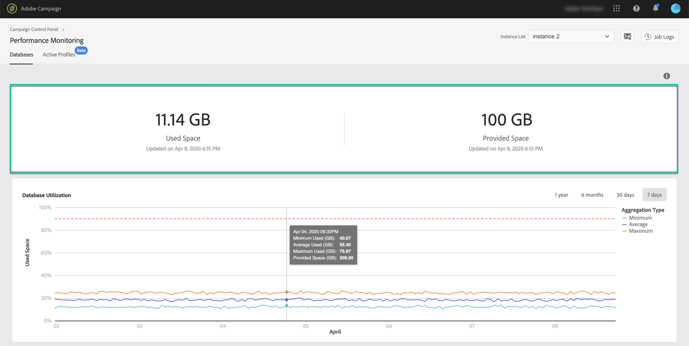
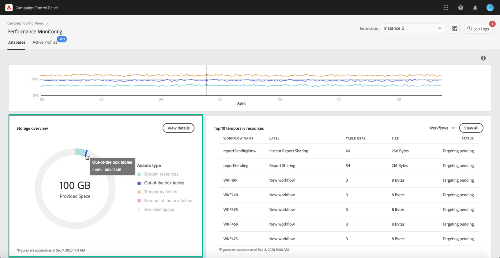
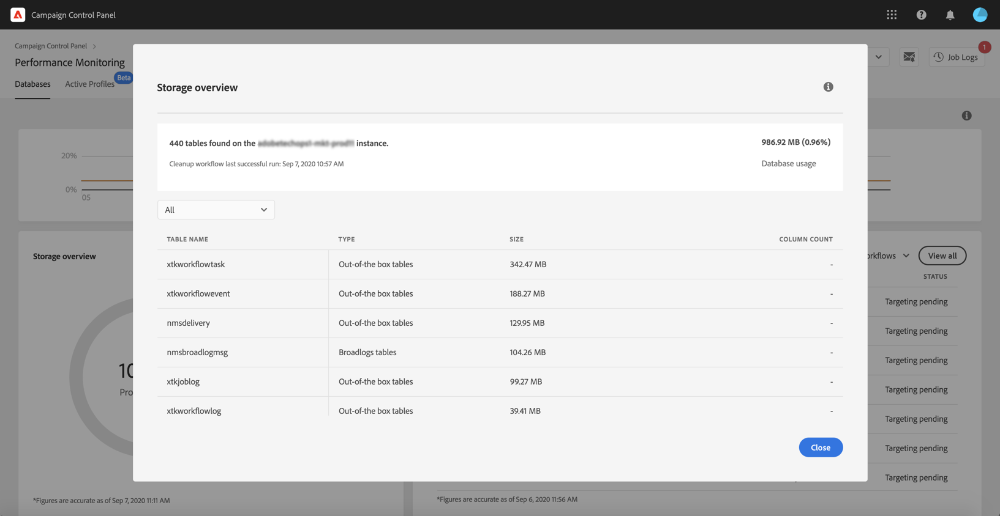
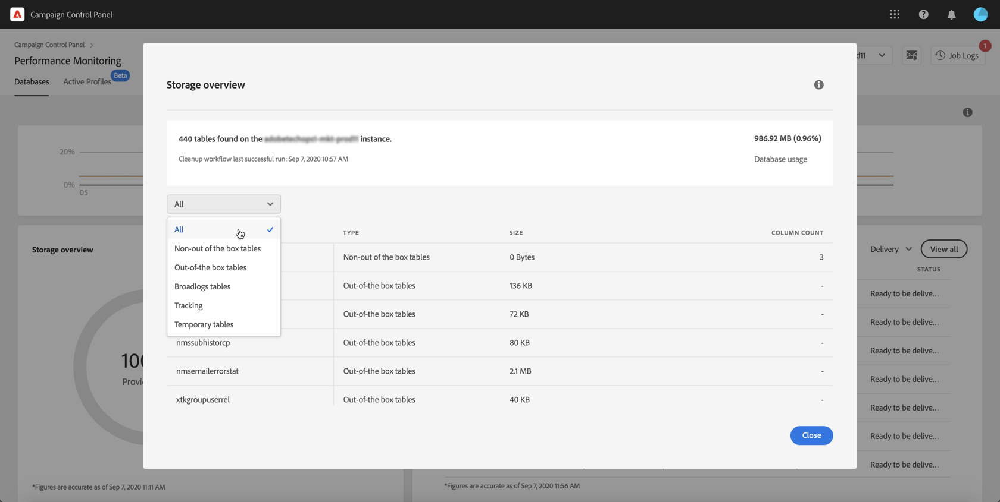
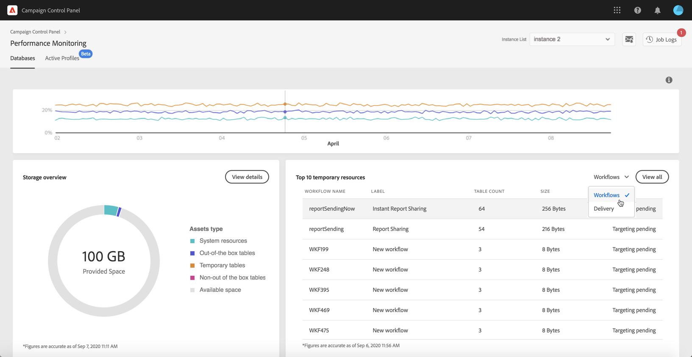
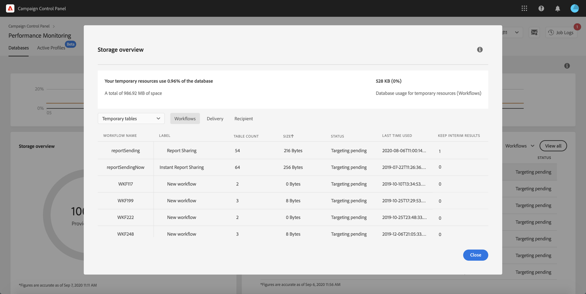

# Database controleren {#database-monitoring}

## Over versies van databases {#about-instances-databases}

Volgens uw contract wordt elk van uw Campaign-versies voorzien van een specifieke hoeveelheid gegevensbestandruimte.

Databases omvatten alle **assets**, **workflows** en **gegevens** die zijn opgeslagen in Adobe Campaign.

Na verloop van tijd kunnen databases hun maximale capaciteit bereiken, vooral als de opgeslagen bronnen nooit vanuit de versie worden verwijderd of als er veel workflows in een gepauzeerde staat zijn.

Het overlopen van een versie van een database kan leiden tot verschillende problemen (niet kunnen aanmelden, e-mails verzenden, enz.). Het is daarom van essentieel belang dat de databases van uw versies worden gecontroleerd om optimale prestaties te garanderen.

>[!NOTE]
>
>Neem contact op met de klantenservice als de hoeveelheid beschikbare databaseruimte zoals weergegeven in het configuratiescherm niet overeenkomt met de hoeveelheid die in uw contract is gespecificeerd.

## Controle van het gebruik van databases {#monitoring-instances-database}

 Deze functie in video ontdekken met [Campaign Classic](https://experienceleague.adobe.com/docs/campaign-classic-learn/control-panel/performance-monitoring/monitoring-databases.html?lang=nl#performance-monitoring) of [Campaign Standard](https://experienceleague.adobe.com/docs/campaign-standard-learn/control-panel/performance-monitoring/monitoring-databases.html?lang=nl#performance-monitoring).

Met het configuratiescherm kunt u het databasegebruik voor elk van uw Campaign-versies controleren. Open hiervoor de **[!UICONTROL Performance Monitoring]**-kaart en selecteer het tabblad **[!UICONTROL Databases]**.

Selecteer de gewenste versie vanuit de **[!UICONTROL Instance List]** om informatie weer te geven over de capaciteit van de versiedatabase en de gebruikte ruimte.

>[!NOTE]
>
>Merk op dat de gegevens van dit dashboard worden bijgewerkt op basis van de **[!UICONTROL Database cleanup technical workflow]** die wordt uitgevoerd op uw Campaign-versie (zie documentatie [Campaign Standard](https://docs.adobe.com/nl/help/en/campaign-standard/using/administrating/application-settings/technical-workflows.html#list-of-technical-workflows) en [Campaign Classic](https://docs.adobe.com/help/nl-NL/campaign-classic/using/monitoring-campaign-classic/data-processing/database-cleanup-workflow.html)).
>
>U kunt daarnaast controleren of u berichten kunt ontvangen wanneer één van uw databases vol is geraakt tijdens de laatste keer dat de workflow werd uitgevoerd met de metrieke waarden **[!UICONTROL Used Space]** en **[!UICONTROL Provided Space]**. Als de workflow al meer dan drie dagen niet meer is uitgevoerd, raden wij u aan de klantenservice van Adobe te raadplegen zodat ze kunnen onderzoeken waarom de workflow niet wordt uitgevoerd.

De onderstaande aanvullende metrische gegevens zijn beschikbaar in dit dashboard om u te helpen het gebruik van de versie van de database te analyseren.

### Databasegebruik {#database-utilization}

Het gedeelte **[!UICONTROL Database utilization]** biedt een grafische weergave van het minimale, gemiddelde en maximale databasegebruik van de afgelopen zeven dagen, evenals de drempel van 90% databasegebruik, weergegeven door een rode stippellijn.

Gebruik de filters in de rechterbovenhoek van de grafiek om de tijdsperiode te wijzigen.

U kunt ook één of meerdere lijnen in de grafiek markeren voor een betere leesbaarheid. U doet dit door deze te selecteren vanuit de **[!UICONTROL Aggregation Type]**-legenda.

U beweegt de muisaanwijzer over de grafiek om informatie weer te geven over het databasegebruik dat op dat moment is gemaakt voor meer informatie over een specifieke tijdsperiode.

### Overzicht van opslag {#storage-overview}

Het gedeelte **[!UICONTROL Storage overview]** biedt een grafische weergave van de ruimte die wordt ingenomen door:

* **[!UICONTROL System resources]**

   Let op: als systeembronnen een groot deel van de databaseruimte verbruiken, raden wij u aan de klantenservice te raadplegen.

* **[!UICONTROL Out-of-the-box tables]** standaard geleverd bij uw Campaign-versies,
* **[!UICONTROL Temporary tables]** gemaakt door workflows en verzendingen;
* **[!UICONTROL Non-out of the box tables]** gegenereerd na het maken van aangepaste bronnen.

Klik op de knop **[!UICONTROL View details]** voor meer informatie over de verschillende assets die databaseruimte verbruiken.

Gebruik het filter om uw zoekopdracht te verfijnen en alleen de tabellen van een specifieke asset weer te geven.

### De tien belangrijkste tijdelijke bronnen {#top-10}

In het gedeelte **[!UICONTROL Top 10 temporary resources]** worden de tien grootste tijdelijke bronnen weergegeven die worden gegenereerd door workflows en verzendingen.

Het controleren van workflows en verzendingen die grote tijdelijke resources maken, is een belangrijke stap bij de controle van uw database. Als een tijdelijke bron te veel databaseruimte in beslag neemt, zorg er dan voor dat deze workflow of verzending noodzakelijk is en navigeer naar uw versie om deze te stoppen.

>[!IMPORTANT]
>
>De algemene aanbeveling is om te voorkomen dat er niet **meer dan 40 kolommen** zijn in niet-standaardresources.

>[!NOTE]
>
>Als een workflow een groot aantal tabeltellingen of een grote databaseomvang bevat, raden we aan de workflow te controleren om te onderzoeken waarom deze zoveel gegevens genereert.
>
>Bronnen voor Campaign Standard en Classic zijn ook beschikbaar aan het eind van deze pagina om u te helpen bij het voorkomen van databaseoverbelasting.

De knop **[!UICONTROL View all]** geeft u toegang tot gedetailleerde informatie over deze tijdelijke bronnen.

>[!NOTE]
>
>De waarde in de kolom **[!UICONTROL Keep interim results]** geeft aan of de optie is ingeschakeld (1) of uitgeschakeld (0) in Campaign. De optie **[!UICONTROL Keep interim results]** is toegankelijk in de eigenschappen van workflows. Hiermee kunt u de resultaten van de overgangen tussen de verschillende activiteiten van een workflow opslaan (zie documentatie voor [Campaign Standard](https://docs.adobe.com/content/help/nl/campaign-standard/using/managing-processes-and-data/executing-a-workflow/managing-execution-options.html) en [Campaign Classic](https://docs.adobe.com/content/help/nl/campaign-classic/using/automating-with-workflows/general-operation/workflow-best-practices.html#logs)).
>
>Als de optie is ingeschakeld voor een van uw workflows, kan de workflow voor het opschonen van de database de ruimte die door tussentijdse resultaten wordt verbruikt, niet vrijmaken. We raden aan de workflow te controleren om te zien of de optie kan worden uitgeschakeld.

## Databaseoverbelasting voorkomen {#preventing-database-overload}

Campaign Standard en Classic bieden verschillende manieren om overconsumptie van de databaseruimte op de schijf te voorkomen.

In het onderstaande gedeelte vindt u nuttige bronnen uit Campaign-documentatie om u te helpen uw databasegebruik te optimaliseren:

**Workflows controleren**

* [Best practices van workflows](https://docs.adobe.com/content/help/nl/campaign-standard/using/managing-processes-and-data/workflow-general-operation/best-practices-workflows.html)  (Campaign Standard)
* [Uitvoering van workflow controleren](https://docs.adobe.com/help/nl-NL/campaign-classic/using/automating-with-workflows/monitoring-workflows/monitoring-workflow-execution.html) (Campaign Classic)

**Databaseonderhoud**

* Technische workflow voor opschonen van databases ([Campaign Standard](https://docs.adobe.com/nl/help/en/campaign-standard/using/administrating/application-settings/technical-workflows.html#list-of-technical-workflows) / [Campaign Classic](https://docs.adobe.com/help/nl-NL/campaign-classic/using/monitoring-campaign-classic/data-processing/database-cleanup-workflow.html))
* [Handleiding voor databaseonderhoud](https://docs.adobe.com/content/help/nl/campaign-classic/using/monitoring-campaign-classic/database-maintenance/recommendations.html) (Campaign Classic)
* [Problemen met databaseprestaties oplossen](https://experienceleague.adobe.com/docs/campaign-classic/using/monitoring-campaign-classic/troubleshooting-toc/database-issues-toc/database-performances.html?lang=nl) (Campaign Classic)
* [Databasegerelateerde opties](https://docs.adobe.com/help/nl-NL/campaign-classic/using/installing-campaign-classic/appendices/configuring-campaign-options.html#database) (Campaign Classic)
* Gegevensretentie ([Campaign Standard](https://docs.adobe.com/help/nl-NL/campaign-standard/using/administrating/application-settings/data-retention.html) / [Campaign Classic](https://docs.adobe.com/help/nl-NL/campaign-classic/using/configuring-campaign-classic/data-model/data-model-best-practices.html#data-retention))

>[!NOTE]
>
>Bovendien kunt u berichten ontvangen wanneer één van uw databases zijn capaciteit bereikt. Hiervoor wordt u lid van [e-mailwaarschuwingen](../../performance-monitoring/using/email-alerting.md).
