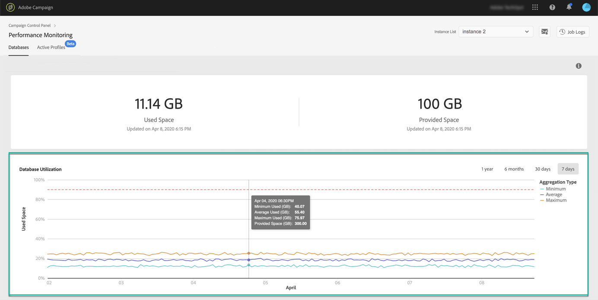

# Bewaking van databases {#database-monitoring}

## Informatie over databases {#about-instances-databases}

Volgens uw contract, wordt elk van uw instanties van de Campagne provisioned met een specifieke hoeveelheid gegevensbestandruimte.

Databases omvatten alle **assets**, **workflows** en **data** die in Adobe Campaign zijn opgeslagen.

In tijd, kunnen de gegevensbestanden hun maximumcapaciteit bereiken, vooral als de opgeslagen middelen nooit van de instantie worden geschrapt, of als er vele werkschema&#39;s in een gepauzeerde staat zijn.

Het overlopen van een instantiedatabase kan leiden tot verschillende problemen (het niet aanmelden, e-mails verzenden enz.). Het is daarom van essentieel belang dat de databases van uw instanties worden gecontroleerd om optimale prestaties te garanderen.

>[!NOTE]
>
>Als de hoeveelheid beschikbare databaseruimte, zoals weergegeven in het Configuratiescherm, niet overeenkomt met de hoeveelheid die in uw contract is opgegeven, dient u contact op te nemen met de klantenservice.

## Gebruik van database {#monitoring-instances-database} controleren

 Deze functie in video ontdekken met  [Campagne ](https://experienceleague.adobe.com/docs/campaign-classic-learn/control-panel/performance-monitoring/monitoring-databases.html?lang=en#performance-monitoring) Classicor  [Campaign Standard](https://experienceleague.adobe.com/docs/campaign-standard-learn/control-panel/performance-monitoring/monitoring-databases.html?lang=en#performance-monitoring)

Met het Configuratiescherm kunt u het databasegebruik voor elk van uw campagneinstanties controleren. Om dit te doen, open **[!UICONTROL Performance Monitoring]** kaart, dan selecteer **[!UICONTROL Databases]** tabel.

Selecteer de gewenste instantie in de **[!UICONTROL Instance List]** om informatie weer te geven over de databasecapaciteit van de instantie en de gebruikte ruimte.

>[!NOTE]
>
>Merk op dat de gegevens van dit dashboard gebaseerd op **[!UICONTROL Database cleanup technical workflow]** worden bijgewerkt die op uw instantie van de Campagne loopt (zie [Campaign Standard](https://docs.adobe.com/help/en/campaign-standard/using/administrating/application-settings/technical-workflows.html#list-of-technical-workflows) en [Campaign Classic](https://docs.adobe.com/help/en/campaign-classic/using/monitoring-campaign-classic/data-processing/database-cleanup-workflow.html) documentatie).
>
>U kunt de laatste keer controleren dat de workflow onder de metriek **[!UICONTROL Used Space]** en **[!UICONTROL Provided Space]** liep. Als de workflow al meer dan drie dagen niet meer wordt uitgevoerd, raden wij u aan de klantenservice van Adobe te raadplegen zodat zij onderzoeken waarom de workflow niet wordt uitgevoerd.

In dit dashboard zijn aanvullende gegevens beschikbaar, die hieronder worden beschreven, om u te helpen het gebruik van de database van de instantie te analyseren:

* [Databasegebruik](../../performance-monitoring/using/database-monitoring.md#database-utilization)
* [Overzicht van opslag](../../performance-monitoring/using/database-monitoring.md#storage-overview)
* [De 10 belangrijkste tijdelijke bronnen](../../performance-monitoring/using/database-monitoring.md#top-10)

### Databasegebruik {#database-utilization}

Het gebied **[!UICONTROL Database utilization]** verstrekt een grafische vertegenwoordiging van het minimum, gemiddelde en maximumgegevensbestandgebruik over de laatste 7 dagen evenals de drempel van het 90% gegevensbestandgebruik die door een rode gestippelde kromme wordt vertegenwoordigd.

Als u de tijdsperiode wilt wijzigen, gebruikt u de filters die beschikbaar zijn in de rechterbovenhoek van de grafiek.

Voor een betere leesbaarheid kunt u ook een of meer curven in de grafiek markeren. U doet dit door deze te selecteren in de legenda **[!UICONTROL Aggregation Type]**.

Houd de muisaanwijzer boven de grafiek voor meer informatie over een bepaalde periode om informatie weer te geven over het databasegebruik dat op dat moment is gemaakt.

### Overzicht van opslag {#storage-overview}

Het gebied **[!UICONTROL Storage overview]** biedt een grafische weergave van de ruimte die wordt ingenomen door:

* **[!UICONTROL System resources]**

   Let op: als systeembronnen een groot deel van de databaseruimte verbruiken, raden wij u aan de klantenservice te bereiken.

* **[!UICONTROL Out-of-the-box tables]** standaard bij uw campagneinstanties worden geleverd,
* **[!UICONTROL Temporary tables]** ontstaan door workflows en leveringen;
* **[!UICONTROL Non-out of the box tables]** gegenereerd na het maken van aangepaste bronnen.

Klik op de knop **[!UICONTROL View details]** voor meer informatie over de verschillende elementen die databaseruimte verbruiken.

Gebruik het filter om uw zoekopdracht te verfijnen en tabellen alleen van een specifiek elementtype weer te geven.

### De tien belangrijkste tijdelijke bronnen {#top-10}

In het gebied **[!UICONTROL Top 10 temporary resources]** worden de tien grootste tijdelijke bronnen weergegeven die worden gegenereerd door workflows en leveringen.

Het controleren van werkstromen en leveringen die grote tijdelijke middelen creëren is een zeer belangrijke stap om uw gegevensbestand te controleren. Als om het even welke tijdelijke bron teveel gegevensbestandruimte verbruikt, zorg ervoor dat het hebben van dit werkschema of levering noodzakelijk is, en navigeer uiteindelijk aan uw instantie om het tegen te houden.

>[!IMPORTANT]
>
>De algemene aanbeveling moet vermijden hebbend **meer dan 40 kolommen** in niet uit de doosmiddelen.

>[!NOTE]
>
>Als een werkschema wordt gevonden om een groot aantal lijsttellingen of gegevensbestandgrootte te hebben, adviseren wij het herzien van het werkschema om te onderzoeken waarom het zo veel gegevens produceert.
>
>Campaign Standard en Klassieke middelen zijn ook beschikbaar aan het eind van deze pagina helpen u gegevensbestandoverbelasting verhinderen.

Met de knop **[!UICONTROL View all]** hebt u toegang tot gedetailleerde informatie over deze tijdelijke bronnen.

>[!NOTE]
>
>De waarde in de kolom **[!UICONTROL Keep interim results]** geeft aan of de optie is ingeschakeld (&quot;1&quot;) of uitgeschakeld (&quot;0&quot;) in Campagne. De optie **[!UICONTROL Keep interim results]** is toegankelijk in de eigenschappen van workflows. Hiermee kunt u de resultaten van de overgangen tussen de verschillende activiteiten van een workflow opslaan (zie [Campaign Standard](https://docs.adobe.com/content/help/en/campaign-standard/using/managing-processes-and-data/executing-a-workflow/managing-execution-options.html) en [Campaign Classic](https://docs.adobe.com/content/help/en/campaign-classic/using/automating-with-workflows/general-operation/workflow-best-practices.html#logs) documentatie).
>
>Als de optie is ingeschakeld voor een van uw workflows, kan de workflow voor het opschonen van databases de ruimte die door tussentijdse resultaten wordt verbruikt, niet vrijmaken. We raden daarom aan de workflow te herzien om te controleren of de optie kan worden uitgeschakeld.

## Database-overbelasting {#preventing-database-overload} voorkomen

Campaign Standard en Klassiek bieden verschillende manieren om overconsumptie van databaseschijfruimte te voorkomen.

In de onderstaande sectie vindt u nuttige informatie uit Campagne-documentatie om u te helpen uw databasegebruik te optimaliseren:

**Workflows bewaken**

* [Aanbevolen werkstromen](https://docs.adobe.com/content/help/en/campaign-standard/using/managing-processes-and-data/workflow-general-operation/best-practices-workflows.html)  (Campaign Standard)
* [Uitvoering](https://docs.adobe.com/help/en/campaign-classic/using/automating-with-workflows/monitoring-workflows/monitoring-workflow-execution.html)  van controlewerkstroom (Campaign Classic)

**Databaseonderhoud**

* Technische workflow voor opschonen van databases ([Campaign Standard](https://docs.adobe.com/help/en/campaign-standard/using/administrating/application-settings/technical-workflows.html#list-of-technical-workflows) / [Campaign Classic](https://docs.adobe.com/help/en/campaign-classic/using/monitoring-campaign-classic/data-processing/database-cleanup-workflow.html))
* [Handleiding voor](https://docs.adobe.com/content/help/en/campaign-classic/using/monitoring-campaign-classic/database-maintenance/recommendations.html)  databaseonderhoud (Campaign Classic)
* [Problemen met](https://docs.adobe.com/content/help/en/campaign-classic/using/monitoring-campaign-classic/troubleshooting/database-performances.html)  databaseprestaties oplossen (Campaign Classic)
* [Databasegerelateerde opties](https://docs.adobe.com/help/en/campaign-classic/using/installing-campaign-classic/appendices/configuring-campaign-options.html#database)  (Campaign Classic)
* Gegevensbewaring ([Campaign Standard](https://docs.adobe.com/help/en/campaign-standard/using/administrating/application-settings/data-retention.html) / [Campaign Classic](https://docs.adobe.com/help/en/campaign-classic/using/configuring-campaign-classic/data-model/data-model-best-practices.html#data-retention))

>[!NOTE]
>
>Bovendien kunt u meldingen ontvangen wanneer een van uw databases zijn capaciteit bereikt. Hiervoor meldt u zich aan [e-mailwaarschuwingen](../../performance-monitoring/using/email-alerting.md).
