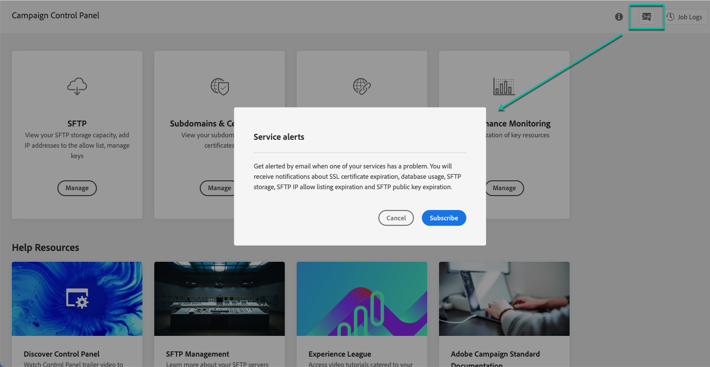
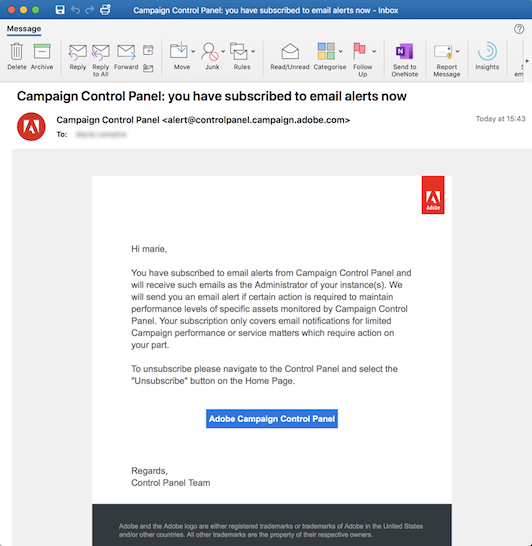

# E-mailwaarschuwingen {#email-alerting}

Voor meer flexibiliteit in uw werk is het Configuratiescherm uitgerust met de functionaliteit voor realtime e-mailwaarschuwingen.

## Lijst van signaleringen {#list}

De lijst van signaleringen ziet er als volgt uit:

* **Opslaggebruik SFTP**: Een van uw SFTP-servers heeft 80% of meer van de capaciteit bereikt. Zie [SFTP-opslagbeheer](../../sftp/using/sftp-storage-management.md).

* **Databasegebruik**: Een van de databases van uw instanties heeft 80% of meer van de capaciteit bereikt. Zie [Bewaking van databases](../../performance-monitoring/using/database-monitoring.md).

* **SFTP IP staat het verlopen van de lijst toe**: Één van de IP waaiers u bepaalde is verlopen of zal in 10 dagen of minder verlopen. Zie [Aanbieding in IP-bereik toegestaan](../../sftp/using/ip-range-allow-listing.md).

* **Vervaldatum openbare sleutel SFTP**: Een van de openbare sleutels die u hebt gedefinieerd, is verlopen of verloopt over tien dagen of minder. Zie [Sleutelbeheer](../../sftp/using/key-management.md).

* **verlopen SSL-certificaat**: Een van de SSL-certificaten van uw subdomeinen is verlopen of verloopt over 30 dagen of minder. Zie [SSL-certificaten van subdomeinen controleren](../../subdomains-certificates/using/monitoring-ssl-certificates.md).

<!--* **Long running Queries**: A query has been running for more than 24 hours on one of your instances. See [Monitoring active queries](database-active-queries.md).-->

>[!NOTE]
>
>Bovendien kunt u in het Configuratiescherm **herinneringen instellen** om per e-mail op de hoogte te worden gesteld voordat er een gebeurtenis op uw instanties zal plaatsvinden (releases en servicebeoordelingen).
>
>Hiervoor moet u zich op e-mailwaarschuwingen hebben geabonneerd en een herinnering voor de gewenste komende gebeurtenissen instellen. [Leer hoe u herinneringen voor volgende gebeurtenissen instelt](../../service-events/service-events.md#reminders)

## Abonneren op waarschuwingen {#subscribe}

Voer de volgende stappen uit om u te abonneren op deze waarschuwingen:

1. Klik op de knop **[!UICONTROL Alerting notifications]** klikt u op een willekeurige locatie in het Configuratiescherm en vervolgens op **[!UICONTROL Subscribe]**.

   

1. Er wordt een e-mail verzonden ter bevestiging van uw abonnement.

   

1. Nadat u zich hebt geabonneerd, geeft het Configuratiescherm een melding over systeemproblemen en worden de acties aanbevolen die moeten worden uitgevoerd. E-mailwaarschuwingen worden verzonden naar iedereen die zich heeft aangemeld voor **alle instanties** dat zij administrateurs van zijn.

   
