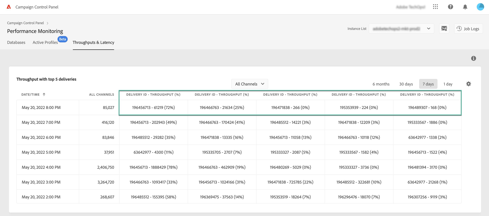

# Doorvoer en latentiebewaking {#throughputs-latency-monitoring}

>[!CONTEXTUALHELP]
>id="cp_performancemonitoring_throughputslatencies"
>title="Doorvoer en latentiebewaking "
>abstract="Op dit tabblad kunt u bewaken hoe de leveringsdoorvoer en latentie zich gedurende een bepaalde periode ontwikkelen op uw instanties. Voor informatie over leveranties die tot de productie bijdragen, schakelaar aan tabelmening."

Met het Configuratiescherm kunt u de doorvoer en latentie van de levering voor elk van uw instanties controleren.

>[!IMPORTANT]
>
>Deze functie is beschikbaar voor alle Campaign Standard- en v8-klanten en voor Campaign V7-klanten met buildnummers 9032,9330, 9346 of 9349 die [standalone](https://experienceleague.adobe.com/docs/campaign-classic/using/installing-campaign-classic/deployment-types-/standalone-deployment.html?lang=nl) implementaties (zonder tussenkomst).

Het is belangrijk om te bewaken hoe de leveringsdoorvoer en latentie zich ontwikkelen over een bepaalde periode om het gebruik van uw instanties te begrijpen en ervoor te zorgen dat ze goed presteren.

Deze informatie wordt beschikbaar gemaakt in het configuratiescherm voor elk van uw Campaign-instanties op de kaart **[!UICONTROL Performance Monitoring]**, het tabblad **[!UICONTROL Throughputs & Latency]** (het kan maximaal 1 uur duren voordat de cijfers worden weergegeven in het configuratiescherm).

>[!NOTE]
>
>Alle cijfers in dit gebied zijn schattingen en alleen ter informatie.

Standaard worden gegevens voor de huidige dag weergegeven. U kunt de weergegeven tijdsduur wijzigen met de knoppen **[!UICONTROL 6 months]**, **[!UICONTROL 30 days]** en **[!UICONTROL 7 days]**. Gegevens worden gepresenteerd:
* Uur gedurende 1 dag en 7 dagen,
* 6 uur voor een weergave van 30 dagen,
* Dagelijks gedurende 6 maanden.

U kunt informatie ook visualiseren in tabelindeling met sorteerbare kolommen in plaats van een grafiek. Klik hiervoor op de knop **[!UICONTROL Visualization settings]** en selecteer vervolgens **[!UICONTROL Table]**.

## Monitoringreflectie {#throughput}

Het gebied **[!UICONTROL Throughput]** geeft informatie over het aantal berichten dat per uur wordt verzonden vanuit de geselecteerde Campaign-instantie voor alle communicatiekanalen waar u recht op hebt.

>[!NOTE]
>
>Voor Campaign v7/v8 is het getoonde doorvoernummer de doorvoer die van MID-instanties (midsourcing) wordt bereikt. Voor MKT-implementaties (standalone marketing) (zonder enige MID-instantie) wordt in plaats daarvan de doorvoer van de MKT-instantie getoond.

Bovendien, staat het Controlebord u toe om IDs van top 5 te identificeren die tot de productie voor de geselecteerde periode bijdragen. Deze informatie is alleen beschikbaar in de tabelweergave:

## Latentie monitor {#latency}

Het gebied **[!UICONTROL Latency]** biedt informatie over de latentie die op de geselecteerde instantie wordt aangetroffen bij het verzenden van realtimetransactiecommunicatie.

>[!NOTE]
>
>Opmerking: informatie met betrekking tot **Latentie profiel** is ook beschikbaar voor [!DNL Campaign Standard] alleen instanties.

Latenties worden vastgelegd en visualiseerd met een percentiel van 95 en 99, wat betekent dat 95% en 99% van de verzoeken sneller moeten zijn dan de opgegeven latentie.

Standaard wordt de latentie voor alle kanalen weergegeven. Met de vervolgkeuzelijst kunt u de latentie voor een specifiek kanaal visualiseren.

>[!NOTE]
>
>Kanaalfilters zijn alleen beschikbaar voor Campaign Classic v7/v8-instanties.
