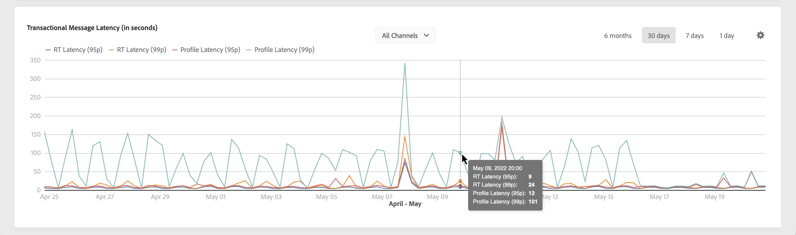

# Doorvoer en latentiebewaking {#throughputs-latency-monitoring}

>[!CONTEXTUALHELP]
>id="cp_performancemonitoring_throughputslatencies"
>title="Doorvoer en latentiebewaking "
>abstract="Op dit tabblad kunt u bewaken hoe de leveringsdoorvoer en latentie zich gedurende een bepaalde periode ontwikkelen op uw instanties."

Het is belangrijk om te bewaken hoe de leveringsdoorvoer en latentie zich ontwikkelen over een bepaalde periode om het gebruik van uw instanties te begrijpen en ervoor te zorgen dat ze goed presteren.

Deze informatie is beschikbaar in het configuratiescherm voor elk van uw Campaign-instanties op het tabblad **[!UICONTROL Performance Monitoring]** kaart, **[!UICONTROL Throughputs & Latencies]**.

>[!NOTE]
>
>Alle cijfers in dit gebied zijn schattingen en alleen ter informatie.

Standaard worden gegevens voor de huidige dag weergegeven. U kunt de weergegeven tijdsduur wijzigen met de knoppen **[!UICONTROL 6 months]**, **[!UICONTROL 30 days]** en **[!UICONTROL 7 days]**.

Het gebied **[!UICONTROL Throughput]** geeft informatie over het aantal berichten dat per uur wordt verzonden vanuit de geselecteerde Campaign-instantie voor alle communicatiekanalen waar u recht op heeft.

U kunt deze informatie ook visualiseren in een tabelindeling met sorteerbare kolommen in plaats van een grafiek. Klik hiervoor op de knop **[!UICONTROL Visualization settings]** en selecteer vervolgens **[!UICONTROL Table]**.

Het gebied **[!UICONTROL Latency]** biedt informatie over de latentie die op de geselecteerde instantie wordt aangetroffen bij het verzenden van realtimetransactiecommunicatie. Latenties worden vastgelegd en visualiseerd met een percentiel van 95 en 99, wat betekent dat 95% en 99% van de verzoeken sneller moeten zijn dan de opgegeven latentie.

