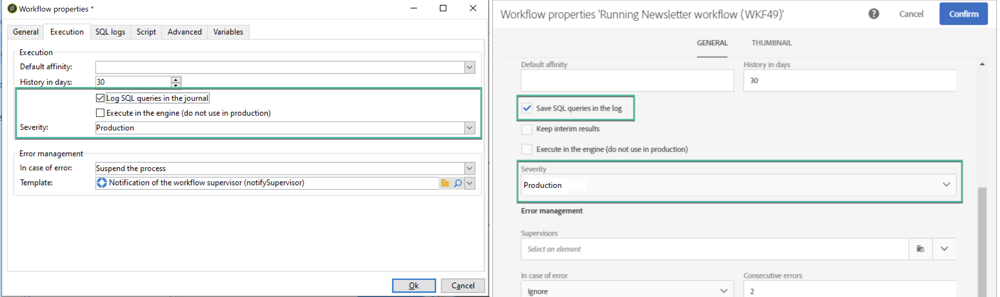

# Workflows controleren {#monitor-workflows}

<!-- Clean paused and completed workflows

When [!DNL Adobe Campaign] workflows are paused or completed, they leave temporary tables on your instances database that consume space and can lead to performance issues.

Control Panel allows you to identify those workflows and clean the temporary resources generated on your instances.

>[!NOTE]
>
>Technically, this operation executes the **[!UICONTROL Database cleanup technical workflow]** that runs on your Campaign instance everyday (see [Campaign Standard](https://experienceleague.adobe.com/docs/campaign-standard/using/administrating/application-settings/technical-workflows.html#list-of-technical-workflows) and [Campaign Classic](https://experienceleague.adobe.com/docs/campaign-classic/using/monitoring-campaign-classic/data-processing/database-cleanup-workflow.html) documentation). 

To clean paused and completed workflows, follow these steps:

1. Navigate to the **[!UICONTROL Performance monitoring]** card.

1. In the **[!UICONTROL Databases]** tab, select the instance where you want to perform the operation.

1. Access the **[!UICONTROL Storage overview]** details, then filter the list on **[!UICONTROL Temporary tables]**. Learn more on **[!UICONTROL Storage overview]** in [this page](database-storage-overview.md).

    

1. All temporary tables generated on your instances by workflows and deliveries display. Click the **[!UICONTROL Clean now]** button to delete the resources generated by paused and completed workflows.

    

1. Once the operation is confirmed, you can track the estimated remaining time in the **[!UICONTROL Storage overview]** list.

    

Monitor workflow parameters -->

In Adobe Campaign is het mogelijk dat bepaalde parameters voor de workflow speciale aandacht vereisen om problemen met uw instanties te voorkomen. Het regelpaneel **[!UICONTROL Storage overview]** Met de details kunt u controleren of een van deze opties is ingeschakeld voor uw workflows.

## **[!UICONTROL Keep interim results]** {#keep-results}

Als deze optie is ingeschakeld (waarde &quot;1&quot;), worden de resultaten van de overgangen tussen de verschillende activiteiten van een workflow opgeslagen. Meer informatie in [Campaign Standard](https://experienceleague.adobe.com/docs/campaign-standard/using/managing-processes-and-data/executing-a-workflow/managing-execution-options.html?lang=nl) en [Campaign Classic](https://experienceleague.adobe.com/docs/campaign-standard/using/managing-processes-and-data/executing-a-workflow/managing-execution-options.html?lang=nl) documentatie.

>[!IMPORTANT]
>
>Deze optie mag nooit worden ingeschakeld in een productieworkflow. Het wordt gebruikt voor analyse- en testdoeleinden en mag daarom alleen worden gebruikt in ontwikkelings- of testomgevingen. We raden u ten zeerste aan het uit te schakelen in Campaign.

## **[!UICONTROL Show SQL log]** {#sql}

Als deze optie is ingeschakeld, worden de SQL-query&#39;s die tijdens de uitvoering van de workflow naar de database worden verzonden, weergegeven in Adobe Campaign. Meer informatie in [Campaign Standard](https://experienceleague.corp.adobe.com/docs/campaign-standard/using/managing-processes-and-data/executing-a-workflow/managing-execution-options.html?lang=en) en [Campaign Classic](https://experienceleague.adobe.com/docs/campaign-classic/using/automating-with-workflows/advanced-management/workflow-properties.html?lang=en#execution) documentatie.

De waarde &quot;1&quot; geeft aan dat de werkstroom de **Ernst** veld ingesteld op &quot;Productie&quot; en dat de optie voor het SQL-querylogboek is ingeschakeld.

>[!IMPORTANT]
>
>Het activeren van deze optie kan gevolgen hebben voor de prestaties en het invullen van de logbestanden op de server. Het mag alleen voor analyse- en diagnosedoeleinden worden gebruikt.

## **[!UICONTROL Supervisors]** {#supervisors}

In dit veld kunt u een operator toewijzen aan een workflow. Als de workflow mislukt, wordt de bijbehorende operator gewaarschuwd. Meer informatie in [Campaign Standard](https://experienceleague.corp.adobe.com/docs/campaign-standard/using/managing-processes-and-data/executing-a-workflow/monitoring-workflow-execution.html?lang=en#error-management) en [Campaign Classic](https://experienceleague.adobe.com/docs/campaign-classic/using/automating-with-workflows/advanced-management/workflow-properties.html?lang=en#error-management) documentatie.

De waarde &quot;1&quot; geeft aan dat de werkstroom de **Ernst** gebied dat aan &quot;Productie&quot;wordt geplaatst en dat geen supervisorgroep aan het werkschema is toegewezen.

