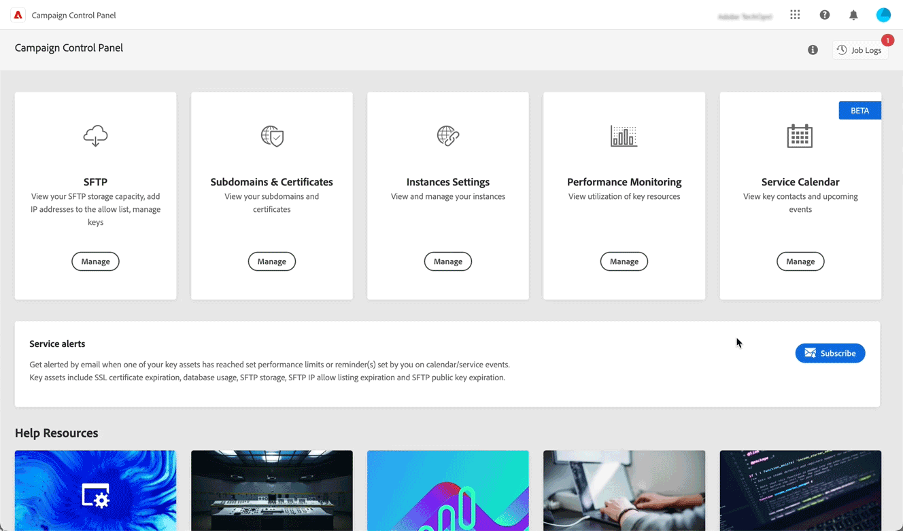

# Nieuwste release {#control-panel-releases}

Deze pagina bevat een overzicht van alle nieuwe functies en verbeteringen van het configuratiescherm.

## Februari 2023 {#february-2023}

**Delegatie verwijderen voor subdomeinen die zijn gedelegeerd aan Adobe**

U kunt nu de delegatie verwijderen van een subdomein dat volledig is gedelegeerd aan Adobe. [Meer informatie](../subdomains-certificates/using/remove-delegated-subdomains.md)

>[!NOTE]
>
>De verwijdering van de delegatie is momenteel niet beschikbaar voor subdomeinen die met behulp van CNAME&#39;s zijn ingesteld.

**Servicekalender**

Servicekalender biedt nu een kalenderweergave om belangrijke gebeurtenissen bij te houden die plaatsvinden in uw instanties. Daarnaast is er informatie toegevoegd over de meldingen die zijn verzonden naar gebruikers die zich hebben aangemeld voor waarschuwingen van het Configuratiescherm. [Meer informatie](../service-events/service-events.md)

