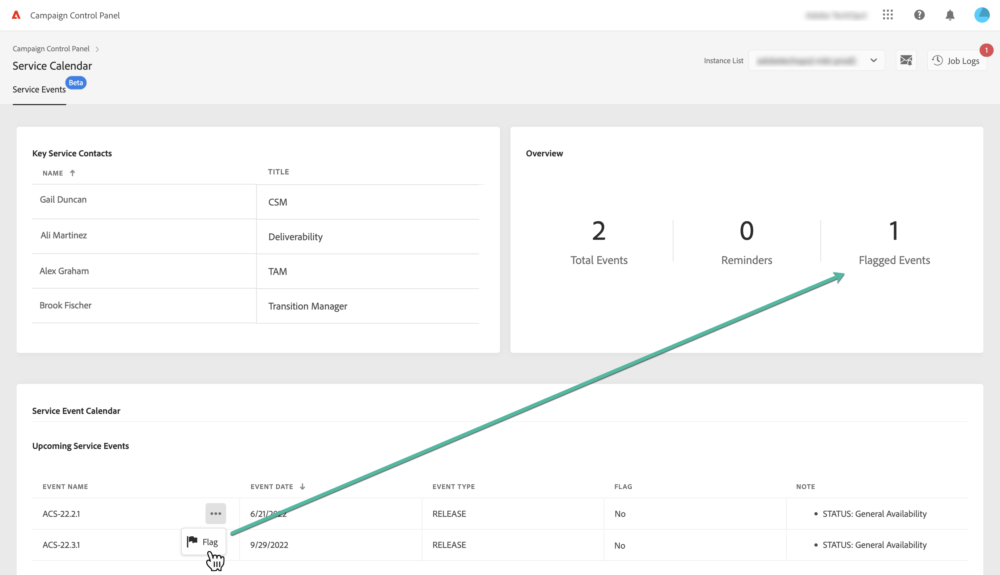

# Belangrijke contacten en gebeurtenissen bewaken {#keycontacts-events}

>[!CONTEXTUALHELP]
>id="cp_servicecalendar_serviceevents"
>title="Servicekalender"
>abstract="De sectie Belangrijke contacten vermeldt de personen bij Adobe met wie u contact kunt opnemen voor elke aanvraag of probleem met uw instanties. In de sectie Servicekalendergebeurtenis kunt u de versies en de servicereviews van de geselecteerde instantie identificeren en herinneringen voor aanstaande gebeurtenissen instellen."

>[!IMPORTANT]
>
>De servicekalender is beschikbaar in de bètaversie en onderhevig aan regelmatige updates en wijzigingen zonder voorafgaande kennisgeving.

Het identificeren van gebeurtenissen die op uw instanties zijn gepland, is essentieel om uw Campaign-instanties te bewaken.

Met het Configuratiescherm kunt u de releases en servicereviews van uw instanties bewaken en toegang krijgen tot een lijst met belangrijke contacten bij Adobe voor elke aanvraag of probleem.

Deze informatie is toegankelijk vanaf de kaart **[!UICONTROL Service Calendar]** op de startpagina van het Configuratiescherm.

## Belangrijke contacten {#key-contacts}

De sectie **[!UICONTROL Key contacts]** bevat de personen bij Adobe met wie u contact kunt opnemen voor elke aanvraag of probleem met uw instanties.

>[!NOTE]
>
>In deze sectie wordt alleen informatie weergegeven voor beheerde serviceaccounts.

De belangrijke contacten omvatten de volgende rollen:

* **[!UICONTROL TAM]**: Technical Account Manager,
* **[!UICONTROL CSM]**: Customer Success Manager,
* **[!UICONTROL Deliverability]**: contactpunt voor afleverbaarheid;
* **[!UICONTROL Transition Manager]**: Managed Services Transition Manager (alleen Managed Services-account),
* **[!UICONTROL On-boarding Specialist]**: specialist die aan het account is toegewezen om u te helpen bij de on-boarding van Campaign Classic (alleen Managed Services-account).

## Gebeurtenissen {#events}

### Gebeurtenissen bewaken {#monitor-events}

Het gedeelte **[!UICONTROL Service Event Calendar]** geeft alle eerdere en toekomstige releases en servicereviews weer voor de geselecteerde instantie.

De kolom **[!UICONTROL Note]** geeft informatie over de status van elke release:

* **[!UICONTROL General availability]**: recentste beschikbare stabiele build.
* **[!UICONTROL Limited availability]**: alleen on-demand implementatie.
* **[!UICONTROL Release candidate]**: engineering gevalideerd. Wachten op controle van productie.
* **[!UICONTROL Pre release]**: eerdere beschikbaarheid voor specifieke klantbehoeften.
* **[!UICONTROL No longer available]**: de build bevat geen grote problemen, maar er is een nieuwe beschikbaar met extra foutoplossingen. Een upgrade is vereist.
* **[!UICONTROL Deprecated]**: ingesloten bekende regressies van de build.
De build wordt niet meer ondersteund. Een upgrade is verplicht.

U kunt een markering aan een of meer aanstaande gebeurtenissen toewijzen om ze te volgen. Klik hiertoe op de knop met 3 puntjes naast de naam van de gebeurtenis.

### Herinneringen instellen {#reminders}

U kunt in de Servicekalender nu herinneringen instellen, zodat u een e-mail ontvangt voordat een gebeurtenis plaatsvindt.

>[!NOTE]
>
>Als u op de hoogte wilt worden gesteld van aanstaande gebeurtenissen, meldt u zich in het Configuratiescherm aan voor e-mailwaarschuwingen. [Meer informatie](../performance-monitoring/using/email-alerting.md)

Ga als volgt te werk om een waarschuwing voor een gebeurtenis in te stellen:

1. Klik op de knop met de drie puntjes naast de gebeurtenis waarvoor u een herinnering wilt ontvangen en selecteer vervolgens **[!UICONTROL Set Reminder]**.

1. Geef de herinnering een naam en selecteer vervolgens de datum waarop u de melding wilt ontvangen voordat de gebeurtenis plaatsvindt.

   

   >[!NOTE]
   >
   >Als u de waarschuwingen van het Configuratiescherm niet hebt ingeschakeld, wordt een bericht weergegeven waarin u zich kunt inschrijven voor de ontvangst van e-mails.

1. De herinnering voor de geselecteerde gebeurtenis is nu ingesteld. U kunt de aanwijzer op elk gewenst moment boven de herinnering plaatsen om de titel weer te geven.

   

   >[!NOTE]
   >
   >U kunt maximaal twee herinneringen instellen voor dezelfde gebeurtenis.

1. Op de datum die in de herinnering is opgegeven, wordt een e-mail verzonden om u te herinneren aan de aanstaande gebeurtenis. De herinnering wordt dan automatisch afgetrokken van het aantal **[!UICONTROL Reminders]** in het Servicekalender-menu.
