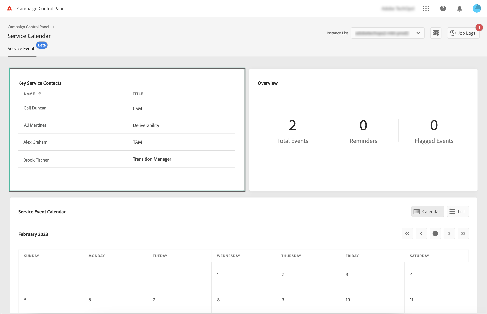

# Belangrijke contacten en gebeurtenissen controleren {#keycontacts-events}

>[!CONTEXTUALHELP]
>id="cp_servicecalendar_serviceevents"
>title="Serviceagenda"
>abstract="De belangrijkste contactensectie maakt een lijst van de personen bij Adobe om voor om het even welk verzoek of kwestie op uw instanties te contacteren. In de sectie van de Kalender van de Gebeurtenis van de Dienst, kunt u alle afgelopen en aanstaande versies en de dienstoverzichten voor de geselecteerde instantie identificeren."

>[!IMPORTANT]
>
>De kalender van de dienst is beschikbaar in bèta, en onderworpen aan regelmatige updates en aanpassingen zonder bericht.

Het is van essentieel belang dat gebeurtenissen die op uw instanties zijn gepland, worden geïdentificeerd om uw campagneinstanties te controleren.

Met Controlebord, kunt u versies en de dienstoverzichten controleren die op uw instanties voorkomen en tot een lijst van zeer belangrijke contacten bij Adobe voor om het even welk verzoek of kwestie toegang hebben.

Deze informatie is toegankelijk via de **[!UICONTROL Service Calendar]** kaart op de startpagina van het Configuratiescherm.

## Belangrijke contacten {#key-contacts}

De **[!UICONTROL Key contacts]** in deze sectie worden de personen op de Adobe vermeld die u kunt contacteren voor een verzoek of afgifte op uw instanties.

>[!NOTE]
>
>Deze sectie zal informatie slechts voor de Beheerde Rekeningen van de Dienst tonen.

De belangrijkste contacten omvatten de volgende rollen:

* **[!UICONTROL TAM]**: Technical Account Manager
* **[!UICONTROL CSM]**: Klantsuccesbeheer,
* **[!UICONTROL Deliverability]**: contactpunt voor de uitvoering van de aflevering;
* **[!UICONTROL Transition Manager]**: Managed Services Transition Manager (alleen Managed Services-account),
* **[!UICONTROL On-boarding Specialist]**: Specialist die aan het account is toegewezen om u te helpen aan boord van een Campaign Classic (alleen Managed Services-account).

## Gebeurtenissen {#events}

De **[!UICONTROL Service Event Calendar]** in deze sectie worden alle eerdere en komende releases en servicebeoordelingen voor de geselecteerde versie weergegeven.

De **[!UICONTROL Note]** de kolom verstrekt informatie over de status van elke versie:

* **[!UICONTROL General availability]**: Meest recente beschikbare stabiele build.
* **[!UICONTROL Limited availability]**: Alleen on-demand implementatie.
* **[!UICONTROL Release candidate]**: Engineering gevalideerd. Wachten op controle van productie.
* **[!UICONTROL Pre release]**: Eerdere beschikbaarheid voor specifieke klantenbehoeften.
* **[!UICONTROL No longer available]**: De build bevat geen belangrijke problemen, maar er is een nieuwe build beschikbaar met extra opgeloste problemen. Een upgrade is vereist.
* **[!UICONTROL Deprecated]**: Bouw bekende regressies in.
De build wordt niet meer ondersteund. Een upgrade is verplicht.

U kunt een vlag aan één of verscheidene aanstaande gebeurtenissen toewijzen om hen te houden. Klik hiertoe op de ovaalknop naast de naam van de gebeurtenis.

