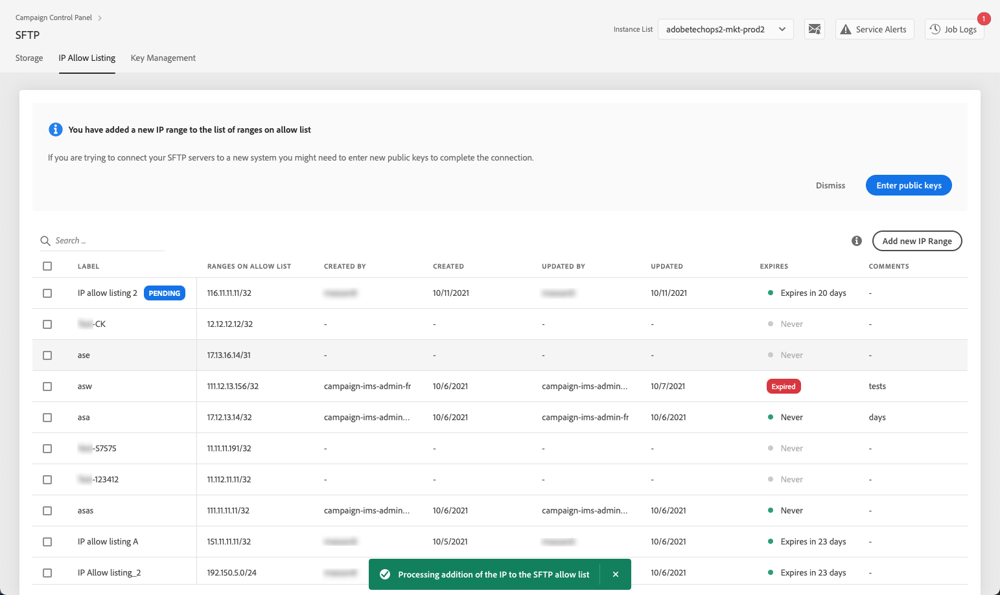
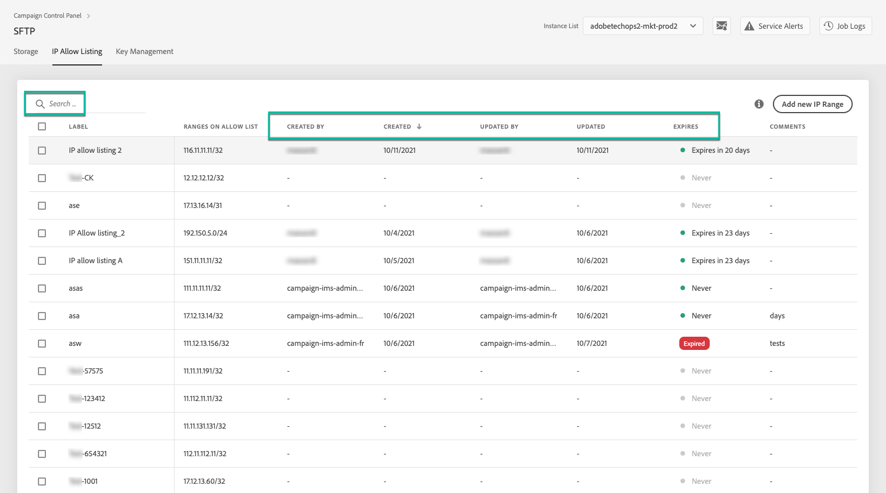
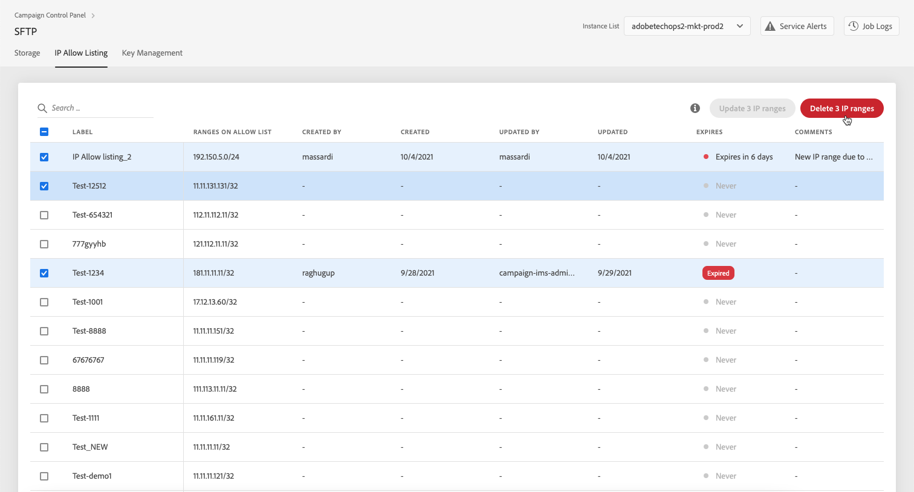

# IP-bereiken toevoegen aan de lijst van gewenste IP-adressen {#ip-range-allow-listing}

>[!CONTEXTUALHELP]
>id="cp_ip_whitelist"
>title="IP-adressen toevoegen aan de lijst van gewenste IP-adressen"
>abstract="Op dit tabblad kunt u IP-bereiken toevoegen aan de lijst van gewenste IP-adressen om een verbinding met uw SFTP-servers tot stand te brengen. Alleen SFTP-servers waartoe u toegang hebt, worden hier weergegeven. Neem contact op met uw beheerder om toegang tot andere SFTP-servers aan te vragen."
>additional-url="https://images-tv.adobe.com/mpcv3/8a977e03-d76c-44d3-853c-95d0b799c870_1560205338.1920x1080at3000_h264.mp4#t=98" text="Demovideo bekijken"

SFTP-servers zijn beveiligd. Om tot hen toegang te hebben tot meningsdossiers of nieuwe degenen te schrijven, moet u het openbare IP adres van het systeem of de cliënt toevoegen die tot de servers aan de lijst van gewenste personen toegang heeft.

 Deze functie in video ontdekken met [Campaign Classic](https://experienceleague.adobe.com/docs/campaign-classic-learn/control-panel/sftp-management/adding-ip-range-to-allow-list.html#sftp-management) of [Campaign Standard](https://experienceleague.adobe.com/docs/campaign-standard-learn/control-panel/sftp-management/adding-ip-range-to-allow-list.html#sftp-management).

## Informatie over de CIDR-indeling {#about-cidr-format}

CIDR (Classless Inter-Domain Routing) is de ondersteunde indeling bij het toevoegen van IP-bereiken met de interface van het Configuratiescherm.

De syntaxis bestaat uit een IP-adres, gevolgd door een slash (/) en een decimaal getal. Het formaat en de syntaxis zijn volledig gedetailleerd in [dit artikel](https://whatismyipaddress.com/cidr){target=&quot;_blank&quot;}.

U kunt op Internet naar vrije online hulpmiddelen zoeken die u zullen helpen de IP waaier omzetten die u in formaat CIDR hebt.

## Best practices {#best-practices}

Volg de onderstaande aanbevelingen en beperkingen wanneer u IP-adressen toevoegt aan de lijst van gewenste IP-adressen in het Configuratiescherm.

* **Voeg IP-bereiken aan de lijst van gewenste IP-adressen toe**, niet afzonderlijke IP-adressen. Als u één IP-adres aan de lijst van gewenste IP-adressen wilt toevoegen, voegt u er ‘/32’ aan toe om aan te geven dat het bereik slechts één IP-adres bevat.
* **Voeg geen zeer grote bereiken, bijvoorbeeld met meer dan 265 IP-adressen, aan de lijst van gewenste IP-adressen toe**. Alle bereiken in CIDR-indeling, die tussen /0 en /23 liggen, worden door het Configuratiescherm verworpen.
* Alleen **openbare IP-adressen** kunnen aan de lijst van gewenste IP-adressen worden toegevoegd.
* Zorg ervoor dat **IP-adressen regelmatig verwijderen** dat u niet meer van de lijst van gewenste personen nodig hebt.

## IP-adressen toevoegen aan de lijst van gewenste IP-adressen {#adding-ip-addresses-allow-list}

>[!CONTEXTUALHELP]
>id="cp_sftp_iprange_add"
>title="Configuratie van IP-bereik"
>abstract="Definieer de IP-bereiken die u aan de lijst van gewenste IP-adressen wilt toevoegen om verbinding te maken met uw SFTP-servers."

Ga als volgt te werk om een IP-bereik aan de lijst van gewenste IP-adressen toe te voegen:

1. Open de **[!UICONTROL SFTP]**-kaart en selecteer vervolgens het tabblad **[!UICONTROL IP Allow Listing]**.
1. De lijst met IP-adressen in de lijst van gewenste IP-adressen wordt voor elke instantie weergegeven. Selecteer de gewenste instantie in de lijst aan de linkerkant en klik op de knop **[!UICONTROL Add new IP range]**.

   

1. Bepaal de IP waaier die u aan de lijst van gewenste personen wilt toevoegen. Dit gebied keurt slechts IP waaiers in formaat CIDR, zoals goed *192.150.5.0/24*.

   

   >[!IMPORTANT]
   >
   >Een IP-bereik mag een bestaand bereik in de lijst van gewenste IP-adressen niet overlappen. Verwijder in dat geval eerst het bereik met de overlappende IP-adressen.

1. Het is mogelijk om een bereik aan de lijst van gewenste personen toe te voegen voor meerdere instanties. U doet dit door op de pijltoets omlaag te drukken of de eerste letters van de gewenste instantie te typen en deze vervolgens te selecteren in de lijst met suggesties.

   

1. Bepaal het etiket dat voor deze IP waaier in de lijst zal tonen.

   

   >[!NOTE]
   >
   >De volgende speciale tekens zijn toegestaan in de **[!UICONTROL Label]** veld:
   > `. _ - : / ( ) # , @ [ ] + = & ; { } ! $`

1. Om uw IP lijst van gewenste personen beter te beheren, kunt u een duur voor de beschikbaarheid van elke IP waaier plaatsen. Selecteer hiertoe een eenheid in het dialoogvenster **[!UICONTROL Type]** vervolgkeuzelijst en definieert een duur in het desbetreffende veld. Voor meer op IP waaiervervaldatum, zie [deze sectie](#expiry).

   

   >[!NOTE]
   >
   >Standaard worden de **[!UICONTROL Type]** veld is ingesteld op **[!UICONTROL Unlimited]**, wat betekent dat de IP waaier nooit verloopt.

1. In de **[!UICONTROL Comment]** veld, kunt u een reden aangeven voor het toestaan van dit IP-bereik (waarom, voor wie, enz.).

1. Klik op de knop **[!UICONTROL Save]**. De IP waaiertoevoeging aan de lijst van gewenste personen zal worden getoond zoals **[!UICONTROL Pending]** tot het verzoek volledig wordt verwerkt, wat slechts een paar seconden zou moeten duren.

   

>[!IMPORTANT]
>
>Als u probeert om uw servers van SFTP aan een nieuw systeem aan te sluiten, en zo nieuwe IP waaiers aan de lijst van gewenste personen toe te voegen, zou u nieuwe openbare sleutels kunnen moeten ingaan om de verbinding te voltooien. Zie [deze sectie](key-management.md)voor meer informatie.

## IP-bereiken beheren {#managing-ip-ranges}

De IP waaiers die u vertoning in creeert **[!UICONTROL IP Allow Listing]** tab.

U kunt de punten sorteren die op de aanmaakdatum of de versiedatum, op de gebruiker worden gebaseerd die creeerde of het, en op de IP waaiervervaldatum uitgeeft.

U kunt ook een IP-bereik doorzoeken door een label, bereik, naam of opmerking te typen.

Om één of meerdere IP waaiers uit te geven, zie [deze sectie](#editing-ip-ranges).

Om één of meerdere IP waaiers van de lijst van gewenste personen te schrappen, selecteer hen, dan klik **[!UICONTROL Delete IP range]** knop.

### Vervaldatum {#expiry}

De **[!UICONTROL Expires]** de kolom toont hoeveel dagen blijven tot de IP waaier zal verlopen.

Als u zich hebt geabonneerd op [e-mailwaarschuwing](../../performance-monitoring/using/email-alerting.md), ontvangt u berichten per e-mail 10 dagen en 5 dagen voordat een IP-reeks verloopt. Op de dag dat deze zal verlopen. Na ontvangst van de waarschuwing kunt u [geef de IP waaier uit](#editing-ip-ranges) zo nodig de geldigheidsduur ervan te verlengen.

Een verlopen IP waaier zal automatisch worden geschrapt na 7 dagen. Het wordt weergegeven als **[!UICONTROL Expired]** in de **[!UICONTROL Expires]** kolom. Binnen deze periode van 7 dagen:

* Een verlopen IP waaier kan niet meer worden gebruikt om tot de servers van SFTP toegang te hebben.

* U kunt geen andere IP waaier tot stand brengen die een verlopen waaier overlapt. U moet eerst de verlopen IP waaier schrappen alvorens nieuwe te creëren.

* U kunt [bewerken](#editing-ip-ranges) een verlopen IP waaier en werk zijn duur bij om het opnieuw ter beschikking te stellen.

* U kunt het uit de lijst van gewenste personen schrappen.

## IP-bereiken bewerken {#editing-ip-ranges}

>[!CONTEXTUALHELP]
>id="cp_sftp_iprange_update"
>title="IP-bereiken bijwerken"
>abstract="Werk de geselecteerde IP waaiers bij toegestaan om met uw server te verbinden SFTP."

Volg onderstaande stappen om IP-bereiken te bewerken.

>[!NOTE]
>
>U kunt IP waaiers slechts uitgeven die sinds de versie van het Controlebord van oktober 2021 zijn gecreeerd.

<!--Edition is not available for IP ranges that have been created before the Control Panel October 2021 release.-->

1. Selecteer één of meerdere IP waaiers van **[!UICONTROL IP Allow Listing]** lijst.

1. Klik op de knop **[!UICONTROL Update IP range]**.

   

1. U kunt de vervaldatum van het IP-bereik alleen bewerken en/of een nieuwe opmerking toevoegen.

   >[!NOTE]
   >
   >Als u de CIDR-indeling, het label of de bijbehorende instantie(s) wilt wijzigen, moet u eerst het IP-bereik verwijderen en een nieuw bereik maken dat aan uw behoeften voldoet.

   

1. Sla uw wijzigingen op.

## Wijzigingen bijhouden {#monitoring-changes}

De **[!UICONTROL Job Logs]** in de homepage van het Controlebord kunt u alle veranderingen volgen en controleren die aan IP adressen op de lijst van gewenste personen zijn aangebracht.

Raadpleeg [deze sectie](../../discover/using/discovering-the-interface.md) voor meer informatie over de interface van het Configuratiescherm.

