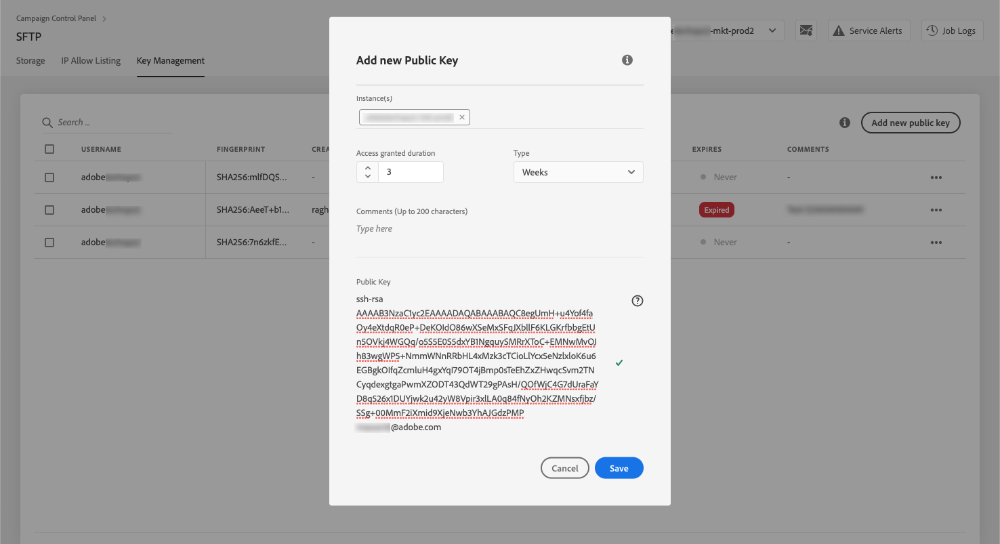
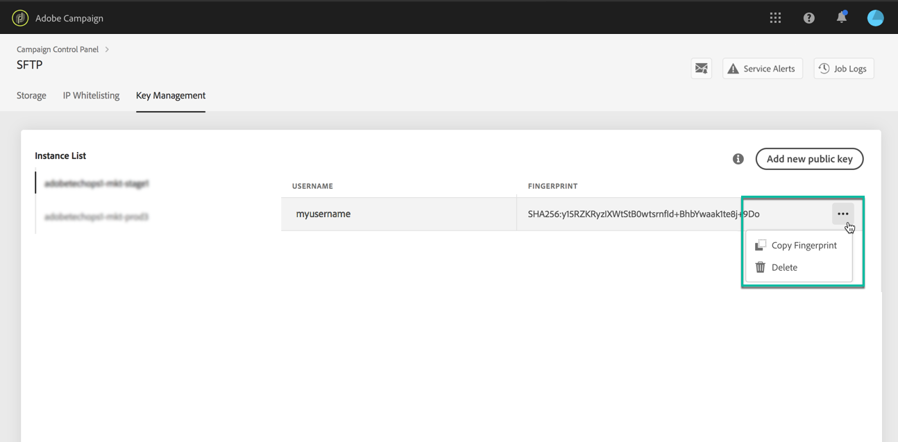

# Sleutelbeheer {#key-management}

>[!CONTEXTUALHELP]
>id="cp_key_management"
>title="Informatie over sleutelbeheer"
>abstract="Op dit tabblad kunt u de openbare sleutels beheren."
>additional-url="https://images-tv.adobe.com/mpcv3/8a977e03-d76c-44d3-853c-95d0b799c870_1560205338.1920x1080at3000_h264.mp4#t=166" text="Demovideo bekijken"

Adobe raadt alle klanten aan verbinding te maken met hun SFTP-servers met een **openbaar/persoonlijk sleutelpaar**.

De stappen om een openbare SSH-sleutel te genereren en toe te voegen om toegang tot de SFTP-server te krijgen, worden hieronder beschreven, evenals aanbevelingen betreffende verificatie.

Zodra de toegang tot de server is ingesteld, moet u **de IP-adressen die toegang tot de server vereisen, toevoegen aan de lijst van gewenste IP-adressen** zodat u er verbinding mee kunt maken. Raadpleeg [deze sectie](../../instances-settings/using/ip-allow-listing-instance-access.md) voor meer informatie.

>[!NOTE]
>
>Het is momenteel niet mogelijk om een openbare SSH-sleutel te verwijderen.

## Aanbevolen procedures {#best-practices}

**De openbare SSH-sleutel**

Zorg ervoor dat u altijd dezelfde verificatie gebruikt om verbinding te maken met de server en dat u een ondersteunde indeling voor de sleutel gebruikt.

**API-integratie met gebruikersnaam en wachtwoord**

In zeer zeldzame gevallen is op wachtwoord gebaseerde verificatie ingeschakeld op sommige SFTP-servers. Adobe raadt u aan verificatie op basis van sleutels te gebruiken, omdat deze methode efficiënter en veiliger is. U kunt verzoeken om over te schakelen op verificatie op basis van sleutels door contact op te nemen met de klantenservice.

>[!IMPORTANT]
>
>Als uw wachtwoord verloopt, kunt u zich niet bij uw SFTP-accounts aanmelden, zelfs als er sleutels op het systeem geïnstalleerd zijn.

## De SSH-sleutel installeren {#installing-ssh-key}

>[!CONTEXTUALHELP]
>id="cp_sftp_publickey_add"
>title="Nieuwe openbare sleutel toevoegen"
>abstract="Voeg een nieuwe openbare sleutel voor een instantie toe."

>[!IMPORTANT]
>
>In de onderstaande stappen wordt slechts een voorbeeld gegeven van het maken van een SSH-sleutel. Volg de richtlijnen van uw organisatie voor SSH-sleutels. Het voorbeeld hieronder is slechts een voorbeeld van hoe dit kan worden gedaan en dient als nuttig referentiepunt voor het communiceren van vereisten aan uw team of interne netwerkgroep.

1. Ga naar het tabblad **[!UICONTROL Key Management]** en klik op de knop **[!UICONTROL Add new public key]**.

   

1. Selecteer in het dialoogvenster dat wordt geopend de gebruikersnaam waarvoor u de openbare sleutel wilt maken en de server waarvoor u de sleutel wilt activeren.

   >[!NOTE]
   >
   >De interface controleert of een bepaalde gebruikersnaam actief is in een bepaalde instantie en geeft u een optie om de sleutel in één of meerdere instanties te activeren.
   >
   >Een of meer openbare SSH-sleutels kunnen voor elke gebruiker worden toegevoegd.

   

1. Kopieer de openbare SSH-sleutel en plak deze. Volg de onderstaande stappen voor uw besturingssysteem om een openbare sleutel te genereren:

   >[!NOTE]
   >
   >De openbare SSH-sleutel moet **2048 bits** zijn.

   **Linux en Mac:**

   Gebruik de terminal om een openbaar en persoonlijk sleutelpaar te genereren:
   1. Voer deze opdracht in: `ssh-keygen -m pem -t rsa -b 2048 -C "your_email@example.com"`.
   1. Geef een naam op voor de sleutel wanneer u hierom wordt gevraagd. Als de ssh-map niet bestaat, maakt het systeem er een voor u.
   1. Voer een wachtwoordzin in en herhaal dit wanneer u hierom wordt gevraagd. U kunt dit ook leeg laten.
   1. Het systeem maakt het sleutelpaar ‘name’ en ‘name.pub’. Zoek het bestand ‘name.pub’ en open het. Het bevat een alfanumerieke tekenreeks die eindigt met het e-mailadres dat u hebt opgegeven.

   **Windows:**

   Wellicht moet u een hulpprogramma van derden installeren waarmee u een persoonlijk/openbaar sleutelpaar in de indeling ‘name.pub’ kunt genereren.

1. Open het pub-bestand, kopieer de hele tekenreeks die begint met ‘ssh...’ en plak deze in Configuratiescherm.

   

1. Klik op de knop **[!UICONTROL Save]** om de sleutel te maken. In het Configuratiescherm worden de openbare sleutel en de bijbehorende vingerafdruk opgeslagen, gecodeerd met de SHA256-indeling.

U kunt vingerafdrukken gebruiken om de persoonlijke sleutels die op uw computer zijn opgeslagen, af te stemmen op de overeenkomstige openbare sleutels die in Configuratiescherm zijn opgeslagen.

Met de knop **...** kunt u een bestaande sleutel verwijderen of de bijbehorende vingerafdruk naar het klembord kopiëren.

