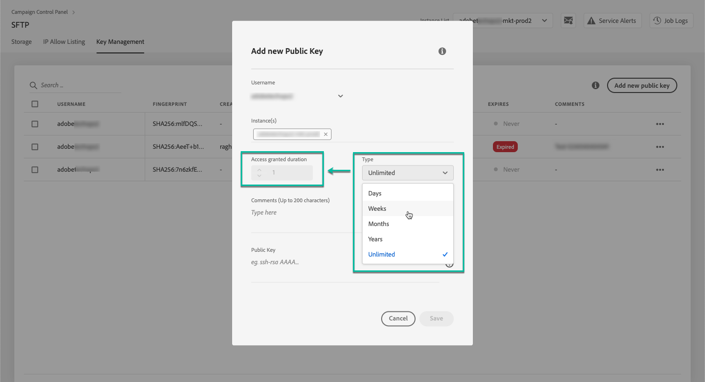
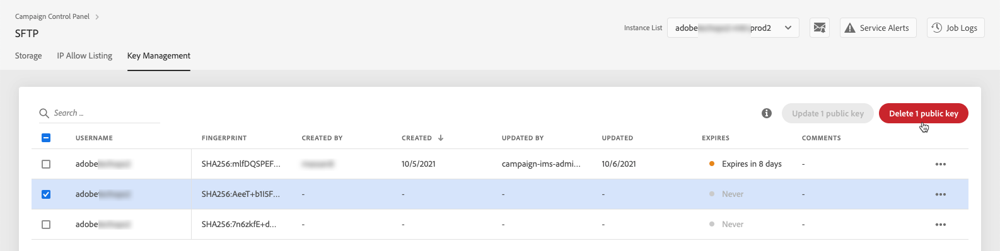

# Sleutelbeheer {#key-management}

>[!CONTEXTUALHELP]
>id="cp_key_management"
>title="Informatie over beheer van openbare sleutels"
>abstract="Op dit tabblad maakt, beheert en bewerkt u de openbare sleutels."
>additional-url="https://images-tv.adobe.com/mpcv3/8a977e03-d76c-44d3-853c-95d0b799c870_1560205338.1920x1080at3000_h264.mp4#t=166" text="Demovideo bekijken"

Adobe raadt alle klanten aan verbinding te maken met hun SFTP-servers met een **openbaar/persoonlijk sleutelpaar**.

De stappen om een openbare SSH-sleutel te genereren en toe te voegen om toegang tot de SFTP-server te krijgen, worden hieronder beschreven, evenals aanbevelingen betreffende verificatie.

Zodra de toegang tot de server is ingesteld, moet u **de IP-adressen die toegang tot de server vereisen, toevoegen aan de lijst van gewenste IP-adressen** zodat u er verbinding mee kunt maken. Raadpleeg [deze sectie](../../instances-settings/using/ip-allow-listing-instance-access.md) voor meer informatie.

 Een video-uitleg van deze functie met [Campaign v7/v8](https://experienceleague.adobe.com/docs/campaign-classic-learn/control-panel/sftp-management/generate-ssh-key.html#sftp-management) of [Campaign Standard](https://experienceleague.adobe.com/docs/campaign-standard-learn/control-panel/sftp-management/generate-ssh-key.html#sftp-management).

## Best practices {#best-practices}

**De openbare SSH-sleutel**

Zorg ervoor dat u altijd dezelfde verificatie gebruikt om verbinding te maken met de server en dat u een ondersteunde indeling voor de sleutel gebruikt.

**API-integratie met gebruikersnaam en wachtwoord**

In zeer zeldzame gevallen, wordt op wachtwoord-gebaseerde authentificatie toegelaten op sommige servers SFTP. Adobe adviseert dat u op sleutel-gebaseerde authentificatie gebruikt, aangezien deze methode efficiënter en veiliger is. U kunt verzoeken om over te schakelen op verificatie op basis van sleutels door contact op te nemen met de klantenservice.

>[!IMPORTANT]
>
>Als uw wachtwoord verloopt, kunt u zich niet bij uw SFTP-accounts aanmelden, zelfs als er sleutels op het systeem geïnstalleerd zijn.

## De SSH-sleutel installeren {#installing-ssh-key}

>[!CONTEXTUALHELP]
>id="cp_sftp_publickey_add"
>title="Toevoeging van openbare sleutels"
>abstract="Genereer een openbare sleutel van SSH voor een instantie en voeg het aan Controlebord toe om tot de server toegang te hebben SFTP."

>[!IMPORTANT]
>
>U moet altijd uw organisatierichtlijnen met betrekking tot SSH sleutels volgen. De stappen hieronder zijn slechts één voorbeeld van hoe de zeer belangrijke verwezenlijking van SSH kan worden gedaan en zij kunnen als nuttig referentiepunt voor het communiceren van vereisten aan uw team of interne netwerkgroep dienen.

1. Ga naar het tabblad **[!UICONTROL Key Management]** en klik op de knop **[!UICONTROL Add new public key]**.

   

1. Selecteer in het dialoogvenster dat wordt geopend de gebruikersnaam waarvoor u de openbare sleutel wilt maken en de server waarvoor u de sleutel wilt activeren.

   

   >[!NOTE]
   >
   >In het Configuratiescherm wordt gecontroleerd of een bepaalde gebruikersnaam actief is op een bepaalde instantie en kunt u de toets op een of meerdere instanties activeren.
   >
   >Een of meer openbare SSH-sleutels kunnen voor elke gebruiker worden toegevoegd.

1. Om uw openbare sleutels beter te beheren, kunt u een duur voor de beschikbaarheid van elke sleutel plaatsen. Selecteer hiertoe een eenheid in het dialoogvenster **[!UICONTROL Type]** vervolgkeuzelijst en definieert een duur in het desbetreffende veld. Voor meer informatie over het vervallen van openbare sleutels raadpleegt u [deze sectie](#expiry).

   

   >[!NOTE]
   >
   >Standaard worden de **[!UICONTROL Type]** veld is ingesteld op **[!UICONTROL Unlimited]**, hetgeen betekent dat de openbare sleutel nooit vervalt.

1. In de **[!UICONTROL Comment]** in het veld kunt u een reden opgeven om deze openbare sleutel toe te voegen (waarom, voor wie, enz.).

1. Als u de **[!UICONTROL Public Key]** veld, moet u een openbare SSH-sleutel genereren. Voer de onderstaande stappen uit volgens uw besturingssysteem.

   **Linux en Mac:**

   Gebruik de terminal om een openbaar en persoonlijk sleutelpaar te genereren:
   1. Voer deze opdracht in: `ssh-keygen -m pem -t rsa -b 2048 -C "your_email@example.com"`.
   1. Geef een naam op voor de sleutel wanneer u hierom wordt gevraagd. Als de ssh-map niet bestaat, maakt het systeem er een voor u.
   1. Voer een wachtwoordzin in en herhaal dit wanneer u hierom wordt gevraagd. U kunt dit ook leeg laten.
   1. Het systeem maakt het sleutelpaar ‘name’ en ‘name.pub’. Zoek het bestand ‘name.pub’ en open het. Het bevat een alfanumerieke tekenreeks die eindigt met het e-mailadres dat u hebt opgegeven.

   **Windows:**

   Wellicht moet u een hulpprogramma van derden installeren waarmee u persoonlijk/openbaar sleutelpaar in dezelfde indeling als &quot;name.pub&quot; kunt genereren.

1. Open het pub-bestand, kopieer de hele tekenreeks die begint met ‘ssh...’ en plak deze in Configuratiescherm.

   

   >[!NOTE]
   >
   >De **[!UICONTROL Public Key]** -veld accepteert alleen de OpenSSH-indeling. De openbare SSH-sleutel moet **2048 bits** zijn.

1. Klik op de knop **[!UICONTROL Save]** om de sleutel te maken. In het Configuratiescherm worden de openbare sleutel en de bijbehorende vingerafdruk opgeslagen, gecodeerd met de SHA256-indeling.

>[!IMPORTANT]
>
>Als de sleutel u creeerde wordt gebruikt om een verbinding met een systeem te vestigen dat nooit eerder met de geselecteerde server van SFTP is verbonden, zult u openbare IP van dat systeem aan de lijst van gewenste personen moeten toevoegen alvorens u dit systeem met de server kunt gebruiken SFTP. Zie [deze sectie](ip-range-allow-listing.md).

Met vingerafdrukken kunt u de persoonlijke sleutels die op uw computer zijn opgeslagen, afstemmen op de overeenkomstige openbare sleutels die in het Configuratiescherm zijn opgeslagen.

Met de knop **...** kunt u een bestaande sleutel verwijderen of de bijbehorende vingerafdruk naar het klembord kopiëren.

## Openbare sleutels beheren {#managing-public-keys}

De openbare sleutels die u creeert tonen in **[!UICONTROL Key Management]** tab.

U kunt de punten sorteren die op de aanmaakdatum of de versiedatum, op de gebruiker worden gebaseerd die creeerde of het, en op de IP waaiervervaldatum uitgeeft.

U kunt ook in een openbare sleutel zoeken door een naam of opmerking te typen.

Om één of meerdere IP waaiers uit te geven, zie [deze sectie](#editing-public-keys).

Als u een of meer openbare sleutels uit de lijst wilt verwijderen, selecteert u deze en klikt u op de knop **[!UICONTROL Delete public key]** knop.

### Vervaldatum {#expiry}

De **[!UICONTROL Expires]** de kolom toont hoeveel dagen blijven tot de openbare sleutel zal verlopen.

Als u zich hebt geabonneerd op [e-mailwaarschuwing](../../performance-monitoring/using/email-alerting.md)ontvangt u berichten per e-mail 10 dagen en 5 dagen voordat een openbare sleutel verloopt. Deze berichten verlopen op de dag dat de sleutel verstrijkt. Na ontvangst van de waarschuwing kunt u [de openbare sleutel bewerken](#editing-public-keys) zo nodig de geldigheidsduur ervan te verlengen.

Een verlopen openbare sleutel wordt automatisch verwijderd na 7 dagen. Het wordt weergegeven als **[!UICONTROL Expired]** in de **[!UICONTROL Expires]** kolom. Binnen deze periode van 7 dagen:

* Een verlopen openbare sleutel kan niet meer worden gebruikt om verbinding te maken met de SFTP-server.

* U kunt [bewerken](#editing-public-keys) een verlopen openbare sleutel en de duur ervan bijwerken om deze opnieuw beschikbaar te maken.

* U kunt deze verwijderen uit de lijst.

## Openbare sleutels bewerken {#editing-public-keys}

>[!CONTEXTUALHELP]
>id="cp_sftp_publickey_update"
>title="Openbare sleutels bewerken"
>abstract="Werk de geselecteerde openbare sleutels bij om tot uw server van SFTP toegang te hebben."

Volg onderstaande stappen om openbare sleutels te bewerken.

>[!NOTE]
>
>U kunt alleen openbare sleutels bewerken die zijn gemaakt sinds de release van het Configuratiescherm in oktober 2021.

1. Selecteer een of meer items in het menu **[!UICONTROL Key Management]** lijst.
1. Klik op de knop **[!UICONTROL Update public key]**.

   

1. U kunt de vervaldatum van de openbare sleutel alleen bewerken en/of een nieuwe opmerking toevoegen.

   >[!NOTE]
   >
   >Als u de gebruikersnaam, de instantie en de openbare sleutel wilt wijzigen in de OpenSSH-indeling, verwijdert u de openbare sleutel en maakt u een nieuwe sleutel die aan uw behoeften voldoet.

1. Sla uw wijzigingen op.
