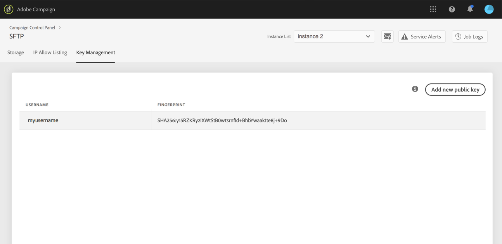

# Aanmelden bij uw SFTP-server {#logging-into-sft-server}

In de onderstaande stappen wordt beschreven hoe u verbinding kunt maken met uw SFTP-server via uw SFTP-clienttoepassing.

[ Ontdek deze functie in video](https://video.tv.adobe.com/v/27263?quality=12)

Voordat u zich aanmeldt bij de server, moet u controleren of:

* Uw SFTP-server is **gehost door Adobe**.
* Uw **gebruikersnaam** is ingesteld voor de server. U kunt deze informatie rechtstreeks controleren in het Configuratiescherm, in het dialoogvenster **Sleutelbeheer** van de SFTP-kaart.
* U hebt een **persoonlijke en openbare sleutel** om u aan te melden bij de SFTP-server. Zie [deze sectie](../../sftp/using/key-management.md) voor meer informatie over het toevoegen van de SSH-toets.
* Uw **het openbare IP adres is toegevoegd aan de lijst van gewenste personen** op de SFTP-server. Indien niet, raadpleeg [deze sectie](../../sftp/using/ip-range-allow-listing.md) voor meer op hoe te om uw IP waaier aan de lijst van gewenste personen toe te voegen.
* U hebt toegang tot een **SFTP-clientsoftware**. U kunt uw afdeling van IT voor de cliënttoepassing raadplegen SFTP die zij om adviseren te gebruiken, of onderzoek naar op Internet als dit door uw bedrijfsbeleid wordt toegestaan.

Voer de volgende stappen uit om verbinding te maken met uw SFTP-server:

1. Start het Configuratiescherm en selecteer vervolgens het **[!UICONTROL Key Management]** van de **[!UICONTROL SFTP]** kaart.

   

1. Start de SFTP-clienttoepassing en kopieer en plak het serveradres vanuit het Configuratiescherm, gevolgd door &quot;campagne.adobe.com&quot;. Vul vervolgens uw gebruikersnaam in.

   

1. In de **[!UICONTROL SSH Private Key]** selecteert u het bestand met de persoonlijke sleutel dat op uw computer is opgeslagen. Het komt overeen met een tekstbestand met dezelfde naam als de openbare sleutel, zonder de extensie &quot;.pub&quot; (bijv. &quot;enable&quot;).

   

   De **[!UICONTROL Password]** wordt automatisch ingevuld met de persoonlijke sleutel uit het bestand.

   

   U kunt controleren of de toets die u wilt gebruiken, is opgeslagen in het Configuratiescherm door de vingerafdruk van de persoonlijke of openbare sleutel te vergelijken met de vingerafdruk van de toetsen die worden weergegeven op het tabblad Key Management van de SFTP-kaart.

   

   >[!NOTE]
   >
   >Als u een Mac-computer gebruikt, kunt u de vingerafdruk van de persoonlijke sleutel die in uw computer is opgeslagen, weergeven door deze opdracht uit te voeren:
   >
   >`ssh-keygen -lf <path of the privatekey>`

1. Klik op **[!UICONTROL Connect]** om u aan te melden bij uw SFTP-server.

   
