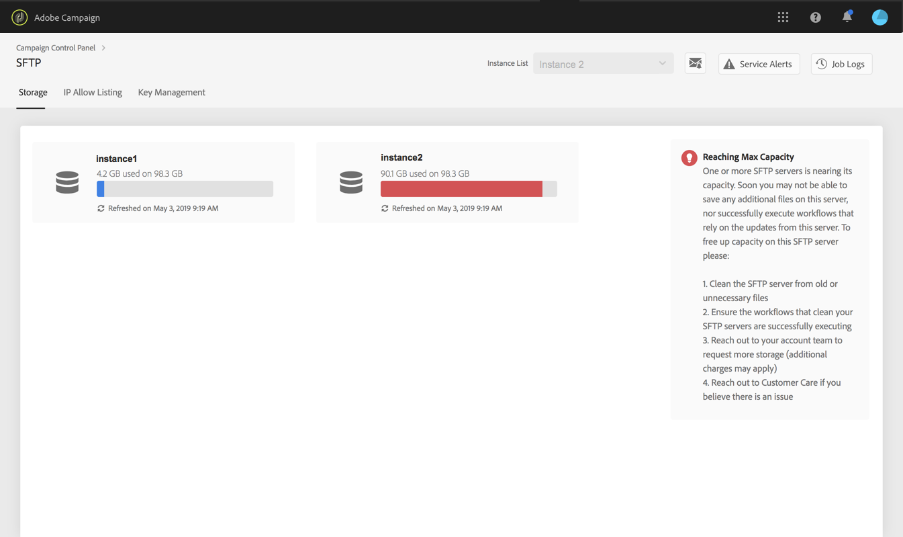
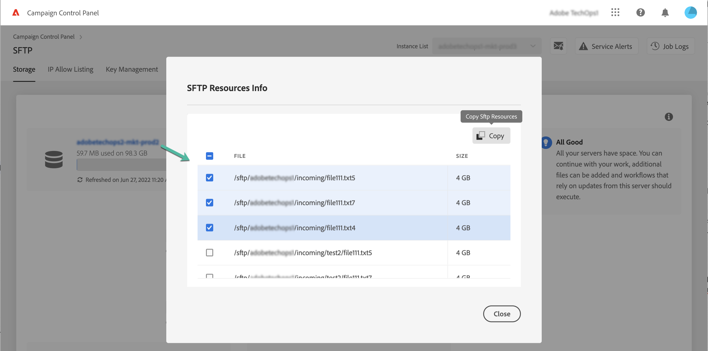

# SFTP-opslagbeheer {#sftp-storage-management}

>[!CONTEXTUALHELP]
>id="cp_storage"
>title="Opslagcapaciteit"
>abstract="Op dit tabblad kunt u de opslagcapaciteit en de gebruiksgegevens voor uw SFTP-servers weergeven. U kunt nu ook de 10 bestanden weergeven die de meeste ruimte op een SFTP-server verbruiken door op de naam van de server te klikken. Alleen SFTP-servers waartoe u toegang hebt, worden hier weergegeven. Neem contact op met uw beheerder om toegang tot andere SFTP-servers aan te vragen."
>additional-url="https://images-tv.adobe.com/mpcv3/8a977e03-d76c-44d3-853c-95d0b799c870_1560205338.1920x1080at3000_h264.mp4" text="Demovideo bekijken"

Afhankelijk van uw contractvoorwaarden is mogelijk andere opslagcapaciteit op uw SFTP-server ingericht.

Het is van essentieel belang dat u regelmatig de beschikbare ruimte voor al uw SFTP-servers controleert. Anders kunt u mogelijk geen bestanden meer opslaan op de server of kunt u geen workflows uitvoeren die afhankelijk zijn van de updates van deze server.

Als u zich hebt geabonneerd op [e-mailwaarschuwing](../../performance-monitoring/using/email-alerting.md)ontvangt u meldingen per e-mail wanneer een van uw SFTP-servers 80% of meer van de capaciteit heeft bereikt. Zie [SFTP-opslagbeheer](../../sftp/using/sftp-storage-management.md).

 Een video-uitleg van deze functie met [Campaign v7/v8](https://experienceleague.adobe.com/docs/campaign-classic-learn/control-panel/sftp-management/monitoring-server-capacity.html?lang=nl#sftp-management) of [Campaign Standard](https://experienceleague.adobe.com/docs/campaign-standard-learn/control-panel/sftp-management/monitoring-server-capacity.html?lang=nl#sftp-management).

## Informatie over opslagcapaciteit weergeven {#accessing-storage-capacity-information}

Informatie over de ruimte die wordt gebruikt door alle instanties waartoe u toegang hebt, is beschikbaar op het tabblad **[!UICONTROL Storage]** van de SFTP-kaart. Deze informatie wordt bijgewerkt telkens wanneer de pagina wordt vernieuwd.

Voor elke instantie wordt met een visueel signaal aangegeven wanneer de opslagcapaciteit wordt overschreden:

* **Oranje**: de instantie gebruikt meer dan 80% van de capaciteit.
* **Rood**: de instantie gebruikt meer dan 90% van de capaciteit.

U kunt nu ook de top 10 vaststellen van bestanden die de meeste ruimte op een SFTP-server verbruiken door op de naam van de server te klikken.

Er zijn ook extra tips beschikbaar om u te adviseren wat u moet doen wanneer de grens van de servercapaciteit bijna is bereikt.

## Aanbevolen procedures wanneer de grens van de opslagcapaciteit wordt bereikt {#best-practices-when-capacity-runs-out}

1. **Verwijder oude of onnodige bestanden van de SFTP-server**. Raadpleeg [deze sectie](../../sftp/using/logging-into-sftp-server.md) voor meer informatie over het openen van de SFTP-servermap.
1. Zorg ervoor dat de **workflows** die uw SFTP-servers opschonen, correct worden uitgevoerd. Raadpleeg de speciale documentatie van [Campaign v7/v8](https://experienceleague.adobe.com/docs/campaign-classic/using/automating-with-workflows/advanced-management/about-technical-workflows.html?lang=nl) en [Campaign Standard](https://experienceleague.adobe.com/docs/campaign-standard/using/administrating/application-settings/technical-workflows.html?lang=nl) voor meer informatie over technische workflows in Adobe Campaign.
1. Neem contact op met uw accountteam om **meer opslagruimte aan te vragen** (hiervoor worden mogelijk extra kosten in rekening gebracht).
1. Neem contact op met de **Klantenservice** als u denkt dat er een probleem is.
