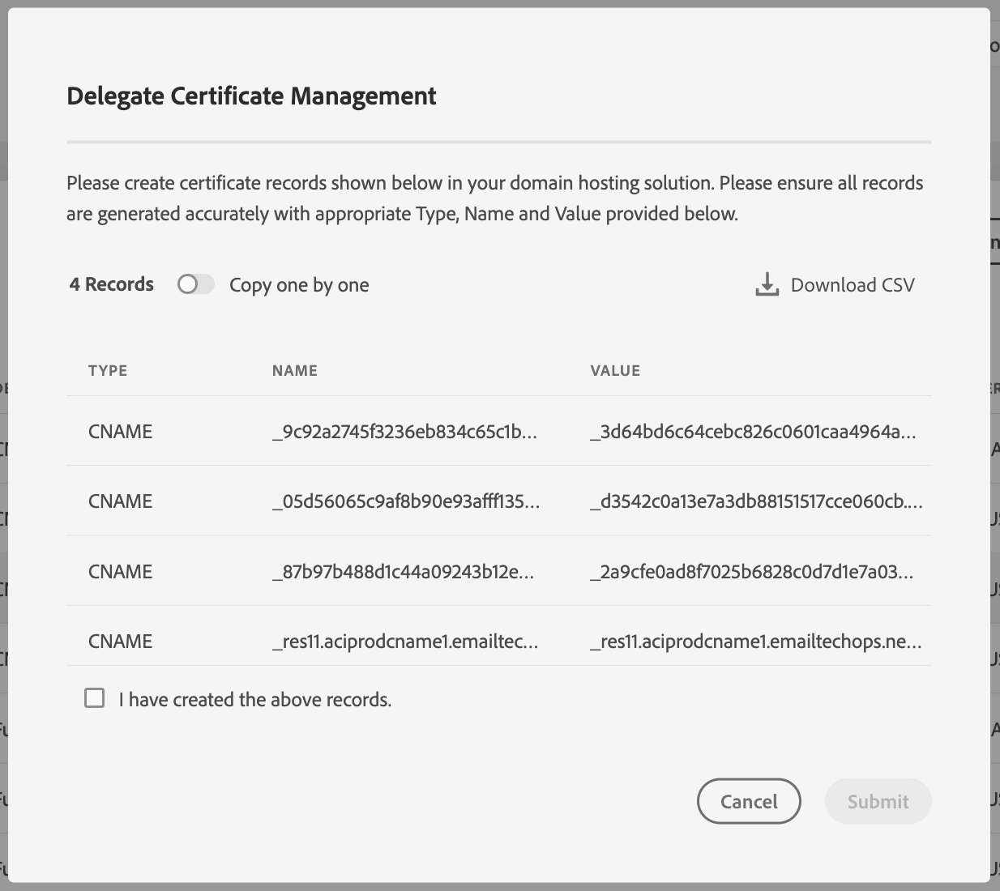

# SSL-certificaten van subdomeinen delegeren aan Adobe {#delegate-ssl-certificates}

>[!CONTEXTUALHELP]
>id="cp_managed_ssl"
>title="SSL-certificaten van subdomeinen delegeren aan Adobe"
>abstract="In het Configuratiescherm kunt u SSL-certificaten van uw subdomeinen laten beheren door Adobe. Als u CNAME&#39;s gebruikt om uw subdomein in te stellen, worden er automatisch certificaatrecords gemaakt en verstrekt om een certificaat te genereren in uw domeinhostingoplossing."

Het wordt sterk aanbevolen om het beheer van de SSL-certificaten van uw subdomeinen aan Adobe te delegeren, omdat Adobe het certificaat automatisch maakt en elk jaar verlengt voordat het certificaat verloopt.

Als u CNAME&#39;s gebruikt om een subdomeindelegatie in te stellen, levert Adobe certificaatrecords die u kunt gebruiken in uw domeinhostingoplossing om uw certificaat te genereren.

De delegatie van SSL-certificaten naar Adobe kan worden uitgevoerd bij het instellen van een nieuw subdomein of voor reeds gedelegeerde subdomeinen.

>[!NOTE]
>
>Door Adobe beheerde SSL is een kosteloze functie die gratis beschikbaar is voor gebruikers. Het delegeren van het certificaat van een subdomein aan Adobe is transparant en heeft geen invloed op uw campagnes en de leverbaarheid. [Meer informatie over beheer van SSL-certificaten](monitoring-ssl-certificates.md#management)

## SSL-certificaten van nieuwe subdomeinen delegeren {#new}

Als u SSL-certificaten wilt delegeren bij het instellen van een nieuw subdomein, schakelt u de optie **[!UICONTROL Opt for Adobe managed SSL for sub-domains]** in de wizard voor subdomeinconfiguratie in. Certificaatrecords die u wilt kopiëren naar uw hostoplossing, worden later in de configuratiewizard verstrekt. Gedetailleerde stappen worden beschreven in [deze sectie](setting-up-new-subdomain.md).

{width="70%" align="left"}

## SSL-certificaten delegeren voor reeds gedelegeerde subdomeinen {#delegated}

Als u SSL-certificaten wilt delegeren voor een subdomein dat al is gedelegeerd, klikt u op de knop met 3 puntjes naast het gewenste subdomein en klikt u op **[!UICONTROL Switch to Managed SSL]**.

{width="70%" align="left"}

Er wordt een dialoogvenster weergegeven met de certificaatrecords die automatisch door Adobe zijn gegenereerd. Kopieer deze records een voor een of download een CSV-bestand en navigeer vervolgens naar uw domeinhostingoplossing om de overeenkomende certificaat te genereren.

Zorg ervoor dat alle certificaatrecords zijn gegenereerd in uw domeinhostingoplossing. Als alles goed is geconfigureerd, bevestigt u het maken van de records en klikt u op **[!UICONTROL Submit]**.

{width="70%" align="left"}
