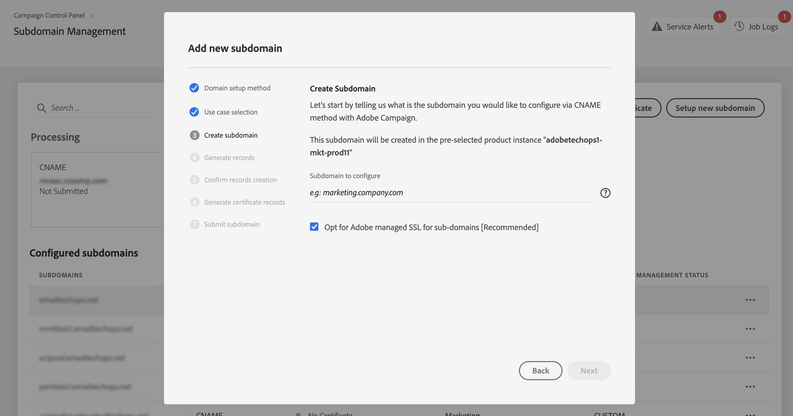

# SSL-certificaten van subdomeinen delegeren aan Adobe {#delegate-ssl-certificates}

>[!CONTEXTUALHELP]
>id="cp_managed_ssl"
>title="SSL-certificaten van subdomeinen delegeren aan Adobe"
>abstract="Met het Configuratiescherm kunt u SSL-certificaten van uw subdomeinen laten beheren door Adobe. Als u CNAME&#39;s gebruikt om uw subdomein in te stellen, worden er automatisch certificatenrecords gemaakt en verstrekt om een certificaat te genereren in uw domeinhostingoplossing."

Het delegeren van SSL-certificaten van uw subdomeinen aan Adobe wordt ten zeerste aanbevolen, omdat Adobe het certificaat automatisch maakt en elk jaar vernieuwt voordat het certificaat verloopt.

Als u CNAMEs aan opstelling gebruikt subdomain delegatie, zal Adobe certificaatverslagen verstrekken in uw domein ontvangende oplossing te gebruiken om uw certificaat te produceren.

De delegatie van SSL-certificaten naar Adobe kan worden uitgevoerd bij het instellen van een nieuw subdomein of voor al gedelegeerde subdomeinen.

>[!NOTE]
>
>Door Adobe beheerde SSL is een kosteloze functie die gratis beschikbaar is voor gebruikers.

## SSL-certificaten van nieuwe subdomeinen delegeren {#new}

Als u SSL-certificaten wilt delegeren bij het instellen van een nieuw subdomein, schakelt u het **[!UICONTROL Opt for Adobe managed SSL for sub-domains]** optie van de tovenaar van de subdomeinconfiguratie. Certificaatrecords die u wilt kopiëren naar uw hostoplossing, worden later beschikbaar gesteld in de configuratietovenaar. Gedetailleerde stappen worden beschreven in [deze sectie](setting-up-new-subdomain.md).

{width="70%" align="left"}

## SSL-certificaten delegeren voor al gedelegeerde subdomeinen {#delegated}

Als u SSL-certificaten wilt delegeren voor een subdomein dat al is gedelegeerd, klikt u op de knop voor ovaal naast het gewenste subdomein en klikt u op **[!UICONTROL Switch to Managed SSL]**.

{width="70%" align="left"}

Er wordt een dialoogvenster weergegeven met de certificaatrecords die automatisch door Adobe zijn gegenereerd. Kopieer deze records, een voor een of door een CSV-bestand te downloaden, en navigeer vervolgens naar de oplossing voor domeinhosting om het overeenkomende certificaat te genereren.

Zorg ervoor dat alle certificaatverslagen in uw domein het ontvangen oplossing zijn geproduceerd. Als alles behoorlijk wordt gevormd, bevestig de archiefverwezenlijking dan klik **[!UICONTROL Submit]**.

{width="70%" align="left"}
