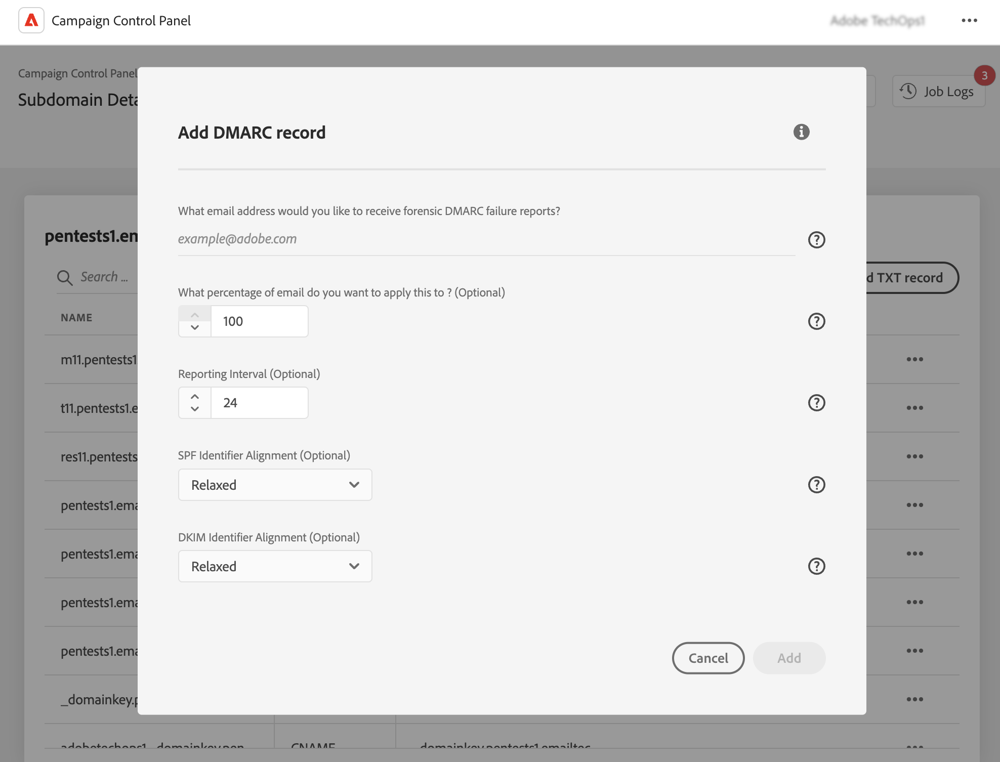

# DMARC-records toevoegen {#dmarc}

## DMARC-records {#about}

Domain based Message Authentication, Reporting and Conformance (DMARC) is een protocolstandaard voor e-mailverificatie waarmee organisaties hun e-maildomeinen beschermen tegen phishing- en spoofingaanvallen. Hiermee kunt u beslissen hoe een e-mailprovider moet omgaan met e-mails die de SPF- en DKIM-controles niet doorstaan, waardoor u een manier hebt om het domein van de afzender te verifiëren en ongeoorloofd gebruik van het domein voor kwaadaardige doeleinden te voorkomen.

Gedetailleerde informatie over de DMARC-implementatie is beschikbaar in de [Handleiding voor best practices inzake leverbaarheid van Adobe](https://experienceleague.adobe.com/docs/deliverability-learn/deliverability-best-practice-guide/additional-resources/technotes/implement-dmarc.html?lang=nl)

## Beperkingen en voorwaarden {#limitations}

* SPF- en DKIM-records zijn vereisten voor het maken van een DMARC-record.
* DMARC-records kunnen alleen worden toegevoegd voor subdomeinen met volledige subdomeindelegatie. [Meer informatie over configuratiemethoden voor subdomeinen](subdomains-branding.md#subdomain-delegation-methods)

  Om een DMARC- verslag op een op CNAME-Gebaseerd subdomain te vestigen, kunt u het DMARC- verslag op zijn ouderdomein vormen. Dit zorgt ervoor dat alle bijbehorende subdomeinen de DMARC verslagparameters erven, zelfs wanneer afgevaardigd door CNAMEs.

* Als er zowel DMARC- als BIMI-records bestaan voor een subdomein:
   * DMARC-records kunnen niet worden verwijderd. Als u een DMARC-record wilt verwijderen, verwijdert u eerst de BIMI-record.
   * DMARC-records kunnen worden bewerkt, maar het DMARC-beleid downgraden naar Geen is niet toegestaan en de percentagewaarde moet worden ingesteld op 100.

## Een DMARC-record voor een subdomein toevoegen {#add}

Ga als volgt te werk om een DMARC-record voor een subdomein toe te voegen:

1. Klik in de lijst met subdomeinen op de knop met 3 puntjes naast het gewenste subdomein en selecteer **[!UICONTROL Subdomain details]**.

1. Klik op de knop **[!UICONTROL Add TXT record]** en kies vervolgens **[!UICONTROL DMARC]** in de vervolgkeuzelijst **[!UICONTROL Record Type]**.

   

1. Kies het **[!UICONTROL Policy Type]** dat de ontvangende server moet volgen als een van uw e-mails mislukt. Beschikbare beleidstypen zijn:

   * **[!UICONTROL None]**,
   * **[!UICONTROL Quarantine]** (plaatsing spammap),
   * **[!UICONTROL Reject]** (e-mail blokkeren).

   Als best practice wordt aanbevolen om de DMARC-implementatie langzaam uit te rollen door uw DMARC-beleid te escaleren van p=none naar p=quarantaine en dan naar p=reject, naarmate u DMARC-inzicht krijgt in de potentiële impact van DMARC.

   * **Stap 1:** analyseer de feedback die u ontvangt, en gebruik (p=none). Dit laat de ontvanger weten dat deze geen actie moet ondernemen tegen berichten waarbij de verificatie mislukt, maar wel e-mailrapporten blijven sturen. Bekijk en los ook problemen met SPF/DKIM op als legitieme berichten niet kunnen worden geverifieerd.

   * **Stap 2:** bepaal of SPF en DKIM op elkaar zijn afgestemd en de verificatie voor alle legitieme e-mail doorstaan, en stel het beleid vervolgens in op (p=quarantaine), wat de ontvangende e-mailserver laat weten dat deze e-mails die niet door de verificatie komen, in quarantaine moet plaatsen (dit betekent doorgaans dat deze berichten in de spammap worden geplaatst). Als het beleid op quarantaine wordt ingesteld, wordt u geadviseerd met een klein percentage van uw e-mails te beginnen.

   * **Stap 3:** stel het beleid in op (p=reject). OPMERKING: Wees voorzichtig met dit beleid en bepaal of het geschikt is voor uw organisatie. Het beleid p=reject laat de ontvanger weten dat elke e-mail voor het domein dat niet door de verificatie komt, moet worden geweigerd (teruggestuurd). Als dit beleid is ingeschakeld, heeft alleen e-mail voor 100% is geverifieerd door uw domein, een kans op plaatsing in het postvak IN.

   >[!NOTE]
   >
   > BIMI-records maken is niet beschikbaar als het beleidstype voor DMARC-records is ingesteld op None.

1. Vul de e-mailadressen in die de DMARC-rapporten moeten ontvangen. U kunt meerdere e-mailadressen toevoegen, gescheiden door komma&#39;s. Wanneer een van uw e-mails niet kan worden geverifieerd, worden DMARC-rapporten automatisch naar het e-mailadres van uw keuze verzonden:

   * Aggregate-DMARC-rapporten bieden informatie op hoog niveau, zoals bijvoorbeeld het aantal e-mails dat niet kon worden geverifieerd gedurende een bepaalde periode.
   * Forensische DMARC-foutrapporten bieden gedetailleerde informatie, zoals bijvoorbeeld van welk IP-adres de e-mail die niet kon worden geverifieerd, afkomstig is.

1. Als het DMARC-beleid is ingesteld op None, voert u een percentage in dat geldt voor 100% van de e-mails.

   Als het beleid is ingesteld op Reject of Quarantaine, raden we u aan te beginnen met een klein percentage e-mails. Naarmate meer e-mails van uw domein de verificatie op ontvangende servers met succes doorstaan, werkt u uw record langzaam bij met een hoger percentage.

   >[!NOTE]
   >
   >Als uw domein BIMI gebruikt, moet uw DMARC-beleid een percentagewaarde van 100% hebben. BIMI ondersteunt geen DMARC-beleid waarvan deze waarde is ingesteld op minder dan 100%.

   

1. DMARC-rapporten worden elke 24 uur verzonden. U kunt de verzendfrequentie van rapporten wijzigen in het veld **[!UICONTROL Reporting Interval]**. Het minimaal toegestane interval is 1 uur, en de maximaal toegestane waarde is 2190 uur (namelijk 3 maanden).

1. Geef in de velden **SPF** en **[!UICONTROL DKIM Identifier Alignment]** op hoe streng de ontvangende servers moeten zijn bij het controleren van de SPF- en DKIM-verificatie voor een e-mail.

   * Modus **[!UICONTROL Relaxed]**: de server accepteert verificatie ook als de e-mail vanuit een subdomein is verzonden,
   * De modus **[!UICONTROL Strict]** accepteert verificatie alleen als het domein van de afzender exact overeenkomt met een SPF- en DKIM-domein.

   Stel dat we werken met het domein `http://www.luma.com`. In de modus Ontspannen worden e-mails vanuit het subdomein `marketing.luma.com` geverifieerd door de server, terwijl ze in de modus Streng worden afgewezen.

1. Klik op **[!UICONTROL Add]** om het maken van de DMARC-record te bevestigen.

Zodra het maken van de DMARC-record is verwerkt (ongeveer 5 minuten), wordt deze weergegeven in het detailscherm van het subdomein. [Meer informatie over het bewaken van TXT-records voor uw subdomeinen](gs-txt-records.md#monitor)
