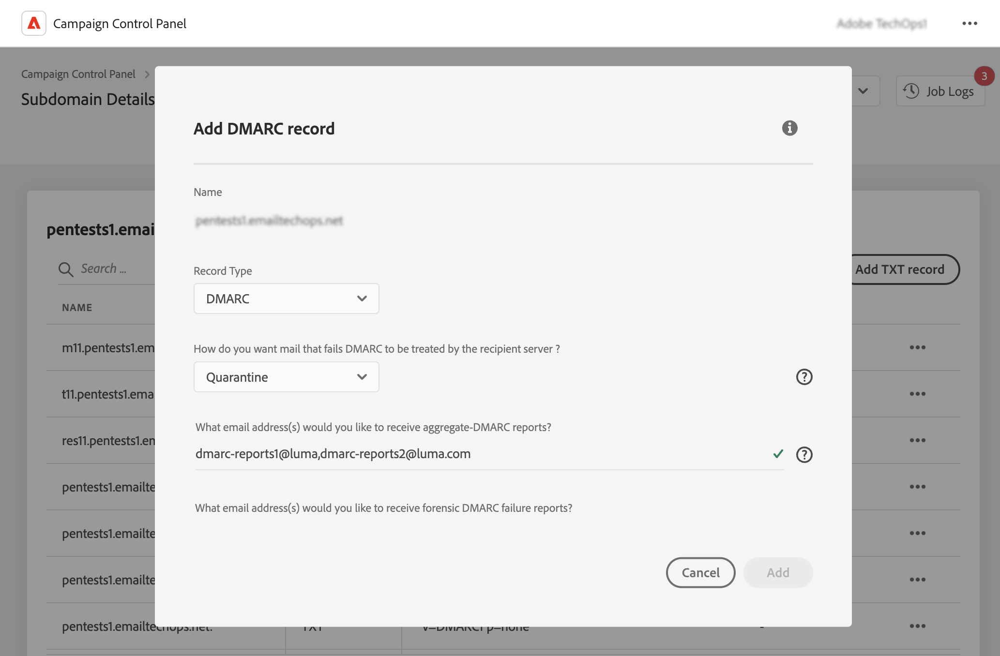

# DMARC-records toevoegen {#dmarc}

## Informatie over DMARC-records {#about}

Op domein gebaseerde Message Authentication, Reporting and Conformance (DMARC) is een standaard voor een e-mailverificatieprotocol waarmee organisaties hun e-maildomeinen beschermen tegen phishing en spoofing-aanvallen. Het staat u toe om te beslissen hoe een brievenbusleverancier e-mails zou moeten behandelen die SPF en controles DKIM ontbreken, die een manier verstrekken om het domein van de afzender voor authentiek te verklaren en onbevoegd gebruik van het domein voor kwaadwillige doeleinden te verhinderen.

<!--Detailed information on DMARC implementation is available in [Adobe Deliverability Best Practice Guide](https://experienceleague.adobe.com/docs/deliverability-learn/deliverability-best-practice-guide/additional-resources/technotes/implement-bimi.html)-->

## Beperkingen en voorwaarden {#limitations}

* SPF en DKIM verslagen zijn eerste vereisten voor het creëren van een DMARC verslag.
* DMARC-records kunnen alleen worden toegevoegd voor subdomeinen die gebruikmaken van Volledige subdomeindelegatie. [Meer informatie over configuratiemethoden voor subdomeinen](subdomains-branding.md#subdomain-delegation-methods)

## Een DMARC-record toevoegen voor een subdomein {#add}

Ga als volgt te werk om een DMARC-record voor een subdomein toe te voegen:

1. Klik in de lijst met subdomeinen op de knop met de ovaal naast het gewenste subdomein en selecteer **[!UICONTROL Subdomain details]**.

1. Klik op de knop **[!UICONTROL Add TXT record]** en kies vervolgens **[!UICONTROL DMARC]** van de **[!UICONTROL Record Type]** vervolgkeuzelijst.

   

1. Kies de optie **[!UICONTROL Policy Type]** dat de ontvangende server moet volgen wanneer een van uw e-mails mislukt. Beschikbare beleidstypen zijn:

   * **[!UICONTROL None]**,
   * **[!UICONTROL Quarantine]** (plaatsing spammap),
   * **[!UICONTROL Reject]** (e-mail blokkeren).

   Als beste praktijken, wordt het geadviseerd om implementatie DMARC langzaam uit te voeren door uw beleid DMARC van p=none, aan p=quarantaine, aan p=weiger te escaleren aangezien u DMARC inzicht in de potentiële invloed van DMARC krijgt.

   * **Stap 1:** Analyseer terugkoppelen u ontvangt en gebruikt (p=none), die de ontvanger vertelt om geen acties tegen berichten uit te voeren die authentificatie ontbreken, maar nog e-mailrapporten naar de afzender verzenden. Ook, herzie en los kwesties met SPF/DKIM op als de wettige berichten authentificatie ontbreken.

   * **Stap 2:** Bepaal als SPF en DKIM worden gericht en authentificatie voor al wettige e-mail overgaan, en dan het beleid verplaatsen naar (p=quarantaine), dat de ontvangende e-mailserver aan quarantainemail vertelt die authentificatie ontbreekt (dit betekent over het algemeen het plaatsen van die berichten in de spamomslag). Als het beleid aan quarantaine wordt geplaatst, adviseert het dat u met een klein percentage van uw e-mails begint.

   * **Stap 3:** Pas het beleid aan (p=afwijzen). NOTA: Gelieve te gebruiken dit beleid met voorzichtigheid en te bepalen als het voor uw organisatie aangewezen is. Het p= afwijzingsbeleid vertelt de ontvanger om het even welke e-mail voor het domein volledig te ontkennen (stuiteren) dat authentificatie ontbreekt. Als dit beleid is ingeschakeld, heeft alleen e-mail die is geverifieerd als 100% en die is geverifieerd door uw domein, een kans bij plaatsing in Postvak IN.

   >[!NOTE]
   >
   > BIMI-record maken is niet beschikbaar als het gegevenstype DMARC-record is ingesteld op Geen.

1. Vul de e-mailadressen in die de DMARC-rapporten moeten ontvangen. Wanneer een van uw e-mailberichten mislukt, worden DMARC-rapporten automatisch naar het e-mailadres van uw keuze verzonden:

   * Samengevoegde DMARC-rapporten bevatten informatie op hoog niveau, zoals bijvoorbeeld het aantal e-mailberichten dat gedurende een bepaalde periode is mislukt.
   * De forensische DMARC mislukkingsrapporten verstrekken gedetailleerde informatie zoals, bijvoorbeeld, welk IP adres de ontbroken e-mail voortkomt uit.

1. Als het DMARC-beleid is ingesteld op Geen, voert u een percentage in dat van toepassing is op 100% van de e-mailberichten.

   Als het beleid is ingesteld op Afwijzen of Quarantine, wordt u aangeraden te beginnen met een klein percentage van uw e-mailberichten. Naarmate meer e-mails van uw domeinverificatie via ontvangende servers verlopen, werkt u uw record langzaam bij met een hoger percentage.

   >[!NOTE]
   >
   >Als uw domein BIMI gebruikt, moet uw beleid DMARC een percentagewaarde van 100% hebben. BIMI ondersteunt geen DMARC-beleid met deze waarde ingesteld op minder dan 100%.

   

1. DMARC-rapporten worden elke 24 uur verzonden. U kunt de verzendfrequentie van rapporten wijzigen in het dialoogvenster **[!UICONTROL Reporting Interval]** veld. De minimaal toegestane interval is 1 uur, terwijl de maximaal toegestane waarde 2190 uur (d.w.z. 3 maanden) is.

1. In de **SPF** en **[!UICONTROL DKIM Identifier Alignment]** in de velden, geeft u aan hoe strikt de ontvangende servers moeten zijn bij het controleren van SPF- en DKIM-verificatie voor een e-mail.

   * **[!UICONTROL Relaxed]** modus: de server accepteert verificatie, zelfs als de e-mail vanuit een subdomein wordt verzonden,
   * **[!UICONTROL Strict]** de wijze keurt authentificatie slechts goed wanneer het afzenderdomein precies met SPF en domein DKIM aanpast.

   Laten we zeggen dat we met de `http://www.luma.com` domein. In de modus &quot;Ontspannen&quot; komen e-mails van de `marketing.luma.com` subdomain zal door de server worden geautoriseerd, terwijl zij op &quot;Strikte&quot;wijze zullen worden verworpen.

1. Klikken **[!UICONTROL Add]** om het maken van DMARC-records te bevestigen.

Nadat de DMARC-record is gemaakt (ongeveer 5 minuten), wordt deze weergegeven in het detailscherm van de subdomeinen. [Leer hoe u TXT-records voor uw subdomeinen kunt controleren](gs-txt-records.md#monitor)