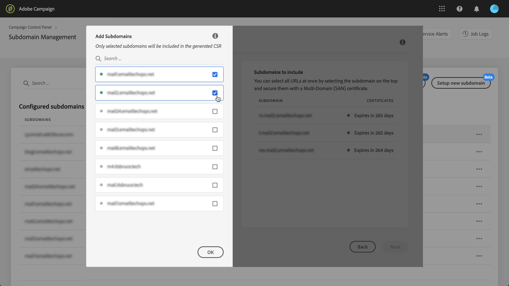

# CSR genereren {#generating-csr}

>[!CONTEXTUALHELP]
>id="cp_generate_csr"
>title="CSR-generatie"
>abstract="Voordat u een certificaat aanschaft, moet een Certificate Signing Request (CSR) worden gegenereerd voor de instantie en subdomeinen die u wilt beveiligen."

>[!CONTEXTUALHELP]
>id="cp_select_subdomains"
>title="Selecteer de subdomeinen voor uw CSR."
>abstract="U kunt naar wens alle of alleen specifieke subdomeinen opnemen in uw Certificate Signing Request (CSR). Alleen geselecteerde subdomeinen worden gecertificeerd via het aangeschafte SSL-certificaat."
>additional-url="https://experienceleague.adobe.com/docs/control-panel/using/subdomains-and-certificates/subdomains-branding.html?lang=nl" text="Informatie over branding van subdomeinen"

## Het CSR genereren {#generate}

Voer de volgende stappen uit om een Certificate Signing Request (CSR) te genereren:

1. Selecteer in de kaart **[!UICONTROL Subdomains & Certificates]** de gewenste instantie en klik op de knop **[!UICONTROL Manage Certificate]**.

   

1. Selecteer **[!UICONTROL 1 - Generate a CSR]** en klik op **[!UICONTROL Next]** om de wizard te starten die u door het proces voor het genereren van een CSR zal leiden.

   

1. Er wordt een formulier weergegeven met alle gegevens die nodig zijn om de CSR te genereren.

   Zorg ervoor dat u de gevraagde informatie volledig en correct invult; anders kan het certificaat niet worden verlengd (neem indien nodig contact op met uw interne team en het beveiligings- en IT-team). Klik vervolgens op **[!UICONTROL Next]**.

   * **[!UICONTROL Organization]**: officiële naam van de organisatie.
   * **[!UICONTROL Organization Unit]**: eenheid die is gekoppeld aan het subdomein (voorbeeld: Marketing, IT).
   * **[!UICONTROL Instance]** (vooraf ingevuld): URL van de Campaign-instantie die aan het subdomein is gekoppeld.
   * **[!UICONTROL Common name]**: Als de algemene naam standaard is geselecteerd, kunt u indien nodig een van de subdomeinen selecteren.

   

1. Selecteer de subdomeinen die u in de CSR wilt opnemen en klik op **[!UICONTROL OK]**.

   

1. De geselecteerde subdomeinen worden weergegeven in de lijst. Selecteer voor elk subdomein of u het wilt opnemen en klik op **[!UICONTROL Next]**.

   

1. Er wordt een samenvatting weergegeven van de subdomeinen die u in de CSR wilt opnemen. Klik op **[!UICONTROL Submit]** om uw aanvraag te bevestigen.

   

   >[!NOTE]
   >
   >De **[!UICONTROL Copy CSR content]** kunt u alle informatie met betrekking tot CSR kopiëren (organisatie-id, instantie, naam van organisatie, algemene naam, opgenomen subdomeinen enz.)

1. Het csr-bestand dat overeenkomt met uw selectie, wordt automatisch gegenereerd en gedownload. U kunt het nu gebruiken om het SSL-certificaat aan te schaffen bij de Certificate Authority (certificeringsinstantie) die door uw bedrijf is goedgekeurd. Als u CSR opnieuw moet downloaden, voert u de in [deze sectie](#download).

Nadat uw CSR is gegenereerd en gedownload, kunt u het gebruiken om een SSL-certificaat aan te schaffen bij een certificeringsinstantie die is goedgekeurd door uw organisatie.

Nadat het SSL-certificaat is aangeschaft, kunt u het op uw exemplaar installeren om uw subdomein te beveiligen. [Meer informatie](install-ssl-certificate.md)

## CSR downloaden {#download}

Als u een SSL-certificaat wilt aanschaffen, moet u eerst de certificaataanvraag downloaden. CSR wordt automatisch gedownload nadat het is geproduceerd. U kunt het op elk ogenblik ook opnieuw downloaden van de Logboeken van de Baan:

1. In de **[!UICONTROL Job Logs]**, selecteert u de **[!UICONTROL Finished]** en filtert u de lijst vervolgens om taken weer te geven die betrekking hebben op subdomeinen.

   

1. Open de taak die overeenkomt met het genereren van de CSR en klik op de knop **[!UICONTROL Downbload]** koppeling om het .csr-bestand op te halen.

   
