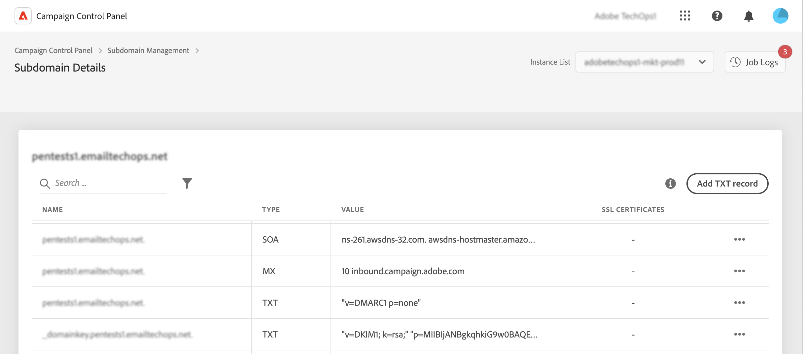

# Aan de slag met TXT-records {#managing-txt-records}

>[!CONTEXTUALHELP]
>id="cp_siteverification_add"
>title="TXT-records beheren"
>abstract="TXT-records zijn DNS-records die worden gebruikt om tekstgegevens over een domein te verstrekken die kunnen worden gelezen door externe bronnen. Met het Configuratiescherm kunt u drie typen records toevoegen aan uw subdomeinen: Google Site Verification, DMARC- en BIMI-records."

## Informatie over TXT-records {#about}

TXT-records zijn DNS-records die worden gebruikt om tekstgegevens over een domein te verstrekken die kunnen worden gelezen door externe bronnen. Met het Configuratiescherm kunt u drie typen records toevoegen aan uw subdomeinen:

* Met **Google TXT-records** kunt u verklaren dat u eigenaar van uw domein bent, wat zorgt voor veel e-mails in het postvak IN en weinig in het postvak Ongewenste e-mail. [Meer informatie over het toevoegen van Google TXT-records](managing-txt-records.md)
* **DMARC-records** bieden een manier om het domein van de afzender te verifiëren en onbevoegd gebruik van het domein voor kwaadwillige doeleinden te verhinderen. [Meer informatie over het toevoegen van DMARC-records](dmarc.md)
* Met **BIMI-records** kunt u een goedgekeurd logo naast uw e-mails in het postvak IN van e-mailproviders weergeven om merkherkenning en vertrouwen te verbeteren. [Meer informatie over het toevoegen van BIMI-records](bimi.md)

## De records van uw subdomeinen controleren {#monitor}

U kunt alle TXT-records controleren die voor elk subdomein zijn toegevoegd door de details van de subdomeinen te bekijken.

In dit scherm worden alle TXT-records voor het geselecteerde subdomein weergegeven met informatie over hun configuratie in de kolom Waarde. Als u een Google TXT-, DMARC- of BIMI-record wilt verwijderen, klikt u op de knop met het weglatingsteken en selecteert u vervolgens Verwijderen. Zo nodig kunt u DMARC- en BIMI-records ook bewerken.

