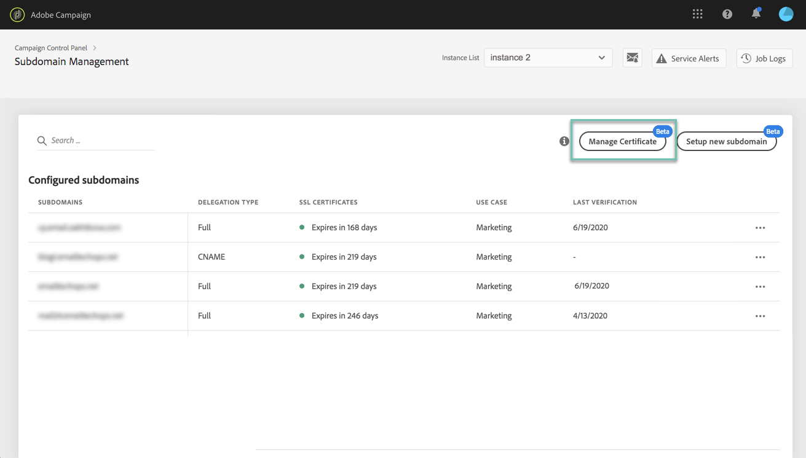

# Het SSL-certificaat installeren {#installing-ssl-certificate}

>[!CONTEXTUALHELP]
>id="cp_install_ssl_certificate"
>title="SSL-certificaatinstallatie"
>abstract="Installeer het SSL-certificaat dat u hebt aangeschaft bij de certificeringsinstantie die is goedgekeurd door uw organisatie."
>additional-url="https://experienceleague.adobe.com/docs/control-panel/using/subdomains-and-certificates/subdomains-branding.html?lang=nl" text="Informatie over branding van subdomeinen"

Nadat u een SSL-certificaat hebt aangeschaft, kunt u het op uw instantie installeren. Voordat u verdergaat, moet u op de hoogte zijn van de volgende voorwaarden:

* De Certificate Signing Request (CSR) moet zijn gegenereerd vanuit het Configuratiescherm. Anders kunt u het certificaat niet installeren via het Configuratiescherm.
* Het CSR-verzoek (Certificate Signing Request) moet overeenkomen met het subdomein dat is geconfigureerd om te werken met Adobe. Het kan bijvoorbeeld niet meer subdomeinen bevatten dan het subdomein dat is geconfigureerd.
* Het certificaat moet een huidige datum hebben. Certificaten met datums in de toekomst kunnen niet worden geïnstalleerd. Bovendien mogen certificaten niet verlopen zijn (geldige begin- en einddatum).
* Het certificaat moet worden uitgegeven door een vertrouwde certificeringsinstantie (CA) zoals Comodo, DigiCert of GoDaddy, enz.
* De grootte van het certificaat moet 2048 bits zijn en de algoritme moet RSA zijn.
* Het certificaat moet de indeling X.509 PEM hebben.
* SAN-certificaten worden ondersteund.
* Wildcard-certificaten worden niet ondersteund.
* Het zipbestand of het certificaat mag niet met een wachtwoord beveiligd zijn.
* Het zipbestand mag alleen het volgende bevatten in bij voorkeur afzonderlijke bestanden:
   * Eindentiteitscertificaat
   * Keten van tussencertificaten (in de juiste volgorde gerangschikt)
   * Basiscertificaat (optioneel)

Voer de volgende stappen uit om het certificaat te installeren:

1. Selecteer in de kaart **[!UICONTROL Subdomains & Certificates]** de gewenste instantie en klik op de knop **[!UICONTROL Manage Certificate]**.

   

1. Selecteer **[!UICONTROL 3 - Install Certificate Bundle]** en klik op **[!UICONTROL Next]** om de wizard te starten die u door het certificaatinstallatieproces zal leiden.

   

1. Selecteer het zipbestand dat het te installeren certificaat bevat en klik op **[!UICONTROL Submit]**.

   

>[!NOTE]
>
>Het certificaat wordt geïnstalleerd op alle domeinen/subdomeinen die in de CSR zijn opgenomen. Eventuele extra domeinen of subdomeinen in het certificaat worden niet in aanmerking genomen.

Nadat het SSL-certificaat is geïnstalleerd, worden de vervaldatum en het statuspictogram van het certificaat dienovereenkomstig bijgewerkt.
