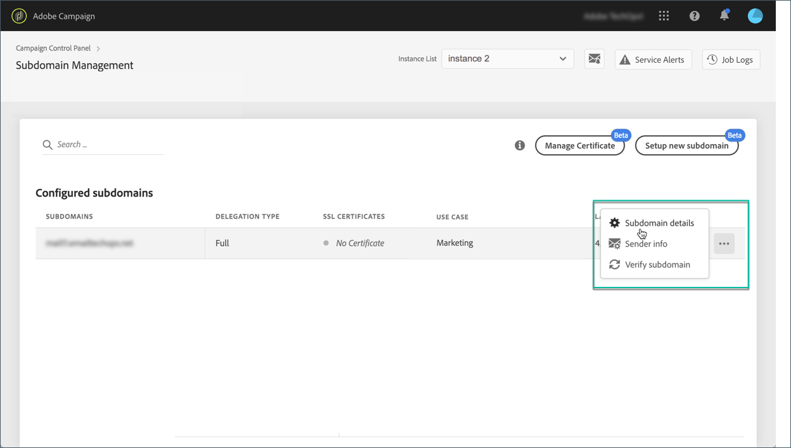
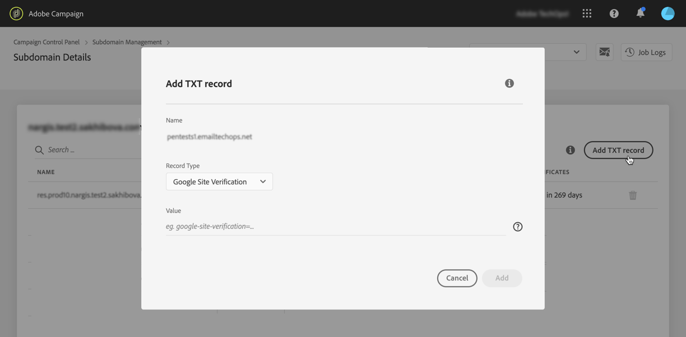

# TXT-records beheren {#managing-txt-records}

>[!CONTEXTUALHELP]
>id="cp_siteverification_add"
>title="TXT-records beheren"
>abstract="Bij sommige services, zoals Google, moet u een TXT-record aan uw domeininstellingen toevoegen om te controleren of u eigenaar bent van het domein."

## TXT-records {#about-txt-records}

TXT-records zijn een type DNS-records dat wordt gebruikt om tekstgegevens over een domein te verstrekken en dat kan worden gelezen door externe bronnen.

Om hoge inbox tarieven, en lage spamtarieven te verzekeren, vereisen sommige diensten zoals Google dat u een verslag TXT aan uw domeinmontages toevoegt om te verifiëren dat u het domein bezit.

Gmail is momenteel een van de populairste aanbieders van e-mailadressen. Met Adobe Campaign kunt u speciale TXT-records voor de verificatie van de Google-site toevoegen aan uw subdomeinen om ervoor te zorgen dat deze worden geverifieerd, zodat u verzekerd bent van goede leverantie en e-mailadressen.

Aanvullende bronnen:

* [Video over zelfstudie over campagne](https://docs.adobe.com/content/help/en/campaign-standard-learn/tutorials/administrating/control-panel/google-txt-record-management.html)
* [Campagne Classic - zelfstudievideo](https://docs.adobe.com/content/help/en/campaign-classic-learn/tutorials/administrating/control-panel-acc/google-txt-record-management.html)

## Een Google TXT-record toevoegen voor een subdomein {#adding-a-google-txt-record}

Ga als volgt te werk om een Google TXT-record toe te voegen aan uw subdomein dat wordt gebruikt voor het e-mailen van Gmail-adressen:

1. Navigate to the **[!UICONTROL Subdomain and Certificates]** card.

1. Selecteer uw instantie en open vervolgens de details van het subdomein waaraan u een DNS-record wilt toevoegen.

   

1. Klik op de **[!UICONTROL Add TXT record]** knop en voer vervolgens de waarde in die wordt gegenereerd in G Suite Admin-gereedschappen. Raadpleeg de Help bij [de](https://support.google.com/a/answer/183895)G Suite Admin voor meer informatie.

   

1. Klik op de **[!UICONTROL Add]** knop ter bevestiging.

   

Nadat de TXT-record is toegevoegd, moet deze door Google worden geverifieerd. Hiervoor navigeert u naar de G Suite Admin-hulpprogramma&#39;s en start u de verificatiestap (zie de Help bij [G Suite Admin](https://support.google.com/a/answer/183895)).

Als u een record wilt verwijderen, selecteert u de record in de lijst met records en klikt u op de knop Verwijderen.

>[!NOTE]
>
>De enige record die u uit de DNS-recordlijst kunt verwijderen, is de record die u eerder hebt toegevoegd (in ons geval de Google TXT-record).
