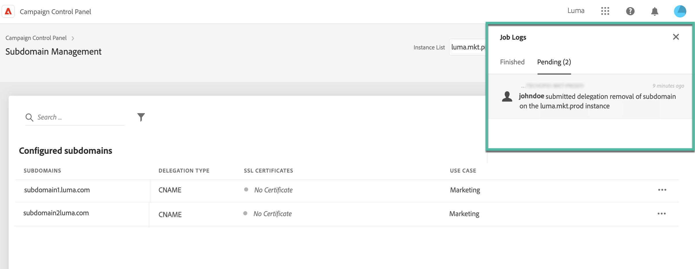

# Delegatie van subdomeinen naar Adobe verwijderen {#remove-delegated--subdomains}

>[!CONTEXTUALHELP]
>id="cp_subdomain_undelegate"
>title="Subdomeindelegatie verwijderen"
>abstract="In dit scherm kunt u de delegatie van een subdomein aan Adobe verwijderen. Houd er rekening mee dat dit proces niet ongedaan kan worden gemaakt en onomkeerbaar is totdat de uitvoering is voltooid.  Als u de delegatie van een primair domein voor de geselecteerde instantie probeert te verwijderen, wordt u gevraagd het domein te kiezen dat het gaat vervangen."

Met het Configuratiescherm kunt u de delegatie verwijderen van een subdomein dat is gedelegeerd aan Adobe.

>[!NOTE]
>
>Het verwijderen van de delegatie is momenteel niet beschikbaar voor subdomeinen die zijn ingesteld met behulp van CNAME&#39;s.

## Belangrijke opmerkingen {#important}

Overweeg zorgvuldig de gevolgen die optreden zodra het verwijderingsproces is gestart, voordat u doorgaat:

* Zodra het proces is geactiveerd, kan de verwijdering van subdomeindelegatie niet ongedaan worden gemaakt en is deze onomkeerbaar totdat de uitvoering van het proces is voltooid.
* Geen enkele andere subdomeindelegatie kan worden verwijderd wanneer een soortgelijk proces op een ander subdomein wordt uitgevoerd.
* Een delegatie die op een subdomein is verwijderd, kan pas 3 dagen na verwijdering opnieuw worden gedelegeerd.

## Een subdomeindelegatie verwijderen {#steps}

Volg deze stappen om de delegatie van een subdomein naar Adobe te verwijderen:

1. Klik op de knop met 3 puntjes naast de domeindelegatie die u wilt verwijderen en selecteer **[!UICONTROL Remove delegated subdomain]**.

   

1. Review de disclaimer en bevestig de verwijdering van de domeindelegatie aan Adobe.

1. Review informatie over de instantie waaraan het subdomein is gekoppeld, inclusief gerelateerde IP-affiniteiten en merkconfiguraties.

   Als u de delegatie van het primaire domein voor de geselecteerde instantie verwijdert, moet u het domein kiezen dat het gaat vervangen met behulp van de lijst **[!UICONTROL Replacement Domain]**.

   Klik op **[!UICONTROL Next]** om door te gaan met verwijderen.

   

1. Review het overzicht dat wordt weergegeven. Als u de verwijdering wilt bevestigen, typt u de URL van het domein waarvoor u de delegatie wilt verwijderen en klikt u op **[!UICONTROL Submit]**.

   

Nadat het verwijderen van de delegatie is gestart, wordt de taak in behandeling weergegeven in de taaklogboeken totdat deze is voltooid.

## Foutcodes {#FAQ}

In deze sectie worden de foutberichten weergegeven die kunnen optreden wanneer u probeert de delegatie van een subdomein te verwijderen:

| Foutcode | Bericht | Beschrijving |
|  ---  |  ---  |  ---  |
| 8002 | Gevraagde verwijdering van gedelegeerd domein kan niet worden behandeld omdat er een soortgelijk overlappend verzoek in behandeling is. Probeer het over 3 dagen | Er wordt al een subdomeindelegatie verwijderd voor de geselecteerde instantie. Wacht tot 3 dagen om een nieuwe verwijdertaak te starten. |
| 8003 | Gevraagde verwijdering van gedelegeerd domein wordt niet ondersteund voor deze instantie. | Het verwijderen van delegatie wordt niet ondersteund voor het geselecteerde subdomein vanwege een technisch probleem. Neem contact op met de klantenservice. |
| 8004 | Gevraagde verwijdering van gedelegeerd domein is niet toegestaan omdat er in dit geval slechts één domein is. | Er is slechts één subdomein gedelegeerd voor de geselecteerde instantie. Verwijdering van delegatie is niet toegestaan. |
| 8005 | Gevraagde verwijdering van gedelegeerd domein wordt niet ondersteund voor deze configuratie. | Het verwijderen van delegatie wordt niet ondersteund voor het geselecteerde subdomein vanwege een technisch probleem. Neem contact op met de klantenservice. |
| 8006 | Gevraagde verwijdering van gedelegeerd domein is om onbekende redenen niet toegestaan. Neem contact op met de klantenservice. | Het verwijderen van delegaties wordt niet ondersteund voor de geselecteerde instantie vanwege een onbekend probleem. Neem contact op met de klantenservice. |
