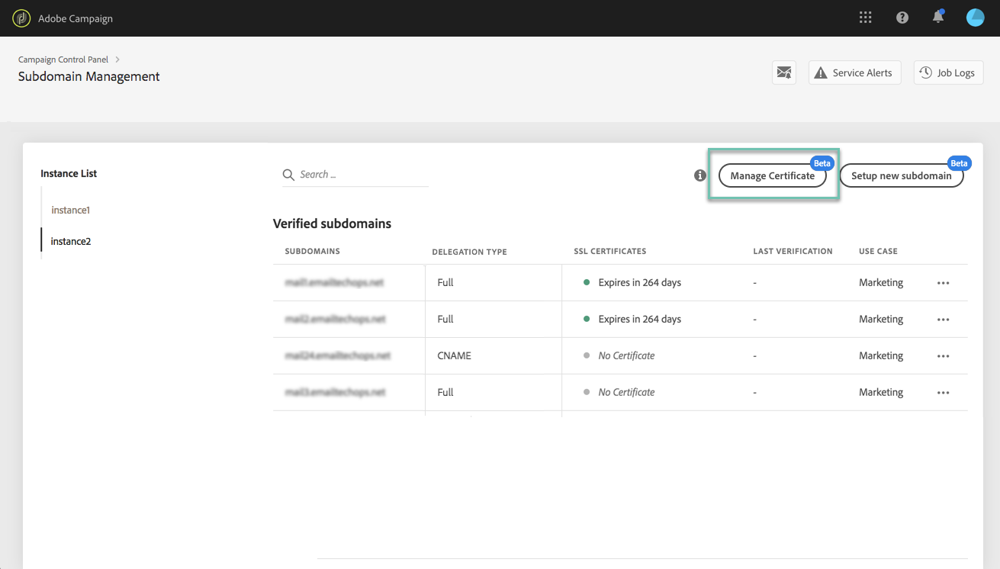
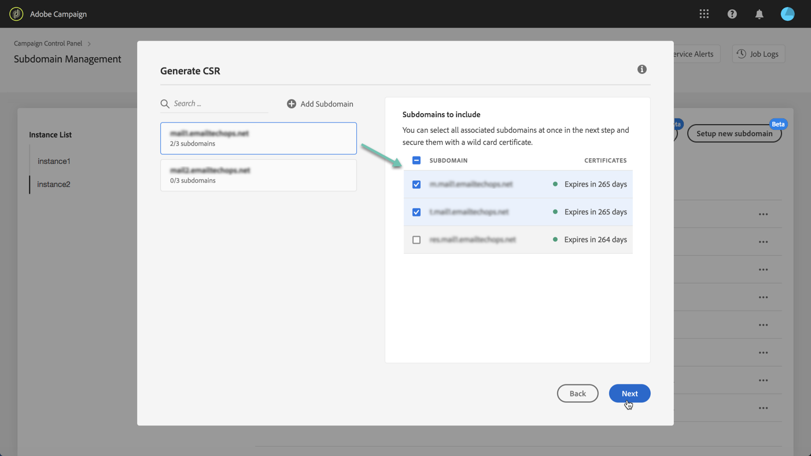

# Het SSL-certificaat van een subdomein verlengen {#renewing-subdomains-ssl-certificates}

>[!CONTEXTUALHELP]
>id="cp_add_ssl_certificate"
>title="SSL-certificaatvernieuwing"
>abstract="Als u een SSL-certificaat wilt vernieuwen, moet u een CSR genereren, het SSL-certificaat voor uw subdomeinen aanschaffen en de certificaatbundel installeren."
>additional-url="https://experienceleague.adobe.com/docs/control-panel/using/subdomains-and-certificates/renewing-subdomain-certificate.html#generating-csr" text="Een Certificate Signing Request (CSR) genereren"
>additional-url="https://experienceleague.adobe.com/docs/control-panel/using/subdomains-and-certificates/renewing-subdomain-certificate.html#installing-ssl-certificate" text="Een SSL-certificaat installeren"

## Certificaatverlenging {#about-certificate-renewal-process}

>[!IMPORTANT]
>
>De subdomeinconfiguratie via het configuratiescherm is beschikbaar in de bètaversie en kan zonder voorafgaande kennisgeving regelmatig worden bijgewerkt en gewijzigd.

Het proces voor het verlengen van SSL-certificaten bestaat uit drie stappen:

1. **Het genereren van de Certificate Signing Request (CSR)**
De Adobe-klantenservice genereert een CSR voor u. U moet informatie verstrekken die nodig is om de CSR te genereren (zoals algemene naam, organisatienaam en -adres, enz.).
1. **Aankoop van het SSL-certificaat**
Nadat de CSR is gegenereerd, kunt u deze downloaden en gebruiken om het SSL-certificaat aan te schaffen bij de certificeringsinstantie die door uw bedrijf is goedgekeurd.
1. **Installatie van het SSL-certificaat**
Nadat u het SSL-certificaat hebt aangeschaft, kunt u het op het gewenste subdomein installeren.

 Deze functie in video ontdekken met [Campaign Classic](https://experienceleague.adobe.com/docs/campaign-classic-learn/control-panel/subdomains-and-certificates/adding-ssl-certificates.html#subdomains-and-certificates) of [Campaign Standard](https://experienceleague.adobe.com/docs/campaign-standard-learn/control-panel/subdomains-and-certificates/adding-ssl-certificates.html#adding-ssl-certificates).

## Een Certificate Signing Request (CSR) genereren {#generating-csr}

>[!CONTEXTUALHELP]
>id="cp_generate_csr"
>title="CSR-generatie"
>abstract="Voordat u een certificaat aanschaft, moet een Certificate Signing Request (CSR) worden gegenereerd voor de instantie en subdomeinen die u wilt beveiligen."

>[!CONTEXTUALHELP]
>id="cp_select_subdomains"
>title="Selecteer de subdomeinen voor uw CSR."
>abstract="U kunt naar wens alle of alleen specifieke subdomeinen opnemen in uw Certificate Signing Request (CSR). Alleen geselecteerde subdomeinen worden gecertificeerd via het aangeschafte SSL-certificaat."
>additional-url="https://experienceleague.adobe.com/docs/control-panel/using/subdomains-and-certificates/subdomains-branding.html" text="Informatie over branding van subdomeinen"

Voer de volgende stappen uit om een Certificate Signing Request (CSR) te genereren:

1. Selecteer in de kaart **[!UICONTROL Subdomains & Certificates]** de gewenste instantie en klik op de knop **[!UICONTROL Manage Certificate]**.

   

1. Selecteer **[!UICONTROL 1 - Generate a CSR]** en klik op **[!UICONTROL Next]** om de wizard te starten die u door het proces voor het genereren van een CSR zal leiden.

   

1. Er wordt een formulier weergegeven met alle gegevens die nodig zijn om de CSR te genereren.

   Zorg ervoor dat u de gevraagde informatie volledig en correct invult; anders kan het certificaat niet worden verlengd (neem indien nodig contact op met uw interne team en het beveiligings- en IT-team). Klik vervolgens op **[!UICONTROL Next]**.

   * **[!UICONTROL Organization]**: officiële naam van de organisatie.
   * **[!UICONTROL Organization Unit]**: eenheid die is gekoppeld aan het subdomein (voorbeeld: Marketing, IT).
   * **[!UICONTROL Instance]** (vooraf ingevuld): URL van de Campaign-instantie die aan het subdomein is gekoppeld.

   

1. Selecteer de subdomeinen die u in de CSR wilt opnemen en klik op **[!UICONTROL OK]**.

   

1. De geselecteerde subdomeinen worden weergegeven in de lijst. Selecteer voor elk subdomein of u het wilt opnemen en klik op **[!UICONTROL Next]**.

   

1. Er wordt een samenvatting weergegeven van de subdomeinen die u in de CSR wilt opnemen. Klik op **[!UICONTROL Submit]** om uw aanvraag te bevestigen.

   

1. Het csr-bestand dat overeenkomt met uw selectie, wordt automatisch gegenereerd en gedownload. U kunt het nu gebruiken om het SSL-certificaat aan te schaffen bij de Certificate Authority (certificeringsinstantie) die door uw bedrijf is goedgekeurd.

   >[!NOTE]
   >
   >Als de CSR niet wordt opgeslagen/gedownload, gaat de aanvraag verloren en u moet u deze opnieuw genereren.

## Een certificaat aanschaffen met de CSR {#purchasing-certificate}

Nadat u een Certificate Signing Request (CSR) hebt verkregen via het Configuratiescherm, koopt u een SSL-certificaat bij een certificeringsinstantie die is goedgekeurd door uw organisatie.

## Het SSL-certificaat installeren {#installing-ssl-certificate}

>[!CONTEXTUALHELP]
>id="cp_install_ssl_certificate"
>title="SSL-certificaatinstallatie"
>abstract="Installeer het SSL-certificaat dat u hebt aangeschaft bij de certificeringsinstantie die is goedgekeurd door uw organisatie."
>additional-url="https://experienceleague.adobe.com/docs/control-panel/using/subdomains-and-certificates/subdomains-branding.html" text="Informatie over branding van subdomeinen"

Nadat u een SSL-certificaat hebt aangeschaft, kunt u het op uw instantie installeren. Voordat u verdergaat, moet u op de hoogte zijn van de volgende voorwaarden:

* De Certificate Signing Request (CSR) moet zijn gegenereerd vanuit het Configuratiescherm. Anders kunt u het certificaat niet installeren via het Configuratiescherm.
* Het CSR-verzoek (Certificate Signing Request) moet overeenkomen met het subdomein dat is geconfigureerd om te werken met Adobe. Bijvoorbeeld, kan het niet meer subdomeinen bevatten die zijn gevormd.
* Het certificaat moet een huidige datum hebben. Certificaten met datums in de toekomst kunnen niet worden geïnstalleerd. Bovendien mogen certificaten niet verlopen zijn (geldige begin- en einddatum).
* Het certificaat moet worden uitgegeven door een vertrouwde certificeringsinstantie (CA) zoals Comodo, DigiCert of GoDaddy, enz.
* De grootte van het certificaat moet 2048 bits zijn en de algoritme moet RSA zijn.
* Het certificaat moet de indeling X.509 PEM hebben.
* SAN-certificaten worden ondersteund.
* Wildcard-certificaten worden niet ondersteund.
* Het zipbestand of het certificaat mag niet met een wachtwoord beveiligd zijn.
* Het zipbestand mag alleen het volgende bevatten in bij voorkeur afzonderlijke bestanden:
   * Eindentiteitscertificaat
   * Keten van tussencertificaten (in de juiste volgorde gerangschikt)
   * Basiscertificaat (optioneel)

Voer de volgende stappen uit om het certificaat te installeren:

1. Selecteer in de kaart **[!UICONTROL Subdomains & Certificates]** de gewenste instantie en klik op de knop **[!UICONTROL Manage Certificate]**.

   

1. Selecteer **[!UICONTROL 3 - Install Certificate Bundle]** en klik op **[!UICONTROL Next]** om de wizard te starten die u door het certificaatinstallatieproces zal leiden.

   

1. Selecteer het zipbestand dat het te installeren certificaat bevat en klik op **[!UICONTROL Submit]**.

   

>[!NOTE]
>
>Het certificaat wordt geïnstalleerd op alle domeinen/subdomeinen die in de CSR zijn opgenomen. Eventuele extra domeinen of subdomeinen in het certificaat worden niet in aanmerking genomen.

Nadat het SSL-certificaat is geïnstalleerd, worden de vervaldatum en het statuspictogram van het certificaat dienovereenkomstig bijgewerkt.

**Verwante onderwerpen:**

* [Branding van subdomeinen](../../subdomains-certificates/using/subdomains-branding.md)
* [Uw subdomeinen controleren](../../subdomains-certificates/using/monitoring-subdomains.md)
