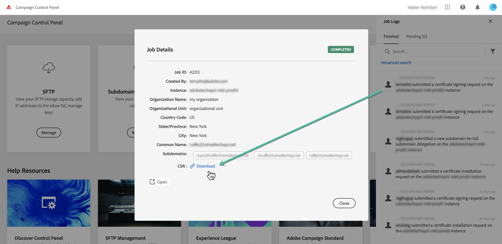

# SSL-certificaten verlengen {#renewing-subdomains-ssl-certificates}

>[!CONTEXTUALHELP]
>id="cp_add_ssl_certificate"
>title="SSL-certificaat verlengen"
>abstract="Als u een SSL-certificaat wilt verlengen, moet u een CSR genereren, het SSL-certificaat voor uw subdomeinen aanschaffen en de certificaatbundel installeren. Deze bewerking is alleen vereist als u ervoor hebt gekozen certificaten handmatig te beheren in plaats van deze aan Adobe te delegeren. "

>[!NOTE]
>
>Het vernieuwen van de SSL-certificaten van uw subdomeinen is alleen vereist als u ervoor kiest om zelf certificaten te beheren in plaats van dit proces aan Adobe te delegeren. Het delegeren van SSL-certificaten van uw subdomeinen aan Adobe wordt sterk aanbevolen, omdat Adobe het certificaat automatisch maakt en elk jaar vernieuwt voordat het certificaat verloopt. [Meer informatie over beheer van SSL-certificaten](monitoring-ssl-certificates.md#management)

Het proces voor het verlengen van SSL-certificaten bestaat uit drie stappen:

1. **Certificate Signing Request (CSR) genereren**

   Voordat u een certificaat aanschaft, moet een Certificate Signing Request (CSR) worden gegenereerd voor de instantie en subdomeinen die u wilt beveiligen. U moet informatie verstrekken die nodig is om het CSR te genereren (zoals algemene naam, organisatienaam en -adres, enz.). [Meer informatie](#generate)

1. **Aankoop van het SSL-certificaat**

   Zodra het CSR is gegenereerd, kunt u het gebruiken om het SSL-certificaat aan te schaffen bij de certificeringsautoriteit die door uw bedrijf is goedgekeurd.

1. **Installatie van het SSL-certificaat**

   Installeer het aangeschafte SSL-certificaat op het gewenste subdomein om dit te beveiligen. [Meer informatie](#install)

 Een video-uitleg van deze functie met [Campaign v7/v8](https://experienceleague.adobe.com/docs/campaign-classic-learn/control-panel/subdomains-and-certificates/adding-ssl-certificates.html?lang=nl#subdomains-and-certificates) of [Campaign Standard](https://experienceleague.adobe.com/docs/campaign-standard-learn/control-panel/subdomains-and-certificates/adding-ssl-certificates.html?lang=nl#adding-ssl-certificates).

**Verwante onderwerpen:**

* [Best Practice-gids voor levering - aanvraagproces voor een SSL-certificaat voor Adobe Campaign](https://experienceleague.adobe.com/docs/deliverability-learn/deliverability-best-practice-guide/additional-resources/campaign/ac-ssl-certificate-request.html?lang=nl)
* [Branding van subdomeinen](../../subdomains-certificates/using/subdomains-branding.md)
* [Uw subdomeinen bewaken](../../subdomains-certificates/using/monitoring-subdomains.md)

## De CSR genereren {#generate}

>[!CONTEXTUALHELP]
>id="cp_generate_csr"
>title="Genereren van CSR"
>abstract="Voordat u een certificaat aanschaft, moet een Certificate Signing Request (CSR) worden gegenereerd voor de instantie en subdomeinen die u wilt beveiligen."

>[!CONTEXTUALHELP]
>id="cp_select_subdomains"
>title="Selecteer de subdomeinen voor uw CSR."
>abstract="U kunt naar wens alle of alleen specifieke subdomeinen opnemen in uw Certificate Signing Request (CSR). Alleen geselecteerde subdomeinen worden gecertificeerd via het aangeschafte SSL-certificaat."

Voer de volgende stappen uit om een Certificate Signing Request (CSR) te genereren:

1. Selecteer in de kaart **[!UICONTROL Subdomains & Certificates]** de gewenste instantie en klik op de knop **[!UICONTROL Manage Certificate]**.

   

1. Selecteer **[!UICONTROL 1 - Generate a CSR]** en klik op **[!UICONTROL Next]** om de wizard te starten die u door het proces voor het genereren van een CSR zal leiden.

   

1. Er wordt een formulier weergegeven met alle gegevens die nodig zijn om de CSR te genereren.

   Zorg ervoor dat u de gevraagde informatie volledig en correct invult; anders kan het certificaat niet worden verlengd (neem indien nodig contact op met uw interne team en het beveiligings- en IT-team). Klik vervolgens op **[!UICONTROL Next]**.

   * **[!UICONTROL Organization]**: officiële naam van de organisatie.
   * **[!UICONTROL Organization Unit]**: eenheid die is gekoppeld aan het subdomein (voorbeeld: Marketing, IT).
   * **[!UICONTROL Instance]** (vooraf ingevuld): URL van de Campaign-instantie die aan het subdomein is gekoppeld.
   * **[!UICONTROL Common name]**: de algemene naam is standaard geselecteerd. U kunt indien nodig een van de subdomeinen selecteren.

   

1. Selecteer de subdomeinen die u in de CSR wilt opnemen en klik op **[!UICONTROL OK]**.

   

1. De geselecteerde subdomeinen worden weergegeven in de lijst. Selecteer voor elk subdomein of u het wilt opnemen en klik op **[!UICONTROL Next]**.

   

1. Er wordt een samenvatting weergegeven van de subdomeinen die u in de CSR wilt opnemen. Klik op **[!UICONTROL Submit]** om uw aanvraag te bevestigen.

   

   >[!NOTE]
   >
   >Met de knop **[!UICONTROL Copy CSR content]** kunt u alle informatie met betrekking tot de CSR kopiëren (organisatie-ID, instantie, naam van organisatie, algemene naam, opgenomen subdomeinen, enz.)

1. Het CSR-bestand dat overeenkomt met uw selectie, wordt automatisch gegenereerd en gedownload. U kunt het nu gebruiken om het SSL-certificaat aan te schaffen bij de certificeringsinstantie die door uw bedrijf is goedgekeurd. Als u de CSR opnieuw moet downloaden, volgt u de stappen beschreven in [deze sectie](#download).

Nadat uw CSR is gegenereerd en gedownload, kunt u het gebruiken om een SSL-certificaat aan te schaffen bij een certificeringsinstantie die is goedgekeurd door uw organisatie.

Nadat het SSL-certificaat is aangeschaft, kunt u het op uw instantie installeren om uw subdomein te beveiligen. [Meer informatie](#install)

## CSR downloaden {#download}

Als u een SSL-certificaat wilt aanschaffen, moet u eerst de CSR (Certificate Signing Request) downloaden. De CSR wordt automatisch gedownload nadat deze is gegenereerd. U kunt deze ook op elk moment opnieuw downloaden vanuit de taaklogboeken:

1. In de **[!UICONTROL Job Logs]**, selecteert u het tabblad **[!UICONTROL Finished]** en filtert u de lijst vervolgens om taken weer te geven die betrekking hebben op het beheer van subdomeinen.

   

1. Open de taak die overeenkomt met het genereren van de CSR en klik op de koppeling **[!UICONTROL Downbload]** om het CSR-bestand op te halen.

   

## Het SSL-certificaat installeren {#install}

>[!CONTEXTUALHELP]
>id="cp_install_ssl_certificate"
>title="SSL-certificaat installeren"
>abstract="Installeer het SSL-certificaat dat u hebt aangeschaft bij de certificeringsinstantie die is goedgekeurd door uw organisatie."

Nadat u een SSL-certificaat hebt aangeschaft, kunt u het op uw instantie installeren. Voordat u verdergaat, moet u op de hoogte zijn van de volgende voorwaarden:

* De Certificate Signing Request (CSR) moet zijn gegenereerd vanuit het Configuratiescherm. Anders kunt u het certificaat niet installeren via het Configuratiescherm.
* De Certificate Signing Request (CSR) moet overeenkomen met het subdomein dat is geconfigureerd om met Adobe te werken. Het kan bijvoorbeeld niet meer subdomeinen bevatten dan het subdomein dat is geconfigureerd.
* Het certificaat moet een huidige datum hebben. Certificaten met datums in de toekomst kunnen niet worden geïnstalleerd. Bovendien mogen certificaten niet verlopen zijn (geldige begin- en einddatum).
* Het certificaat moet worden uitgegeven door een vertrouwde certificeringsinstantie (CA) zoals Comodo, DigiCert of GoDaddy, enz.
* De grootte van het certificaat moet 2048 bits zijn en de algoritme moet RSA zijn.
* Het certificaat moet de indeling X.509 PEM hebben.
* SAN-certificaten worden ondersteund.
* Wildcard-certificaten worden niet ondersteund.
* Het zipbestand of het certificaat mag niet met een wachtwoord beveiligd zijn.
* Het zipbestand mag alleen het volgende bevatten in bij voorkeur afzonderlijke bestanden:
   * Eindentiteitscertificaat
   * Keten van tussencertificaten (in de juiste volgorde gerangschikt)
   * Basiscertificaat (optioneel)

Voer de volgende stappen uit om het certificaat te installeren:

1. Selecteer in de kaart **[!UICONTROL Subdomains & Certificates]** de gewenste instantie en klik op de knop **[!UICONTROL Manage Certificate]**.

   

1. Selecteer **[!UICONTROL 3 - Install Certificate Bundle]** en klik op **[!UICONTROL Next]** om de wizard te starten die u door het certificaatinstallatieproces zal leiden.

   

1. Selecteer het zipbestand dat het te installeren certificaat bevat en klik op **[!UICONTROL Submit]**.

   

>[!NOTE]
>
>Het certificaat wordt geïnstalleerd op alle domeinen/subdomeinen die in de CSR zijn opgenomen. Eventuele extra domeinen of subdomeinen in het certificaat worden niet in aanmerking genomen.

Nadat het SSL-certificaat is geïnstalleerd, worden de vervaldatum en het statuspictogram van het certificaat dienovereenkomstig bijgewerkt.
