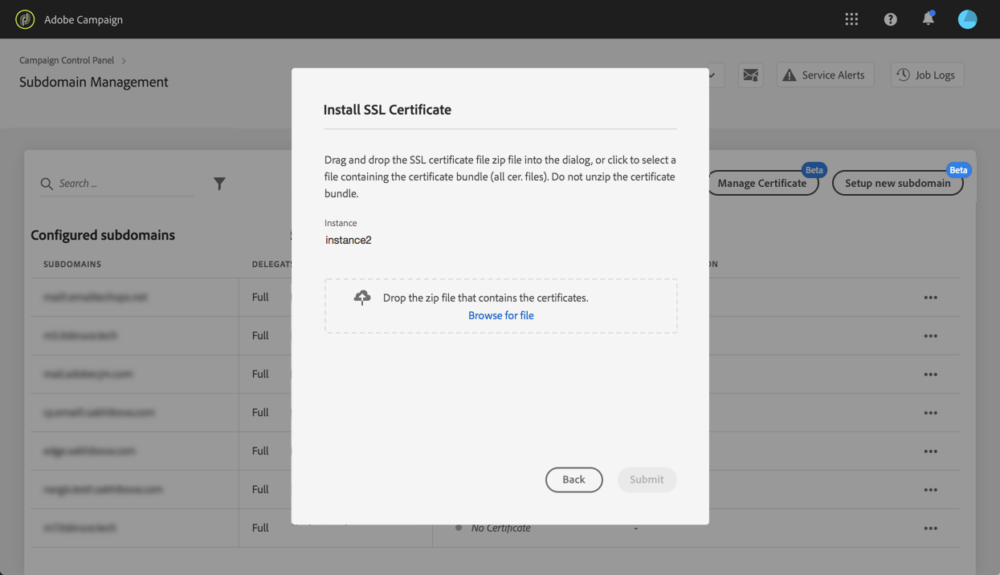

# SSL-certificaat van een subdomein vernieuwen {#renewing-subdomains-ssl-certificates}

>[!CONTEXTUALHELP]
>id="cp_add_ssl_certificate"
>title="SSL-certificaat toevoegen"
>abstract="Als u een SSL-certificaat wilt toevoegen, moet u een CSR genereren, het SSL-certificaat voor uw subdomeinen aanschaffen en de certificaatbundel installeren."
>additional-url="https://docs.adobe.com/content/help/en/control-panel/using/subdomains-and-certificates/renewing-subdomain-certificate.html#generating-csr" text="CSR (Certificate Signing Request) genereren"
>additional-url="https://docs.adobe.com/content/help/en/control-panel/using/subdomains-and-certificates/renewing-subdomain-certificate.html#installing-ssl-certificate" text="Een SSL-certificaat installeren"

>[!IMPORTANT]
>
>De delegatie van subdomeinen van het Controlebord is beschikbaar in bèta, en onderworpen aan regelmatige updates en wijzigingen zonder bericht.

## Certificaatvernieuwing {#about-certificate-renewal-process}

Het SSL-certificaatvernieuwingsproces bestaat uit drie stappen:

1. **Door het genereren van de CSR (Certificate Signing Request)** Adobe Klantenservice wordt een CSR voor u gegenereerd. U zult wat informatie moeten verstrekken die wordt vereist om CSR (zoals Gemeenschappelijke Naam, Naam en adres van de Organisatie, enz.) te produceren.
1. **Aankoop van het SSL-certificaat** Nadat de CSR is gegenereerd, kunt u het downloaden en gebruiken om het SSL-certificaat aan te schaffen bij de certificeringsinstantie die door uw bedrijf is goedgekeurd.
1. **Installatie van het SSL-certificaat** Nadat u het SSL-certificaat hebt aangeschaft, kunt u het op het gewenste subdomein installeren.

## CSR (Certificate Signing Request) genereren {#generating-csr}

>[!CONTEXTUALHELP]
>id="cp_generate_csr"
>title="CSR genereren"
>abstract="Aanvraag voor certificaatondertekening moet worden gegenereerd voor de instantie en subdomeinen die u wilt beveiligen voordat u een certificaat aanschaft."

>[!CONTEXTUALHELP]
>id="cp_select_subdomains"
>title="Selecteer subdomeinen voor uw CSR"
>abstract="U kunt alle of alleen specifieke subdomeinen opnemen in uw certificaataanvraag. Alleen geselecteerde subdomeinen worden gecertificeerd via het aangeschafte SSL-certificaat."
>additional-url="https://docs.adobe.com/content/help/en/control-panel/using/subdomains-and-certificates/renewing-subdomain-certificate.html#generating-csr" text="CSR (Certificate Signing Request) genereren"
>additional-url="https://docs.adobe.com/content/help/en/control-panel/using/subdomains-and-certificates/subdomains-branding.html" text="Informatie over branding van subdomeinen"

Voer de volgende stappen uit om een CSR-aanvraag (Certificate Signing Request) te genereren:

1. Selecteer in de **[!UICONTROL Subdomains & Certificates]** kaart de gewenste variant en klik op de **[!UICONTROL Manage Certificate]** knop.

   

1. Selecteer **[!UICONTROL 1 - Generate a CSR]**, dan klik **[!UICONTROL Next]** om de tovenaar te lanceren die u door het CSR generatieproces zal begeleiden.

   

1. Er wordt een formulier weergegeven met alle gegevens die nodig zijn om de CSR te genereren.

   Zorg ervoor dat u de gevraagde informatie volledig en correct invult, anders kan het certificaat niet worden vernieuwd (neem indien nodig contact op met uw interne team, beveiligings- en IT-teams) en klik op **[!UICONTROL Next]**.

   * **[!UICONTROL Organization]**: naam van de officiële organisatie.
   * **[!UICONTROL Organization Unit]**: eenheid die is gekoppeld aan het subdomein (voorbeeld: Marketing, IT).
   * **[!UICONTROL Instance]** (voorgevulde spuit): URL van de instantie Campagne die aan subdomain wordt geassocieerd.
   

1. Selecteer de subdomeinen om in CSR te omvatten, dan klik **[!UICONTROL OK]**.

   

1. De geselecteerde subdomeinen worden weergegeven in de lijst. Selecteer voor elk subdomein de subdomeinen die u wilt opnemen en klik op **[!UICONTROL Next]**.

   

1. Een samenvatting van subdomeinen om in de vertoningen te omvatten CSR. Klik **[!UICONTROL Submit]** om uw verzoek te bevestigen.

   

1. Het CSR-bestand dat overeenkomt met uw selectie, wordt automatisch gegenereerd en gedownload. U kunt het nu gebruiken om het SSL-certificaat aan te schaffen bij de Certificate Authority (certificeringsinstantie) die door uw bedrijf wordt goedgekeurd.

   >[!NOTE]
   >
   >Als CSR niet wordt opgeslagen/gedownload, zal het worden verloren en u zult het opnieuw moeten produceren.

## Een certificaat aanschaffen met de CSR {#purchasing-certificate}

Nadat u een CSR-bestand voor certificaatondertekening hebt verkregen van het Configuratiescherm, koopt u een SSL-certificaat aan bij een certificeringsinstantie die is goedgekeurd door uw organisatie.

## Het SSL-certificaat installeren {#installing-ssl-certificate}

>[!CONTEXTUALHELP]
>id="cp_install_ssl_certificate"
>title="SSL-certificaat installeren"
>abstract="Installeer het SSL-certificaat dat u hebt aangeschaft bij de certificeringsinstantie die is goedgekeurd door uw organisatie."
>additional-url="https://docs.adobe.com/content/help/en/control-panel/using/subdomains-and-certificates/subdomains-branding.html" text="Informatie over branding van subdomeinen"

Nadat u een SSL-certificaat hebt aangeschaft, kunt u het op uw exemplaar installeren. Voordat u verdergaat, moet u zich bewust zijn van de volgende voorwaarden:

* De CSR-aanvraag (Certificate Signing Request) moet zijn gegenereerd vanuit het Configuratiescherm. Anders kunt u het certificaat niet installeren via het Configuratiescherm.
* De CSR (Certificate Signing Request) moet overeenkomen met het subdomein dat aan Adobe is gedelegeerd. Het kan bijvoorbeeld niet meer subdomeinen bevatten die zijn gedelegeerd.
* Het certificaat moet een huidige datum hebben. Certificaten met datums kunnen in de toekomst niet worden geïnstalleerd en mogen niet verlopen (geldige begin- en einddatum).
* Het certificaat moet worden uitgegeven door een vertrouwde certificeringsinstantie (CA), zoals Comodo, DigiCert, GoPapa, enz.
* De grootte van het certificaat moet 2048 bits zijn en het algoritme moet RSA zijn.
* Het certificaat moet de indeling X.509 PEM hebben.
* SAN-certificaten worden ondersteund.
* Jokertekens worden niet ondersteund.
* Het ZIP-bestand of het certificaat moet niet met een wachtwoord beveiligd zijn.
* Het ZIP-bestand mag alleen het volgende bevatten in bij voorkeur afzonderlijke bestanden:
   * Eindentiteitscertificaat.
   * Tussentijdse certificaatketen (in de juiste volgorde gerangschikt).
   * Basiscertificaat (optioneel).

Voer de volgende stappen uit om het certificaat te installeren:

1. Selecteer in de **[!UICONTROL Subdomains & Certificates]** kaart de gewenste variant en klik op de **[!UICONTROL Manage Certificate]** knop.

   

1. Selecteer **[!UICONTROL 3 - Install Certificate Bundle]**, klik dan **[!UICONTROL Next]** om de tovenaar te lanceren die u door het proces van de certificaatinstallatie zal begeleiden.

   

1. Selecteer het .zip-bestand dat het te installeren certificaat bevat en klik op **[!UICONTROL Submit]**.

   

>[!NOTE]
>
>Het certificaat wordt geïnstalleerd op alle domeinen/subdomeinen inbegrepen in CSR. Eventuele extra domein of subdomein in het certificaat worden niet in aanmerking genomen.

Nadat het SSL-certificaat is geïnstalleerd, worden de vervaldatum en het statuspictogram van het certificaat dienovereenkomstig bijgewerkt.

**Verwante onderwerpen:**

* [SSL-certificaten toevoegen (zelfstudie video)](https://docs.adobe.com/content/help/en/campaign-learn/campaign-standard-tutorials/administrating/control-panel/adding-ssl-certificates.html)
* [Branding van subdomeinen](../../subdomains-certificates/using/subdomains-branding.md)
* [De subdomeinen controleren](../../subdomains-certificates/using/monitoring-subdomains.md)