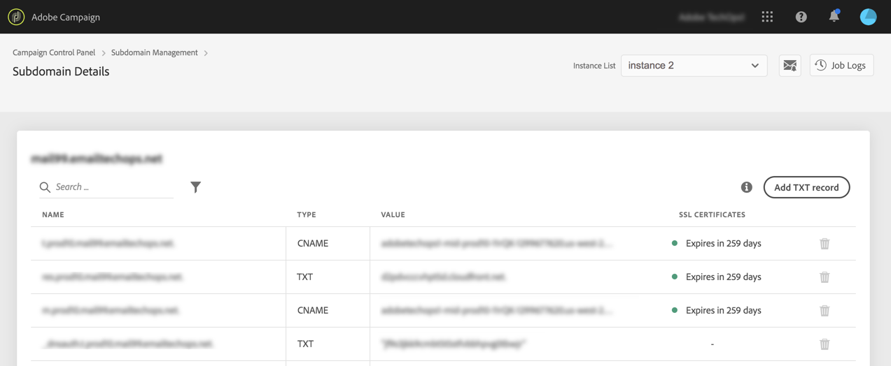
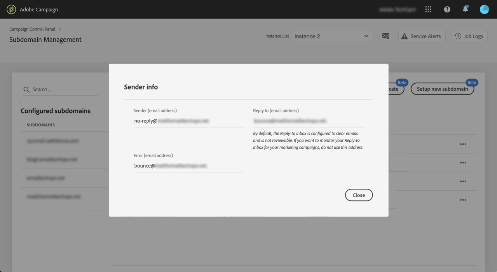

# Een nieuw subdomein instellen {#setting-up-subdomain}

>[!CONTEXTUALHELP]
>id="cp_subdomain_management"
>title="Nieuwe subdomeinen instellen en certificaten beheren"
>abstract="U moet een nieuw subdomein instellen en de SSL-certificaten van uw subdomeinen beheren voordat u e-mails kunt verzenden of landingspagina’s kunt publiceren met Adobe Campaign."
>additional-url="https://docs.adobe.com/content/help/nl-NL/control-panel/using/subdomains-and-certificates/monitoring-ssl-certificates.html" text="SSL-certificaten van uw subdomeinen bewaken"

## Verplichte lectuur {#must-read}

>[!IMPORTANT]
>
>Subdomeinconfiguratie van het Controlebord is beschikbaar in bèta, en onderworpen aan regelmatige updates en wijzigingen zonder bericht.

Deze pagina verstrekt informatie over hoe te opstelling nieuwe subdomeinen gebruikend Volledige subdomain delegatie of CNAMEs. Algemene concepten voor deze twee methoden worden in deze sectie beschreven: [Subdomeinen branding](../../subdomains-certificates/using/subdomains-branding.md).

**Verwant onderwerp:**

* [Uw subdomeinen bewaken](../../subdomains-certificates/using/monitoring-subdomains.md)

### Instantieselectie

Subdomeinconfiguratie is alleen beschikbaar voor **productie** instanties.

Als de instantie die u in de tovenaar selecteert geen eerder opstellings subdomeinen heeft, zal eerste gevormde subdomain **primair subdomain** voor die instantie worden en u zult niet het in de toekomst kunnen veranderen.

Als gevolg hiervan worden **reverse DNS-records** gemaakt voor andere subdomeinen met dit primaire subdomein. **Antwoordadressen en adressen voor retourzending voor andere subdomeinen worden op basis van het primaire subdomein gegenereerd.**

### Configuratie Nameservers

Wanneer u naamservers configureert, mag u het hoofdsubdomein **nooit aan Adobe delegeren**. Anders werkt het domein alleen met Adobe. Elk ander gebruik is onmogelijk, zoals bijvoorbeeld het verzenden van interne e-mails naar de werknemers van uw organisatie.

Bovendien mag u **geen afzonderlijk zonebestand maken** voor dit nieuwe subdomein.

## Volledige subdomeindelegatie {#full-subdomain-delegation}

Volg de onderstaande stappen om een subdomein volledig te delegeren aan Adobe Campaign.

 Deze functie in video ontdekken met  [Campagne ](https://experienceleague.adobe.com/docs/campaign-classic-learn/control-panel/subdomains-and-certificates/subdomain-delegation.html?lang=en#subdomains-and-certificates) Classicor  [Campaign Standard](https://experienceleague.adobe.com/docs/campaign-standard-learn/control-panel/subdomains-and-certificates/subdomain-delegation.html?lang=en#subdomains-and-certificates)

1. Selecteer in de kaart **[!UICONTROL Subdomains & Certificates]** de gewenste productie-instantie en klik op **[!UICONTROL Setup new subdomain]**.

   

1. Klik op **[!UICONTROL Next]** om de methode voor volledige delegatie te bevestigen.

   

1. Maak het gewenste subdomein en naamservers in de hostingoplossing die door uw organisatie wordt gebruikt. Daarvoor kopieert u de weergegeven informatie van de Adobe-naamserver en plakt u deze in de wizard. Raadpleeg de [videotutorial](https://video.tv.adobe.com/v/30175?captions=dut) voor meer informatie over het maken van een subdomein in een hostingoplossing.

   

1. Wanneer het subdomein is gemaakt met de bijbehorende Adobe-naamservergegevens, klikt u op **[!UICONTROL Next]**.

1. Als u een Campaign Classic-instantie hebt geselecteerd, selecteert u het gewenste gebruiksgeval voor het subdomein: **Marketingscommunicatie** of **Transactionele en operationele communicatie**. Algemene concepten in de gebruiksgevallen van subdomeinen worden weergegeven in [deze sectie](../../subdomains-certificates/using/subdomains-branding.md#about-subdomains-use-cases).

   

1. Voer het subdomein in dat u in uw hostingoplossing hebt gemaakt en klik op **[!UICONTROL Submit]**.

   Zorg ervoor dat u de **volledige naam** invult van het subdomein dat u wilt delegeren. Als u bijvoorbeeld het subdomein usoffers.email.weretail.com wilt delegeren, typt u &#39;usoffers.email.weretail.com&#39;.

   

Zodra subdomain wordt voorgelegd, zullen diverse controles en configuratiestappen door het Controlebord worden uitgevoerd. Voor meer op dit, zie [Subdomain controles en configuratie](#subdomain-checks-and-configuration).

## Subdomeinconfiguratie met gebruik van CNAME-records {#use-cnames}

Volg de onderstaande stappen om een subdomein te configureren met gebruik van CNAME&#39;s.

 Deze functie in video ontdekken met  [Campagne ](https://experienceleague.adobe.com/docs/campaign-classic-learn/control-panel/subdomains-and-certificates/delegating-subdomains-using-cname.html?lang=en#subdomains-and-certificates) Classicor  [Campaign Standard](https://experienceleague.adobe.com/docs/campaign-standard-learn/control-panel/subdomains-and-certificates/delegating-subdomains-using-cname.html?lang=en)

1. Selecteer in de kaart **[!UICONTROL Subdomains & Certificates]** de gewenste productie-instantie en klik op **[!UICONTROL Setup new subdomain]**.

   

1. Selecteer de methode **[!UICONTROL CNAME]** en klik vervolgens op **[!UICONTROL Next]**.

   

1. Als u een Campaign Classic-instantie hebt geselecteerd, selecteert u het gewenste gebruiksgeval voor het subdomein: **Marketingscommunicatie** of **Transactionele en operationele communicatie**. Algemene concepten in de gebruiksgevallen van subdomeinen worden weergegeven in [deze sectie](../../subdomains-certificates/using/subdomains-branding.md#about-subdomains-use-cases).

   

1. Voer het subdomein in dat u in uw hostingoplossing hebt gemaakt en klik op **[!UICONTROL Next]**.

   Zorg ervoor u **volledige naam** van subdomain aan opstelling invult. Als u bijvoorbeeld het subdomein &quot;usaanbiedingen.email.weretail.com&quot; wilt configureren, typt u &quot;usaanbiedingen.email.weretail.com&quot;.

   

1. De lijst van verslagen die in uw DNS serververtoningen moeten worden geplaatst. Kopieer deze verslagen, of één voor één, of door een Csv- dossier te downloaden, dan navigeer aan uw domein ontvangende oplossing om de passende DNS verslagen te produceren.

   

1. Zorg ervoor dat alle DNS verslagen van vorige stappen in uw domein het ontvangen oplossing zijn geproduceerd. Als alles behoorlijk wordt gevormd, selecteer de eerste verklaring dan **[!UICONTROL Submit]** om te bevestigen.

   

   >[!NOTE]
   >
   >Als u de verslagen wilt tot stand brengen en de subdomeinconfiguratie later voorleggen, selecteer de tweede verklaring dan **[!UICONTROL Submit later]**. U zult dan de subdomeinconfiguratie van het subdomain beheersscherm **[!UICONTROL Processing]** gebied direct kunnen hervatten.
   >
   >Merk op dat DNS verslagen die op uw server moeten worden geplaatst door Controlebord 30 dagen zullen worden gehouden. Na die periode, zult u subdomain van kras moeten vormen.

Zodra subdomain wordt voorgelegd, zullen diverse controles en configuratiestappen door het Controlebord worden uitgevoerd. Voor meer op dit, zie [Subdomain controles en configuratie](#subdomain-checks-and-configuration).

## Controles en configuratie van subdomein {#subdomain-checks-and-configuration}

1. Zodra een subdomein is voorgelegd, zal het Controlebord controleren dat het correct aan Adobe NS- verslagen richt en dat het Begin van het verslag van de Autoriteit (SOA) niet voor dit subdomein bestaat.

   >[!NOTE]
   >
   >Merk op dat terwijl de looppas van de subdomeinconfiguratie, andere verzoeken door het Controlebord in een rij zullen zijn ingegaan en slechts uitgevoerd nadat de subdomeinconfiguratie voltooit, om het even welke prestatieskwesties te verhinderen.

1. Als de controles slagen, worden DNS-records, extra URL’s, inboxes, enz., voor het subdomein ingesteld.

   

   U kunt meer details op de configuratievooruitgang krijgen door de subdomeinconfiguratie **[!UICONTROL Details]** knoop te klikken.

   

1. Uiteindelijk wordt het **Afleverteam** over het nieuwe subdomein geïnformeerd, om het te controleren. Het controleproces kan tot 10 werkdagen duren nadat subdomain is gevormd.

   >[!IMPORTANT]
   >
   >De uitgevoerde leveringscontroles omvatten terugkoppelt lijnen en het testen van de spamklachtenlijnen. U kunt het subdomein daarom beter niet gebruiken voordat de controle is voltooid, aangezien dit in slechte subdomeinreputatie zou kunnen resulteren.

1. Aan het einde van het proces zijn de subdomeinen geconfigureerd voor uw Adobe Campaign-instantie en zijn de onderstaande elementen gemaakt:

   * **Het subdomein met de volgende DNS-records**: SOA, MX, CNAME(’s), DKIM, SPF, TXT
   * **Aanvullende subdomeinen** voor het hosten van spiegel-, resource- en trackingpagina’s en de domeinsleutel
   * **Inboxes**: Sender, Error, Reply-to

   Standaard is de inbox Reply-to in het Configuratiescherm geconfigureerd voor het wissen van e-mailberichten en kan deze niet worden weergegeven. Gebruik dit adres niet als u de inbox Reply-to voor uw marketingcampagnes wilt bewaken.

Klik op de knoppen **[!UICONTROL Subdomain details]** en **[!UICONTROL Sender info]** voor meer details over het subdomein.

## Problemen oplossen {#troubleshooting}

* In sommige gevallen gaat de subdomeinconfiguratie door, maar het subdomein kan niet met succes worden geverifieerd. Het subdomein blijft in de lijst **[!UICONTROL Configured]** staan met een taaklog dat informatie over de fout bevat. Neem contact op met de klantenservice als u het probleem niet kunt oplossen.
* Als het subdomein als Unverified wordt weergegeven nadat het is geconfigureerd, start u een nieuwe subdomeincontrole (**...**/**[!UICONTROL Verify subdomain]**). Als nog steeds dezelfde status wordt weergegeven, is er mogelijk een wijziging in het ontvangersschema aangebracht die niet kan worden gecontroleerd met standaardprocessen. Probeer een campagne met dat subdomein te verzenden.
* Als de leveringscontrolefase van de subdomeinconfiguratie te lang (meer dan 10 werkdagen) duurt, neemt u contact op met de klantenservice.
