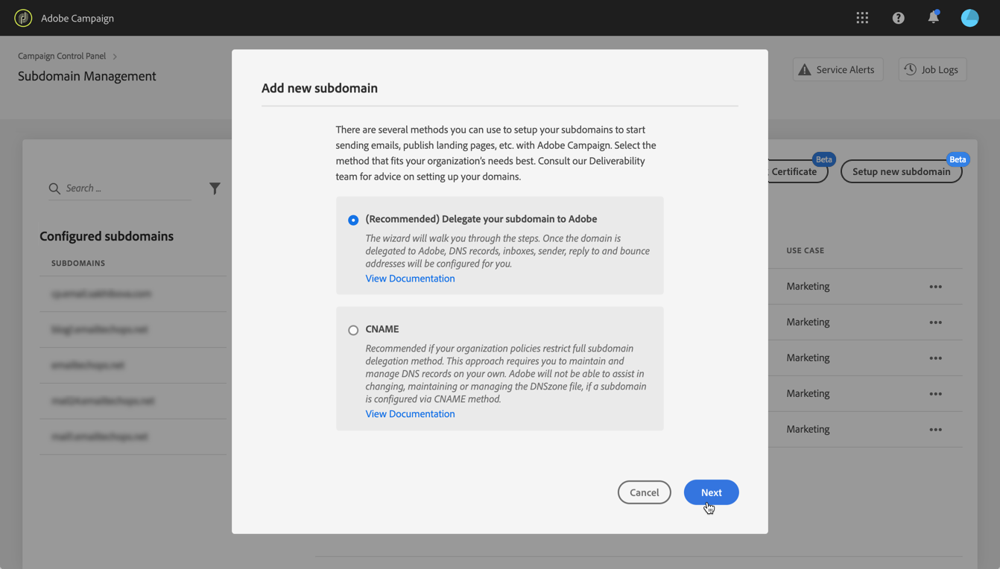
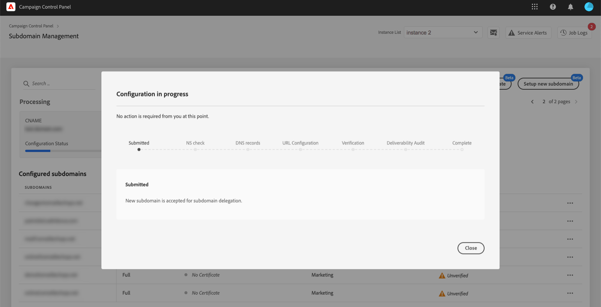

# Een nieuw subdomein instellen {#setting-up-subdomain}

>[!CONTEXTUALHELP]
>id="cp_subdomain_management"
>title="Nieuwe subdomeinen instellen en certificaten beheren"
>abstract="U moet een nieuw subdomein instellen en de SSL-certificaten van uw subdomeinen beheren voordat u e-mails kunt verzenden of landingspagina’s kunt publiceren met Adobe Campaign."
>additional-url="https://docs.adobe.com/content/help/nl-NL/control-panel/using/subdomains-and-certificates/monitoring-ssl-certificates.html" text="SSL-certificaten van uw subdomeinen bewaken"

## Lees hier meer {#must-read}

>[!IMPORTANT]
>
>De subdomeinconfiguratie via het configuratiescherm is beschikbaar in bèta en kan zonder voorafgaande kennisgeving regelmatig worden bijgewerkt en gewijzigd.

Deze pagina biedt informatie over het instellen van nieuwe subdomeinen met volledige subdomeindelegatie of CNAMEs Algemene concepten voor deze twee methoden worden in dit gedeelte beschreven: [Branding van subdomeinen](../../subdomains-certificates/using/subdomains-branding.md).

**Verwant onderwerp:**

* [Uw subdomeinen controleren](../../subdomains-certificates/using/monitoring-subdomains.md)

### Versieselectie

Subdomeinconfiguratie is alleen beschikbaar voor **productie** versies.

Als de versie die u in de wizard selecteert, geen eerder ingestelde subdomeinen heeft, wordt het eerste geconfigureerde subdomein het **primaire subdomein** voor die versie en kunt u dit in de toekomst niet meer wijzigen.

Als gevolg hiervan worden **reverse DNS-records** gemaakt voor andere subdomeinen die dit primaire subdomein gebruiken. **Antwoord- en bounce-adressen** voor andere subdomeinen worden gegenereerd vanuit het primaire subdomein.

### Configuratie naamservers

Wanneer u naamservers configureert, mag u het hoofdsubdomein **nooit aan Adobe delegeren**. Anders werkt het domein alleen met Adobe. Elk ander gebruik is onmogelijk, zoals bijvoorbeeld het verzenden van interne e-mails naar de werknemers van uw organisatie.

Bovendien mag u **geen afzonderlijk zonebestand maken** voor dit nieuwe subdomein.

## Volledige subdomeindelegatie {#full-subdomain-delegation}

Volg de onderstaande stappen om een subdomein volledig te delegeren aan Adobe Campaign.

 Deze functie in video ontdekken met [Campaign Classic](https://experienceleague.adobe.com/docs/campaign-classic-learn/control-panel/subdomains-and-certificates/subdomain-delegation.html?lang=nl#subdomains-and-certificates) of [Campaign Standard](https://experienceleague.adobe.com/docs/campaign-standard-learn/control-panel/subdomains-and-certificates/subdomain-delegation.html?lang=nl#subdomains-and-certificates)

1. Selecteer in de kaart **[!UICONTROL Subdomains & Certificates]** de gewenste productieversie en klik op **[!UICONTROL Setup new subdomain]**.

   

1. Klik op **[!UICONTROL Next]** om de methode voor volledige delegatie te bevestigen.

   

1. Maak het gewenste subdomein en naamservers in de hostingoplossing die door uw organisatie wordt gebruikt. Daarvoor kopieert u de weergegeven informatie van de Adobe-naamserver en plakt u deze in de wizard. Raadpleeg de [videotutorial](https://video.tv.adobe.com/v/30175) voor meer informatie over het maken van een subdomein in een hostingoplossing.

   

1. Klik op **[!UICONTROL Next]** wanneer het subdomein is gemaakt met de bijbehorende naamserverinformatie van Adobe.

1. Als u een Campaign Classic-versie hebt geselecteerd, selecteert u het gewenste gebruiksscenario voor het subdomein: **Marketingcommunicatie** of **Transactionele en operationele communicatie**. Algemene concepten in de gebruiksscenario&#39;s van subdomeinen worden weergegeven in [dit gedeelte](../../subdomains-certificates/using/subdomains-branding.md#about-subdomains-use-cases).

   

1. Voer het subdomein in dat u in uw hostingoplossing hebt gemaakt en klik op **[!UICONTROL Submit]**.

   Zorg ervoor dat u de **volledige naam** invult van het subdomein dat u wilt delegeren. Als u bijvoorbeeld het subdomein usoffers.email.weretail.com wilt delegeren, typt u &#39;usoffers.email.weretail.com&#39;.

   

Nadat het subdomein is verzonden, worden verschillende controles en configuratiestappen  uitgevoerd door het configuratiescherm. Zie voor meer informatie [Controles en configuratie van subdomeinen](#subdomain-checks-and-configuration).

## Subdomeinconfiguratie met gebruik van CNAMEs {#use-cnames}

Volg de onderstaande stappen om een subdomein te configureren met gebruik van CNAMEs.

 Deze functie in video ontdekken met [Campaign Classic](https://experienceleague.adobe.com/docs/campaign-classic-learn/control-panel/subdomains-and-certificates/delegating-subdomains-using-cname.html?lang=nl#subdomains-and-certificates) of [Campaign Standard](https://experienceleague.adobe.com/docs/campaign-standard-learn/control-panel/subdomains-and-certificates/delegating-subdomains-using-cname.html?lang=nl)

1. Selecteer in de kaart **[!UICONTROL Subdomains & Certificates]** de gewenste productieversie en klik op **[!UICONTROL Setup new subdomain]**.

   

1. Selecteer de methode **[!UICONTROL CNAME]** en klik op **[!UICONTROL Next]**.

   

1. Als u een Campaign Classic-versie hebt geselecteerd, selecteert u het gewenste gebruiksscenario voor het subdomein: **Marketingcommunicatie** of **Transactionele en operationele communicatie**. Algemene concepten in de gebruiksgevallen van subdomeinen worden weergegeven in [dit gedeelte](../../subdomains-certificates/using/subdomains-branding.md#about-subdomains-use-cases).

   

1. Voer het subdomein in dat u in uw hostingoplossing hebt gemaakt en klik op **[!UICONTROL Next]**.

   Zorg ervoor dat u de **volledige naam** invult van het subdomein dat u wilt instellen. Als u bijvoorbeeld het subdomein usoffers.email.weretail.com wilt instellen, typt u usoffers.email.weretail.com.

   

1. De lijst van records die in uw DNS-serverweergaven moeten worden geplaatst. Kopieer deze records één voor één of download een CSV-bestand en navigeer vervolgens naar uw domeinhostingoplossing om de overeenkomende DNS-records te genereren.

   

1. Zorg ervoor dat alle DNS-records van vorige stappen zijn gegenereerd in uw domeinhostingoplossing. Als alles goed is geconfigureerd, selecteert u de eerste statement en klikt u op **[!UICONTROL Submit]** om te bevestigen.

   

   >[!NOTE]
   >
   >Als u de records wilt maken en de subdomeinconfiguratie later wilt verzenden, selecteert u de tweede statement en klikt u op **[!UICONTROL Submit later]**. U kunt dan de subdomeinconfiguratie direct vanuit het subdomeinbeheerschermgebied **[!UICONTROL Processing]** hervatten.
   >
   >Houd er rekening mee dat DNS-records die op uw server worden geplaatst, 30 dagen door het configuratiescherm worden bewaard. Na die periode moet u het subdomein helemaal opnieuw configureren.

Nadat het subdomein is verzonden, worden verschillende controles en configuratiestappen  uitgevoerd door het configuratiescherm. Zie voor meer informatie hierover [Controles en configuratie van subdomeinen](#subdomain-checks-and-configuration).

## Controles en configuratie van subdomeinen {#subdomain-checks-and-configuration}

1. Zodra een subdomein is verzonden, controleert het configuratiescherm of het correct verwijst naar Adobe NS-records en of de Start of Authority-record (SOA) niet bestaat voor dit subdomein.

   >[!NOTE]
   >
   >Terwijl de subdomeinconfiguratie wordt uitgevoerd, worden andere verzoeken via het configuratiescherm in een wachtrij geplaatst en worden pas uitgevoerd nadat de subdomeinconfiguratie is voltooid, om prestatieproblemen te voorkomen.

1. Als de controles succesvol zijn, begint het configuratiescherm met het instellen van het subdomein met DNS-records, bijkomende URL&#39;s, inboxen, enz.

   

   Voor meer details over de voortgang van de configuratie klikt u op de knop voor de configuratie van het subdomein **[!UICONTROL Details]**.

   

1. Uiteindelijk wordt het **Afleverteam** over het nieuwe subdomein geïnformeerd om het te controleren. Het auditproces kan tot 10 werkdagen duren nadat het subdomein is geconfigureerd.

   >[!IMPORTANT]
   >
   >De aflevercontroles die worden uitgevoerd, omvatten het testen van feedbackloops en spamklachtloops. We raden daarom af om het subdomein te gebruiken voordat de audit is voltooid, omdat dit kan leiden tot een slechte reputatie van het subdomein.

1. Aan het einde van het proces zijn de subdomeinen geconfigureerd voor uw Adobe Campaign-instantie en zijn de onderstaande elementen gemaakt:

   * **Het subdomein met de volgende DNS-records**: SOA, MX, CNAME(’s), DKIM, SPF, TXT
   * **Aanvullende subdomeinen** voor het hosten van spiegel-, resource- en trackingpagina’s en de domeinsleutel
   * **Inboxes**: Sender, Error, Reply-to

   Standaard is de inbox Reply-to in het Configuratiescherm geconfigureerd voor het wissen van e-mailberichten en kan deze niet worden weergegeven. Gebruik dit adres niet als u de inbox Reply-to voor uw marketingcampagnes wilt bewaken.

Klik op de knoppen **[!UICONTROL Subdomain details]** en **[!UICONTROL Sender info]** voor meer details over het subdomein.

## Probleemoplossing {#troubleshooting}

* In sommige gevallen verloopt de configuratie van het subdomein goed, maar wordt het subdomein mogelijk niet succesvol geverifieerd. Het subdomein blijft in de lijst **[!UICONTROL Configured]** staan met een taaklog dat informatie over de fout bevat. Neem contact op met de klantenservice als u het probleem niet kunt oplossen.
* Als het subdomein als Unverified wordt weergegeven nadat het is geconfigureerd, start u een nieuwe subdomeincontrole (**...**/**[!UICONTROL Verify subdomain]**). Als nog steeds dezelfde status wordt weergegeven, is er mogelijk een wijziging in het ontvangersschema aangebracht die niet kan worden gecontroleerd met standaardprocessen. Probeer een campagne met dat subdomein te verzenden.
* Als de leveringscontrolefase van de subdomeinconfiguratie te lang (meer dan 10 werkdagen) duurt, neemt u contact op met de klantenservice.
